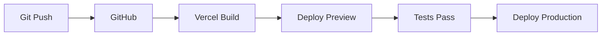

import { Callout } from 'nextra/components'

# Deployment Guide

Complete guide for deploying NeuraScale to production using Vercel.

## Prerequisites

Before deploying, ensure you have:

- ✅ GitHub repository set up
- ✅ Vercel account created
- ✅ Environment variables ready
- ✅ Sanity project configured
- ✅ Domain name (optional)

## Deployment Options

### Option 1: One-Click Deploy (Recommended)

[](https://vercel.com/new/clone?repository-url=https://github.com/identity-wael/neurascale&env=NEXT_PUBLIC_SANITY_PROJECT_ID,NEXT_PUBLIC_SANITY_DATASET,NEXT_PUBLIC_SANITY_API_VERSION&root-directory=apps/web)

1. Click the button above
2. Connect your GitHub account
3. Configure environment variables
4. Deploy!

### Option 2: Vercel Dashboard

1. **Import Project**

   - Go to [vercel.com/new](https://vercel.com/new)
   - Import Git Repository
   - Select `neurascale` repository

2. **Configure Project**

   ```
   Root Directory: apps/web
   Framework Preset: Next.js
   Build Command: (auto-detected)
   Output Directory: (auto-detected)
   Install Command: (auto-detected)
   ```

3. **Environment Variables**
   Add required variables:

   - `NEXT_PUBLIC_SANITY_PROJECT_ID`
   - `NEXT_PUBLIC_SANITY_DATASET`
   - `NEXT_PUBLIC_SANITY_API_VERSION`

4. **Deploy**
   Click "Deploy" and wait for completion

### Option 3: Vercel CLI

```bash
# Install Vercel CLI
npm i -g vercel

# Login to Vercel
vercel login

# Deploy from project root
cd neurascale
vercel --cwd apps/web

# Follow prompts:
# - Set up and deploy: Y
# - Which scope: (your-account)
# - Link to existing project: N
# - Project name: neurascale
# - Root directory: ./apps/web
# - Override settings: N
```

## Configuration Details

### Build Settings

```json
{
  "buildCommand": "npm run build",
  "outputDirectory": ".next",
  "devCommand": "npm run dev",
  "installCommand": "npm install",
  "framework": "nextjs"
}
```

### Root Directory Structure

```
apps/web/           # ← Set as root directory
├── app/
├── components/
├── public/
├── src/
├── package.json
└── next.config.ts
```

### Environment Variables

#### Production Variables

```bash
# Required
NEXT_PUBLIC_SANITY_PROJECT_ID=vvsy01fb
NEXT_PUBLIC_SANITY_DATASET=production
NEXT_PUBLIC_SANITY_API_VERSION=2024-01-01

# Optional
SANITY_API_TOKEN=sk...
EMAIL_USER=contact@neurascale.com
# EMAIL_PASS - See environment variables documentation
NEXT_PUBLIC_GOOGLE_MAPS_API_KEY=AIza...
NEXT_PUBLIC_GA4_MEASUREMENT_ID=G-XXXXXXXX
```

#### Variable Scopes

- **Production**: Live site
- **Preview**: PR previews
- **Development**: Local dev overrides

## Domain Configuration

### Adding Custom Domain

1. **In Vercel Dashboard**:

   - Go to Project Settings → Domains
   - Add your domain: `neurascale.com`
   - Add www subdomain: `www.neurascale.com`

2. **DNS Configuration**:

   ```
   # A Records (for apex domain)
   @ A 76.76.21.21

   # CNAME (for subdomains)
   www CNAME cname.vercel-dns.com
   ```

3. **SSL Certificate**:
   - Automatic via Let's Encrypt
   - No configuration needed

### Domain Providers

#### Cloudflare

1. Set SSL/TLS to "Full"
2. Disable proxying initially
3. Add Vercel's IPs

#### Namecheap

1. Use custom DNS
2. Point to Vercel nameservers
3. Wait for propagation

## Deployment Workflow

### Automatic Deployments



### Branch Deployments

| Branch      | URL                    | Purpose    |
| ----------- | ---------------------- | ---------- |
| `main`      | neurascale.com         | Production |
| `develop`   | develop.neurascale.com | Staging    |
| PR branches | pr-123.neurascale.com  | Preview    |

### Preview Deployments

Every PR gets:

- Unique preview URL
- Isolated environment
- Comment with links
- Automatic updates

## Performance Optimization

### Image Optimization

```typescript
// next.config.ts
module.exports = {
  images: {
    domains: ["cdn.sanity.io"],
    formats: ["image/avif", "image/webp"],
  },
};
```

### Edge Functions

```typescript
// app/api/edge/route.ts
export const runtime = "edge";

export async function GET() {
  return new Response("Hello from the edge!");
}
```

### Caching Strategy

```typescript
// ISR (Incremental Static Regeneration)
export const revalidate = 3600; // 1 hour

// On-demand revalidation
export async function POST() {
  revalidatePath("/");
  return Response.json({ revalidated: true });
}
```

## Monitoring & Analytics

### Vercel Analytics

1. Enable in dashboard
2. No code changes needed
3. Real User Metrics (RUM)
4. Web Vitals tracking

### Speed Insights

<Callout type="info">
  Speed Insights provides detailed performance metrics for your application.
</Callout>

```bash
# Install
npm i @vercel/speed-insights

# Add to layout
import { SpeedInsights } from '@vercel/speed-insights/next'

export default function RootLayout() {
  return (
    <html>
      <body>
        {children}
        <SpeedInsights />
      </body>
    </html>
  )
}
```

### Custom Analytics

```typescript
// lib/analytics.ts
export function trackEvent(name: string, properties?: any) {
  if (typeof window !== "undefined") {
    // Google Analytics
    window.gtag?.("event", name, properties);

    // Vercel Analytics
    window.va?.("event", { name, ...properties });
  }
}
```

## Troubleshooting

### Build Failures

#### "Module not found"

```bash
# Clear cache and reinstall
rm -rf node_modules package-lock.json
npm install
```

#### "Build exceeded memory limit"

```json
// vercel.json
{
  "functions": {
    "app/api/*": {
      "maxDuration": 60,
      "memory": 3008
    }
  }
}
```

#### Environment Variable Issues

- Check variable names (case-sensitive)
- Ensure no trailing spaces
- Verify in Function Logs

### Runtime Errors

#### 500 Errors

1. Check Function Logs
2. Verify environment variables
3. Test locally with production build

#### CORS Issues

```typescript
// next.config.ts
module.exports = {
  async headers() {
    return [
      {
        source: "/api/:path*",
        headers: [{ key: "Access-Control-Allow-Origin", value: "*" }],
      },
    ];
  },
};
```

## Security Checklist

- [ ] Environment variables set correctly
- [ ] API routes protected
- [ ] CORS configured properly
- [ ] Content Security Policy (CSP) headers
- [ ] Rate limiting implemented
- [ ] Secrets rotated regularly

### Security Headers

```typescript
// next.config.ts
const securityHeaders = [
  {
    key: "X-Frame-Options",
    value: "SAMEORIGIN",
  },
  {
    key: "X-Content-Type-Options",
    value: "nosniff",
  },
  {
    key: "Referrer-Policy",
    value: "origin-when-cross-origin",
  },
];
```

## Rollback Strategy

### Instant Rollback

1. Go to Vercel Dashboard
2. Select deployment
3. Click "..." menu
4. Select "Promote to Production"

### Git Revert

```bash
# Revert last commit
git revert HEAD
git push origin main

# Revert specific commit
git revert <commit-hash>
git push origin main
```

## Cost Optimization

### Vercel Pricing

- **Hobby**: Free (personal projects)
- **Pro**: $20/month (commercial)
- **Enterprise**: Custom pricing

### Optimization Tips

1. **Use ISR instead of SSR**
2. **Implement proper caching**
3. **Optimize images**
4. **Minimize API calls**
5. **Use Edge Functions**

## CI/CD Integration

### GitHub Actions

```yaml
# .github/workflows/deploy.yml
name: Deploy to Vercel
on:
  push:
    branches: [main]

jobs:
  deploy:
    runs-on: ubuntu-latest
    steps:
      - uses: actions/checkout@v3
      - uses: vercel/action@v25
        with:
          vercel-token: ${{ secrets.VERCEL_TOKEN }}
          vercel-org-id: ${{ secrets.ORG_ID }}
          vercel-project-id: ${{ secrets.PROJECT_ID }}
```

## Resources

- [Vercel Documentation](https://vercel.com/docs)
- [Next.js Deployment](https://nextjs.org/docs/deployment)
- [Vercel CLI Reference](https://vercel.com/docs/cli)
- [Troubleshooting Guide](https://vercel.com/docs/troubleshooting)
