import { Tabs, Callout, Table } from 'nextra/components'

export const StatusBadge = ({ status }) => {
  const colors = {
    'available': 'nx-bg-green-100 nx-text-green-800 dark:nx-bg-green-900 dark:nx-text-green-200',
    'beta': 'nx-bg-blue-100 nx-text-blue-800 dark:nx-bg-blue-900 dark:nx-text-blue-200',
    'coming-soon': 'nx-bg-yellow-100 nx-text-yellow-800 dark:nx-bg-yellow-900 dark:nx-text-yellow-200',
    'planned': 'nx-bg-gray-100 nx-text-gray-800 dark:nx-bg-gray-900 dark:nx-text-gray-200'
  }
  return (
    <span className={`nx-inline-flex nx-items-center nx-px-2.5 nx-py-0.5 nx-rounded-full nx-text-xs nx-font-medium ${colors[status] || colors.planned}`}>
      {status === 'available' && '✓ Available'}
      {status === 'beta' && '🔧 Beta'}
      {status === 'coming-soon' && '🚀 Coming Soon'}
      {status === 'planned' && '📅 Planned'}
    </span>
  )
}

# Architecture

NeuraScale is a modern BCI platform with a decoupled architecture that separates the user-facing console from the neural data processing engine. The platform combines best-in-class cloud services for optimal performance, security, and developer experience.

## Core Architecture Components

1. **Console (Frontend)** - Next.js application deployed on Vercel for the user interface
2. **Authentication** - Firebase Auth for secure user authentication and session management
3. **User Database** - NeonDB (PostgreSQL) for user data, settings, and session metadata
4. **Neural Engine** - Python-based backend for real-time BCI data processing
5. **API Gateway** - RESTful and WebSocket APIs connecting frontend to backend services

## Implementation Status

<div className="nx-mt-6">
  <table className="nx-w-full nx-table-auto nx-border-collapse">
    <thead>
      <tr className="nx-border-b nx-border-gray-200 dark:nx-border-gray-800">
        <th className="nx-text-left nx-p-2">Component</th>
        <th className="nx-text-left nx-p-2">Status</th>
        <th className="nx-text-left nx-p-2">Notes</th>
      </tr>
    </thead>
    <tbody>
      <tr className="nx-border-b nx-border-gray-200 dark:nx-border-gray-800">
        <td className="nx-p-2"><strong>Frontend Console</strong></td>
        <td className="nx-p-2"><StatusBadge status="beta" /></td>
        <td className="nx-p-2 nx-text-sm">Core UI deployed on Vercel, active development</td>
      </tr>
      <tr className="nx-border-b nx-border-gray-200 dark:nx-border-gray-800">
        <td className="nx-p-2"><strong>Firebase Auth</strong></td>
        <td className="nx-p-2"><StatusBadge status="available" /></td>
        <td className="nx-p-2 nx-text-sm">Fully integrated with Google OAuth</td>
      </tr>
      <tr className="nx-border-b nx-border-gray-200 dark:nx-border-gray-800">
        <td className="nx-p-2"><strong>NeonDB</strong></td>
        <td className="nx-p-2"><StatusBadge status="available" /></td>
        <td className="nx-p-2 nx-text-sm">Production database for user data</td>
      </tr>
      <tr className="nx-border-b nx-border-gray-200 dark:nx-border-gray-800">
        <td className="nx-p-2"><strong>Neural Engine Core</strong></td>
        <td className="nx-p-2"><StatusBadge status="available" /></td>
        <td className="nx-p-2 nx-text-sm">Device management, signal processing framework</td>
      </tr>
      <tr className="nx-border-b nx-border-gray-200 dark:nx-border-gray-800">
        <td className="nx-p-2"><strong>REST API</strong></td>
        <td className="nx-p-2"><StatusBadge status="available" /></td>
        <td className="nx-p-2 nx-text-sm">Device control and data access endpoints</td>
      </tr>
      <tr className="nx-border-b nx-border-gray-200 dark:nx-border-gray-800">
        <td className="nx-p-2"><strong>WebSocket API</strong></td>
        <td className="nx-p-2"><StatusBadge status="beta" /></td>
        <td className="nx-p-2 nx-text-sm">Real-time streaming in development</td>
      </tr>
      <tr className="nx-border-b nx-border-gray-200 dark:nx-border-gray-800">
        <td className="nx-p-2"><strong>ML Pipeline</strong></td>
        <td className="nx-p-2"><StatusBadge status="coming-soon" /></td>
        <td className="nx-p-2 nx-text-sm">Model framework ready, training models</td>
      </tr>
      <tr className="nx-border-b nx-border-gray-200 dark:nx-border-gray-800">
        <td className="nx-p-2"><strong>Cloud Deployment</strong></td>
        <td className="nx-p-2"><StatusBadge status="coming-soon" /></td>
        <td className="nx-p-2 nx-text-sm">GCP infrastructure being configured</td>
      </tr>
      <tr className="nx-border-b nx-border-gray-200 dark:nx-border-gray-800">
        <td className="nx-p-2"><strong>TimescaleDB</strong></td>
        <td className="nx-p-2"><StatusBadge status="planned" /></td>
        <td className="nx-p-2 nx-text-sm">Time-series storage for neural data</td>
      </tr>
      <tr className="nx-border-b nx-border-gray-200 dark:nx-border-gray-800">
        <td className="nx-p-2"><strong>BigQuery Analytics</strong></td>
        <td className="nx-p-2"><StatusBadge status="planned" /></td>
        <td className="nx-p-2 nx-text-sm">Large-scale data analysis platform</td>
      </tr>
    </tbody>
  </table>
</div>

<Callout type="info">
  The platform is under active development with core functionality available for testing. Production deployment with full cloud infrastructure coming soon.
</Callout>

## System Architecture

```mermaid
graph TB
    subgraph "User Layer"
        U1[Web Browser]
        U2[Mobile App]
        U3[Desktop App]
    end

    subgraph "Frontend - Vercel"
        subgraph "NeuraScale Console"
            NC1[Next.js App<br/>React • TypeScript]
            NC2[UI Components<br/>Tailwind • shadcn/ui]
            NC3[State Management<br/>Zustand • React Query]
            NC4[Real-time Updates<br/>Socket.io Client]
        end
        V1[Vercel Edge Network<br/>Global CDN • Edge Functions]
    end

    subgraph "Authentication - Firebase"
        FB1[Firebase Auth<br/>OAuth Providers]
        FB2[User Management<br/>Profiles • Permissions]
        FB3[Session Tokens<br/>JWT • Refresh Tokens]
    end

    subgraph "User Data - NeonDB"
        subgraph "PostgreSQL Database"
            ND1[User Profiles<br/>Settings • Preferences]
            ND2[Session Metadata<br/>Experiments • Results]
            ND3[Device Configs<br/>Saved Configurations]
            ND4[Analysis History<br/>Reports • Exports]
        end
        NP1[Neon Proxy<br/>Connection Pooling]
        NP2[Neon Autoscaling<br/>Compute • Storage]
    end

    subgraph "API Gateway"
        AG1[REST API<br/>Express • Node.js]
        AG2[WebSocket Server<br/>Real-time Streams]
        AG3[GraphQL API<br/>Query Optimization]
    end

    subgraph "Neural Engine Backend"
        subgraph "Device Service"
            DS1[Device Manager]
            DS2[Discovery Engine]
            DS3[Health Monitor]
        end

        subgraph "Processing Service"
            PS1[Signal Pipeline]
            PS2[Feature Extraction]
            PS3[ML Inference]
        end

        subgraph "Data Service"
            DTS1[Time Series API]
            DTS2[Storage API]
            DTS3[Analytics API]
        end
    end

    subgraph "Neural Data Storage"
        NS1[TimescaleDB<br/>Time Series Data]
        NS2[Redis<br/>Real-time Cache]
        NS3[Cloud Storage<br/>Raw EEG Files]
        NS4[PostgreSQL<br/>Analysis Results]
    end

    U1 --> V1
    U2 --> V1
    U3 --> V1

    V1 --> NC1
    NC1 --> NC2
    NC1 --> NC3
    NC1 --> NC4

    NC1 --> FB1
    FB1 --> FB2
    FB2 --> FB3

    NC1 --> NP1
    NP1 --> ND1
    NP1 --> ND2
    NP1 --> ND3
    NP1 --> ND4

    NC1 --> AG1
    NC4 --> AG2
    NC1 --> AG3

    AG1 --> DS1
    AG2 --> PS1
    AG3 --> DTS1

    DS1 --> NS2
    PS1 --> NS1
    DTS1 --> NS3
    DTS1 --> NS4

    style U1 fill:#e3f2fd,color:#0d47a1
    style U2 fill:#e3f2fd,color:#0d47a1
    style U3 fill:#e3f2fd,color:#0d47a1
    style V1 fill:#000000,color:#ffffff
    style NC1 fill:#0070f3,color:#ffffff
    style NC2 fill:#0070f3,color:#ffffff
    style NC3 fill:#0070f3,color:#ffffff
    style NC4 fill:#0070f3,color:#ffffff
    style FB1 fill:#ffa000,color:#ffffff
    style FB2 fill:#ffa000,color:#ffffff
    style FB3 fill:#ffa000,color:#ffffff
    style ND1 fill:#00e5a0,color:#000000
    style ND2 fill:#00e5a0,color:#000000
    style ND3 fill:#00e5a0,color:#000000
    style ND4 fill:#00e5a0,color:#000000
    style NP1 fill:#00e5a0,color:#000000
    style NP2 fill:#00e5a0,color:#000000
    style AG1 fill:#6b7280,color:#ffffff
    style AG2 fill:#6b7280,color:#ffffff
    style AG3 fill:#6b7280,color:#ffffff
    style DS1 fill:#8b5cf6,color:#ffffff
    style PS1 fill:#8b5cf6,color:#ffffff
    style DTS1 fill:#8b5cf6,color:#ffffff
    style NS1 fill:#3b82f6,color:#ffffff
    style NS2 fill:#ef4444,color:#ffffff
    style NS3 fill:#10b981,color:#ffffff
    style NS4 fill:#3b82f6,color:#ffffff
```

## Frontend Architecture (Console)

### Vercel Deployment

The NeuraScale Console is a modern web application built with Next.js and deployed on Vercel's edge network for optimal performance and global availability.

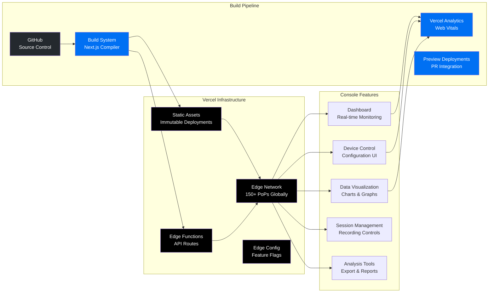

**Key Benefits:**
- Zero-config deployments with Git integration
- Automatic HTTPS and custom domains
- Edge caching and global CDN
- Serverless functions for API routes
- Built-in analytics and monitoring

### Firebase Authentication

Firebase provides secure, scalable authentication with support for multiple identity providers and seamless integration with the frontend.

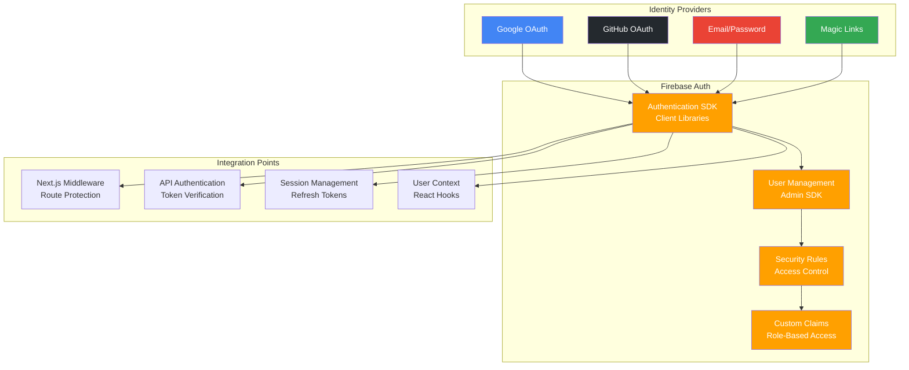

### NeonDB (User Data Storage)

NeonDB provides a serverless PostgreSQL database optimized for modern applications with automatic scaling and branching capabilities.

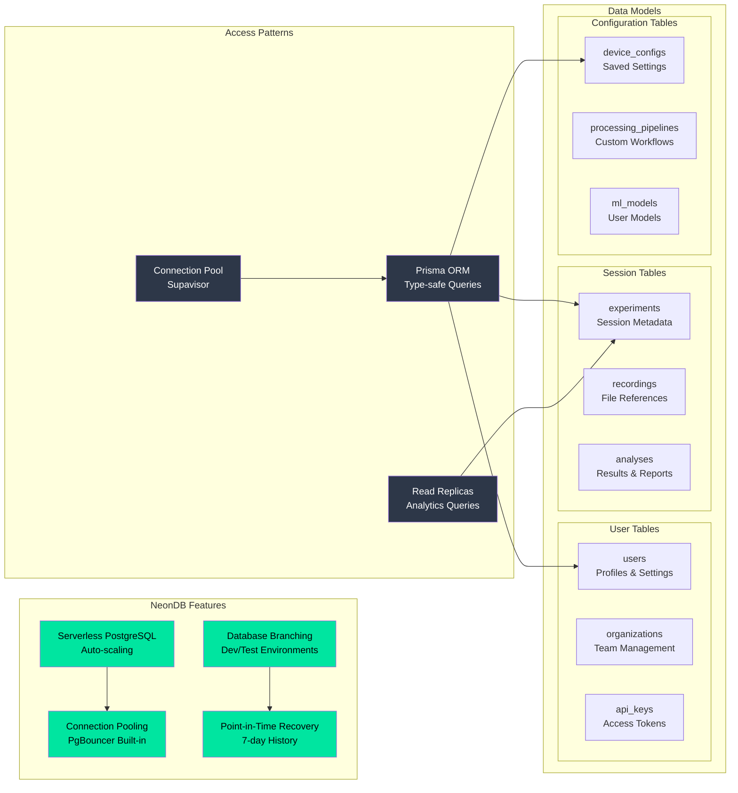

## Backend Architecture (Neural Engine)

### Device Service

The Device Service manages all BCI device connections and real-time data acquisition.

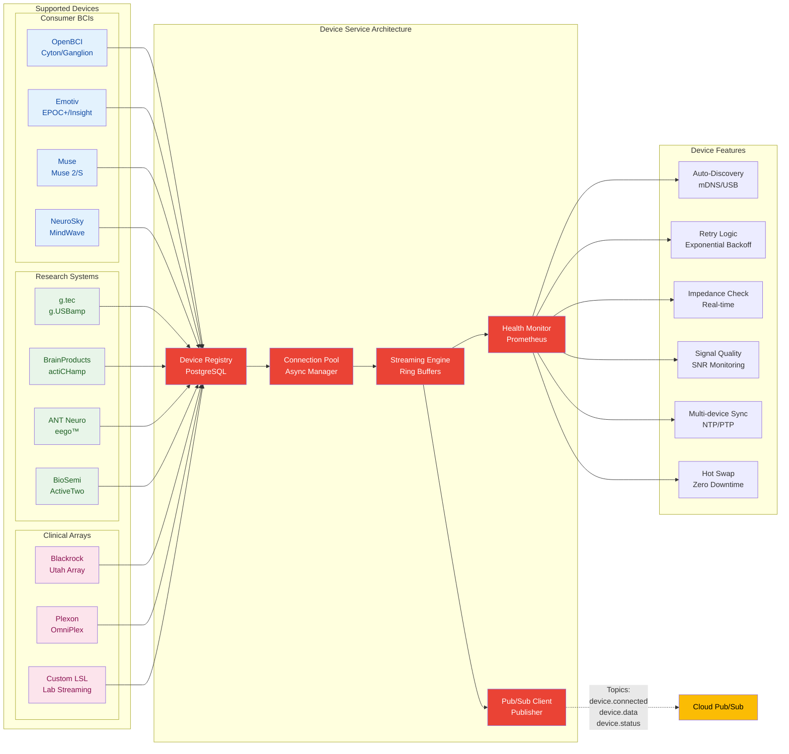

**Technical Specifications:**
- Written in Python 3.12 with asyncio
- Uses lock-free ring buffers for data
- Implements backpressure mechanisms
- Sub-100ms latency guarantee

### Processing Service

The Processing Service handles all signal processing and feature extraction operations using GCP AI/ML services.

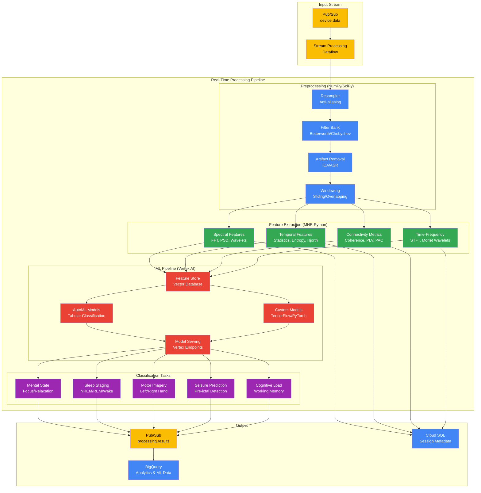

### Data Service

The Data Service manages data persistence, retrieval, and analytics using GCP's multi-tier storage architecture.

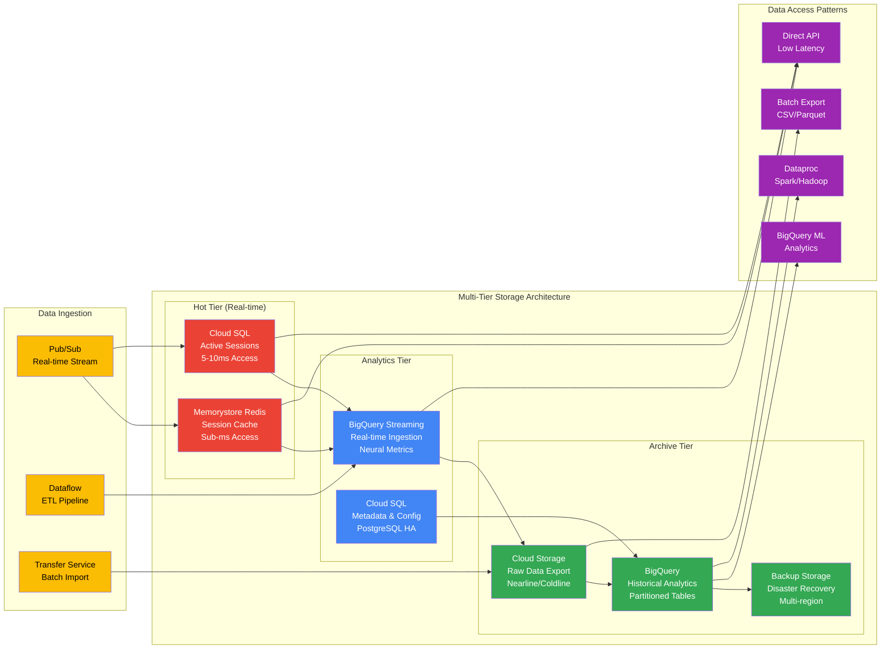

<Callout type="info">
  **Current Implementation**: The production system currently uses Cloud SQL PostgreSQL for metadata and BigQuery for analytics. Bigtable integration is planned for future releases when sub-millisecond latency is required for massive time-series datasets.
</Callout>

## Data Flow & Latency

### Real-Time Data Pipeline

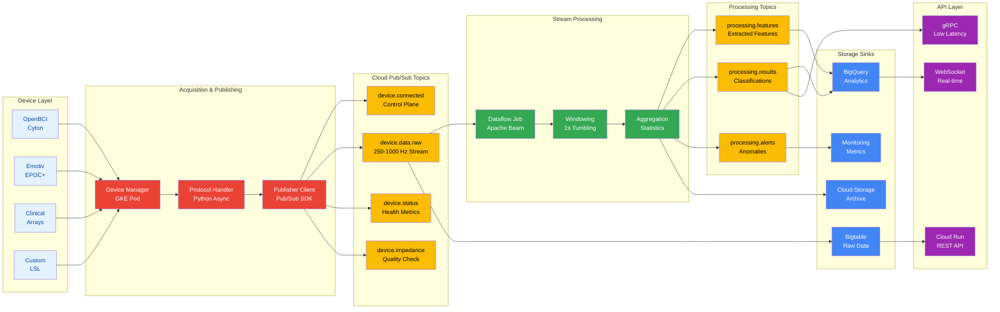

### Latency Budget

<Table>
  <thead>
    <Table.Tr>
      <Table.Th>Stage</Table.Th>
      <Table.Th>Budget</Table.Th>
      <Table.Th>Actual</Table.Th>
      <Table.Th>Notes</Table.Th>
    </Table.Tr>
  </thead>
  <tbody>
    <Table.Tr>
      <Table.Td>Device Acquisition</Table.Td>
      <Table.Td>20ms</Table.Td>
      <Table.Td>10-15ms</Table.Td>
      <Table.Td>Hardware dependent</Table.Td>
    </Table.Tr>
    <Table.Tr>
      <Table.Td>Network Transfer</Table.Td>
      <Table.Td>15ms</Table.Td>
      <Table.Td>5-10ms</Table.Td>
      <Table.Td>Optimized protocols</Table.Td>
    </Table.Tr>
    <Table.Tr>
      <Table.Td>Buffering</Table.Td>
      <Table.Td>5ms</Table.Td>
      <Table.Td>&lt;2ms</Table.Td>
      <Table.Td>Lock-free queues</Table.Td>
    </Table.Tr>
    <Table.Tr>
      <Table.Td>Feature Extraction</Table.Td>
      <Table.Td>15ms</Table.Td>
      <Table.Td>10-15ms</Table.Td>
      <Table.Td>SIMD optimized</Table.Td>
    </Table.Tr>
    <Table.Tr>
      <Table.Td>ML Classification</Table.Td>
      <Table.Td>15ms</Table.Td>
      <Table.Td>5-10ms</Table.Td>
      <Table.Td>TensorRT/ONNX</Table.Td>
    </Table.Tr>
    <Table.Tr>
      <Table.Td>Processing</Table.Td>
      <Table.Td>10ms</Table.Td>
      <Table.Td>5-10ms</Table.Td>
      <Table.Td>Parallel pipelines</Table.Td>
    </Table.Tr>
    <Table.Tr>
      <Table.Td>Storage Write</Table.Td>
      <Table.Td>10ms</Table.Td>
      <Table.Td>5-8ms</Table.Td>
      <Table.Td>Async writes</Table.Td>
    </Table.Tr>
    <Table.Tr>
      <Table.Td>API Response</Table.Td>
      <Table.Td>10ms</Table.Td>
      <Table.Td>5-8ms</Table.Td>
      <Table.Td>Cached responses</Table.Td>
    </Table.Tr>
  </tbody>
</Table>

## Scalability

### Horizontal Scaling Architecture

```mermaid
graph TB
    subgraph "External Traffic"
        ET[Cloud Load Balancer<br/>+ Cloud Armor]
    end

    subgraph "GKE Cluster - Regional"
        subgraph "Control Plane"
            CP[Kubernetes API<br/>HA Masters]
            HPA[Horizontal Pod<br/>Autoscaler]
            VPA[Vertical Pod<br/>Autoscaler]
            CA[Cluster<br/>Autoscaler]
        end

        subgraph "Node Pool 1 - General"
            subgraph "Zone A"
                N1A[n2-standard-4<br/>4 vCPU, 16GB RAM]
                P1A[Device Service<br/>2-10 replicas]
                P2A[API Service<br/>3-20 replicas]
            end

            subgraph "Zone B"
                N1B[n2-standard-4<br/>4 vCPU, 16GB RAM]
                P1B[Device Service<br/>2-10 replicas]
                P2B[API Service<br/>3-20 replicas]
            end

            subgraph "Zone C"
                N1C[n2-standard-4<br/>4 vCPU, 16GB RAM]
                P1C[Device Service<br/>2-10 replicas]
                P2C[API Service<br/>3-20 replicas]
            end
        end

        subgraph "Node Pool 2 - ML/GPU"
            subgraph "GPU Zone A"
                N2A[n1-highmem-4<br/>+ T4 GPU]
                P3A[ML Service<br/>1-5 replicas]
            end

            subgraph "GPU Zone B"
                N2B[n1-highmem-4<br/>+ T4 GPU]
                P3B[ML Service<br/>1-5 replicas]
            end
        end

        subgraph "Node Pool 3 - Memory"
            N3[n2-highmem-8<br/>8 vCPU, 64GB RAM]
            P4[Processing Service<br/>2-8 replicas]
        end
    end

    subgraph "Autoscaling Metrics"
        M1[CPU Usage<br/>>70%]
        M2[Memory Usage<br/>>80%]
        M3[Pub/Sub Queue<br/>>1000 msgs]
        M4[Custom Metrics<br/>Device Count]
    end

    subgraph "Managed Services"
        MS1[Cloud SQL<br/>Auto-failover]
        MS2[Bigtable<br/>Auto-scaling]
        MS3[Pub/Sub<br/>Unlimited Scale]
        MS4[Cloud Storage<br/>∞ Scale]
    end

    ET --> CP
    CP --> HPA
    CP --> VPA
    CP --> CA

    HPA --> P1A
    HPA --> P2A
    HPA --> P3A
    HPA --> P4

    CA --> N1A
    CA --> N1B
    CA --> N1C
    CA --> N2A
    CA --> N2B
    CA --> N3

    M1 --> HPA
    M2 --> HPA
    M3 --> HPA
    M4 --> HPA

    P1A --> MS1
    P2A --> MS2
    P3A --> MS3
    P4 --> MS4

    style ET fill:#34a853,color:#ffffff
    style CP fill:#ea4335,color:#ffffff
    style HPA fill:#fbbc04,color:#000000
    style VPA fill:#fbbc04,color:#000000
    style CA fill:#fbbc04,color:#000000
    style N1A fill:#4285f4,color:#ffffff
    style N1B fill:#4285f4,color:#ffffff
    style N1C fill:#4285f4,color:#ffffff
    style N2A fill:#9c27b0,color:#ffffff
    style N2B fill:#9c27b0,color:#ffffff
    style N3 fill:#4285f4,color:#ffffff
    style MS1 fill:#0f9d58,color:#ffffff
    style MS2 fill:#0f9d58,color:#ffffff
    style MS3 fill:#0f9d58,color:#ffffff
    style MS4 fill:#0f9d58,color:#ffffff
```

### Resource Allocation

<Tabs items={['Device Service', 'Processing Service', 'Data Service']}>
  <Tabs.Tab>
    **Device Service Resources:**
    - CPU: 2-8 cores
    - Memory: 4-16 GB
    - Network: 1-10 Gbps
    - Scaling: By device count
  </Tabs.Tab>

  <Tabs.Tab>
    **Processing Service Resources:**
    - CPU: 8-32 cores
    - Memory: 32-128 GB
    - GPU: Optional (CUDA)
    - Scaling: By channel count
  </Tabs.Tab>

  <Tabs.Tab>
    **Data Service Resources:**
    - CPU: 4-16 cores
    - Memory: 16-64 GB
    - Storage: NVMe SSD
    - Scaling: By write throughput
  </Tabs.Tab>
</Tabs>

## Security Architecture

### Defense in Depth

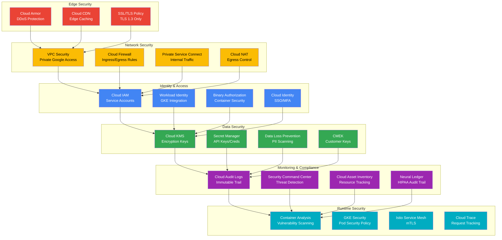

### Compliance Features

<Tabs items={['SOC 2 Type II', 'HIPAA', 'GDPR']}>
  <Tabs.Tab>
    **SOC 2 Type II Certification:**

    **Trust Service Criteria:**
    - **Security**: Firewall protection, intrusion detection, vulnerability scanning
    - **Availability**: 99.9% uptime SLA, redundancy, disaster recovery
    - **Processing Integrity**: Data validation, error handling, quality assurance
    - **Confidentiality**: Encryption, access matrices, secure disposal
    - **Privacy**: Consent management, data subject rights, retention policies

    **Key Controls:**
    - Continuous monitoring and alerting
    - Change management procedures
    - Vendor risk assessments
    - Annual penetration testing
    - Security awareness training
  </Tabs.Tab>

  <Tabs.Tab>
    **HIPAA Compliance:**
    - End-to-end encryption (AES-256)
    - Audit logging with immutability
    - Access controls (RBAC + ABAC)
    - Data retention policies (7 years)
    - Business Associate Agreements
    - Minimum necessary standard
    - Breach notification procedures
    - Physical safeguards for data centers
  </Tabs.Tab>

  <Tabs.Tab>
    **GDPR Compliance:**
    - Consent management
    - Right to deletion
    - Data portability
    - Privacy by design
    - Data minimization
    - Cross-border transfer controls
    - Data Protection Impact Assessments
    - 72-hour breach notification
  </Tabs.Tab>
</Tabs>

## Technology Stack

<Table>
  <thead>
    <Table.Tr>
      <Table.Th>Component</Table.Th>
      <Table.Th>Technology</Table.Th>
      <Table.Th>Justification</Table.Th>
    </Table.Tr>
  </thead>
  <tbody>
    <Table.Tr>
      <Table.Td>Frontend Framework</Table.Td>
      <Table.Td>Next.js 14 + React</Table.Td>
      <Table.Td>Server components, App Router, TypeScript</Table.Td>
    </Table.Tr>
    <Table.Tr>
      <Table.Td>UI Components</Table.Td>
      <Table.Td>shadcn/ui + Tailwind CSS</Table.Td>
      <Table.Td>Customizable, accessible, modern design</Table.Td>
    </Table.Tr>
    <Table.Tr>
      <Table.Td>State Management</Table.Td>
      <Table.Td>Zustand + React Query</Table.Td>
      <Table.Td>Simple state, server state caching</Table.Td>
    </Table.Tr>
    <Table.Tr>
      <Table.Td>Authentication</Table.Td>
      <Table.Td>Firebase Auth</Table.Td>
      <Table.Td>Multiple providers, secure, scalable</Table.Td>
    </Table.Tr>
    <Table.Tr>
      <Table.Td>User Database</Table.Td>
      <Table.Td>NeonDB (PostgreSQL)</Table.Td>
      <Table.Td>Serverless, branching, auto-scaling</Table.Td>
    </Table.Tr>
    <Table.Tr>
      <Table.Td>ORM</Table.Td>
      <Table.Td>Prisma</Table.Td>
      <Table.Td>Type-safe queries, migrations</Table.Td>
    </Table.Tr>
    <Table.Tr>
      <Table.Td>Deployment</Table.Td>
      <Table.Td>Vercel</Table.Td>
      <Table.Td>Edge network, preview deployments</Table.Td>
    </Table.Tr>
    <Table.Tr>
      <Table.Td>Neural Backend</Table.Td>
      <Table.Td>Python 3.12 + FastAPI</Table.Td>
      <Table.Td>Async performance, BCI ecosystem</Table.Td>
    </Table.Tr>
    <Table.Tr>
      <Table.Td>Real-time Comm</Table.Td>
      <Table.Td>Socket.io + WebSocket</Table.Td>
      <Table.Td>Bidirectional, fallback support</Table.Td>
    </Table.Tr>
    <Table.Tr>
      <Table.Td>Time Series DB</Table.Td>
      <Table.Td>TimescaleDB</Table.Td>
      <Table.Td>PostgreSQL extension, optimized for EEG</Table.Td>
    </Table.Tr>
    <Table.Tr>
      <Table.Td>Caching</Table.Td>
      <Table.Td>Redis</Table.Td>
      <Table.Td>In-memory performance, pub/sub</Table.Td>
    </Table.Tr>
    <Table.Tr>
      <Table.Td>File Storage</Table.Td>
      <Table.Td>Cloud Storage</Table.Td>
      <Table.Td>Object storage for EEG files</Table.Td>
    </Table.Tr>
    <Table.Tr>
      <Table.Td>ML Processing</Table.Td>
      <Table.Td>NumPy + SciPy + MNE</Table.Td>
      <Table.Td>Scientific computing, EEG analysis</Table.Td>
    </Table.Tr>
    <Table.Tr>
      <Table.Td>Monitoring</Table.Td>
      <Table.Td>Vercel Analytics + Sentry</Table.Td>
      <Table.Td>Performance tracking, error monitoring</Table.Td>
    </Table.Tr>
  </tbody>
</Table>

## Deployment Architecture

### Multi-Environment Setup

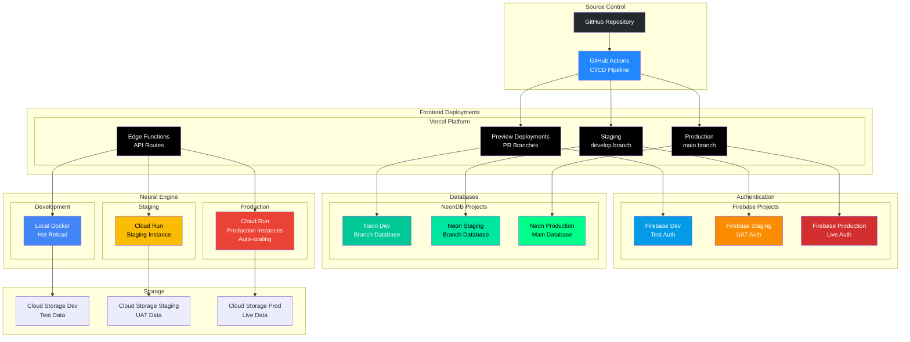

### Vercel Deployment Pipeline

```mermaid
graph LR
    subgraph "Development Flow"
        DEV[Local Development<br/>npm run dev]
        PR[Pull Request<br/>Feature Branch]
        PD[Preview Deploy<br/>Unique URL]
        REV[Code Review<br/>Testing]
    end

    subgraph "Staging Flow"
        MERGE[Merge to develop]
        STG[Staging Deploy<br/>staging.neurascale.io]
        TEST[Integration Testing<br/>E2E Tests]
    end

    subgraph "Production Flow"
        MAIN[Merge to main]
        PROD[Production Deploy<br/>neurascale.io]
        MON[Monitoring<br/>Analytics]
    end

    DEV --> PR
    PR --> PD
    PD --> REV
    REV --> MERGE
    MERGE --> STG
    STG --> TEST
    TEST --> MAIN
    MAIN --> PROD
    PROD --> MON

    style DEV fill:#0070f3,color:#ffffff
    style PR fill:#0070f3,color:#ffffff
    style PD fill:#000000,color:#ffffff
    style STG fill:#fbbc04,color:#000000
    style PROD fill:#00c896,color:#ffffff
```

## Frontend-Backend Integration

### API Architecture

The console communicates with the Neural Engine through a well-defined API layer that handles authentication, data streaming, and session management.

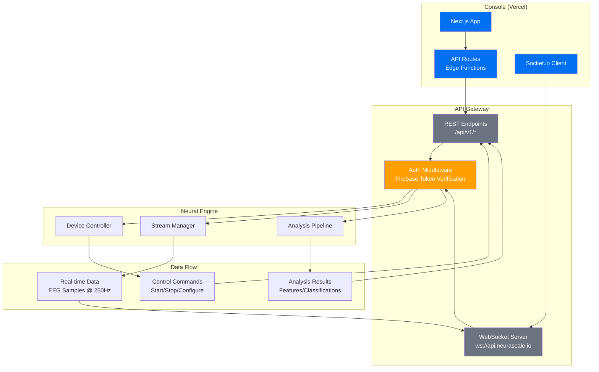

### Authentication Flow

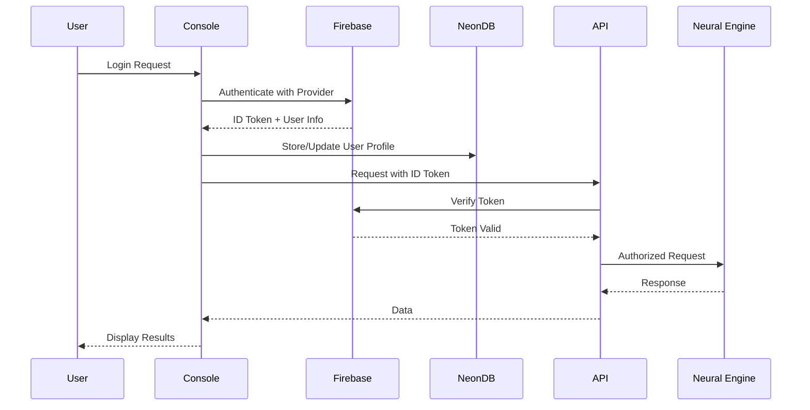

### Disaster Recovery

<Callout type="info">
  **Service-Specific Recovery:**
  - **Vercel**: Automatic failover across global edge network
  - **Firebase**: Multi-region replication, 99.95% SLA
  - **NeonDB**: Point-in-time recovery, branch restoration
  - **Neural Engine**: Multi-instance deployment, health checks
</Callout>

**Backup Strategy:**
- NeonDB: Continuous backups with 7-day retention
- Firebase: Automatic daily backups
- Cloud Storage: Multi-region replication for EEG files
- Configuration: Git-based version control

## Performance Optimization

### Optimization Techniques

<Tabs items={['Zero-Copy', 'SIMD', 'GPU', 'Async I/O']}>
  <Tabs.Tab>
    **Zero-Copy Data Transfer**
    ```python
    # Shared memory segments
    buffer = mmap.mmap(-1, size)
    # Direct memory access
    numpy_array = np.frombuffer(buffer)
    ```
  </Tabs.Tab>

  <Tabs.Tab>
    **SIMD Vectorization**
    ```python
    # NumPy with MKL backend
    # AVX2/AVX-512 instructions
    filtered = np.convolve(data, kernel, mode='same')
    ```
  </Tabs.Tab>

  <Tabs.Tab>
    **GPU Acceleration**
    ```python
    # CuPy for GPU processing
    import cupy as cp
    gpu_data = cp.asarray(cpu_data)
    gpu_fft = cp.fft.fft(gpu_data)
    ```
  </Tabs.Tab>

  <Tabs.Tab>
    **Async I/O**
    ```python
    # AsyncIO for concurrent operations
    async def process_streams(devices):
        tasks = [process_device(d) for d in devices]
        await asyncio.gather(*tasks)
    ```
  </Tabs.Tab>
</Tabs>

## Future Enhancements

### Roadmap

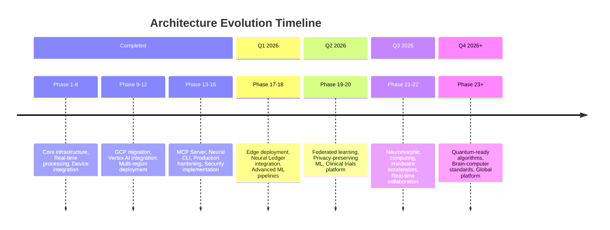

### Research Areas

- **Neuromorphic Computing** - Brain-inspired hardware integration
- **Spiking Neural Networks** - Event-based processing
- **Reservoir Computing** - Efficient temporal processing
- **Brain-Computer Interface Standards** - Industry standardization

## Related Documentation

- [API Documentation](/api-documentation) - Complete API reference
- [Neural Management System](/neural-management-system) - Neural Engine details
- [Security](/security) - Security and compliance details
- [Contributing Guide](/contributing) - Development guidelines
