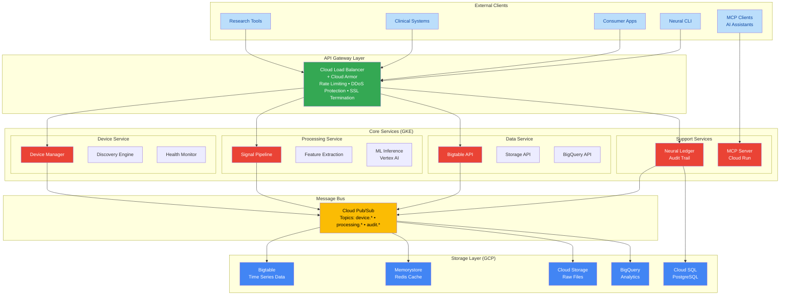
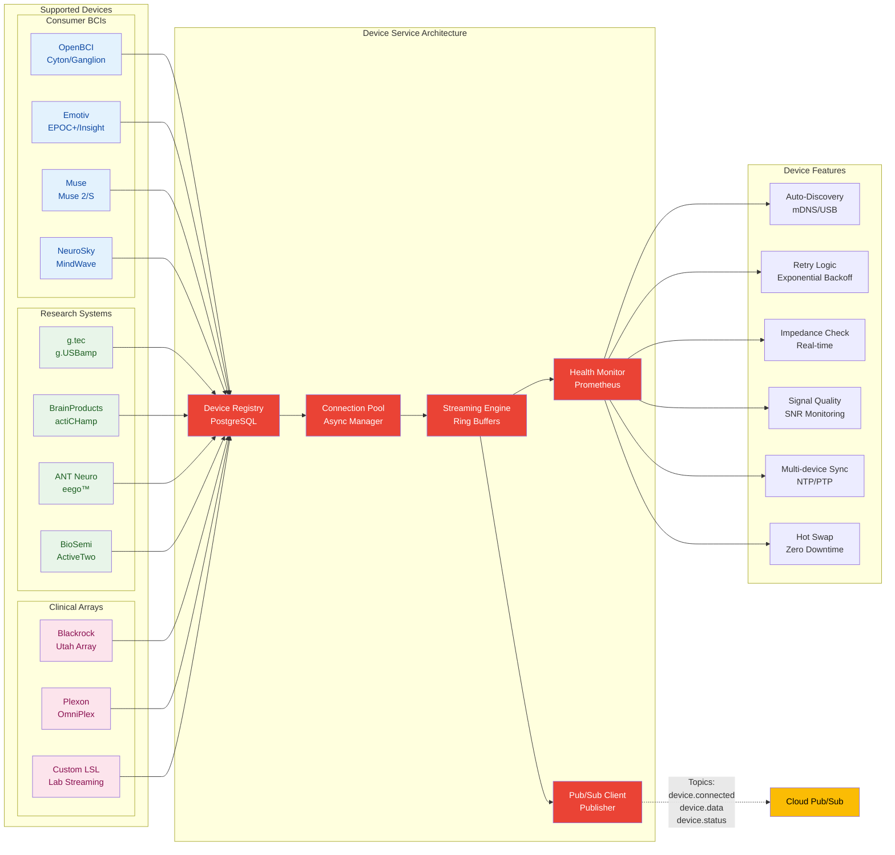
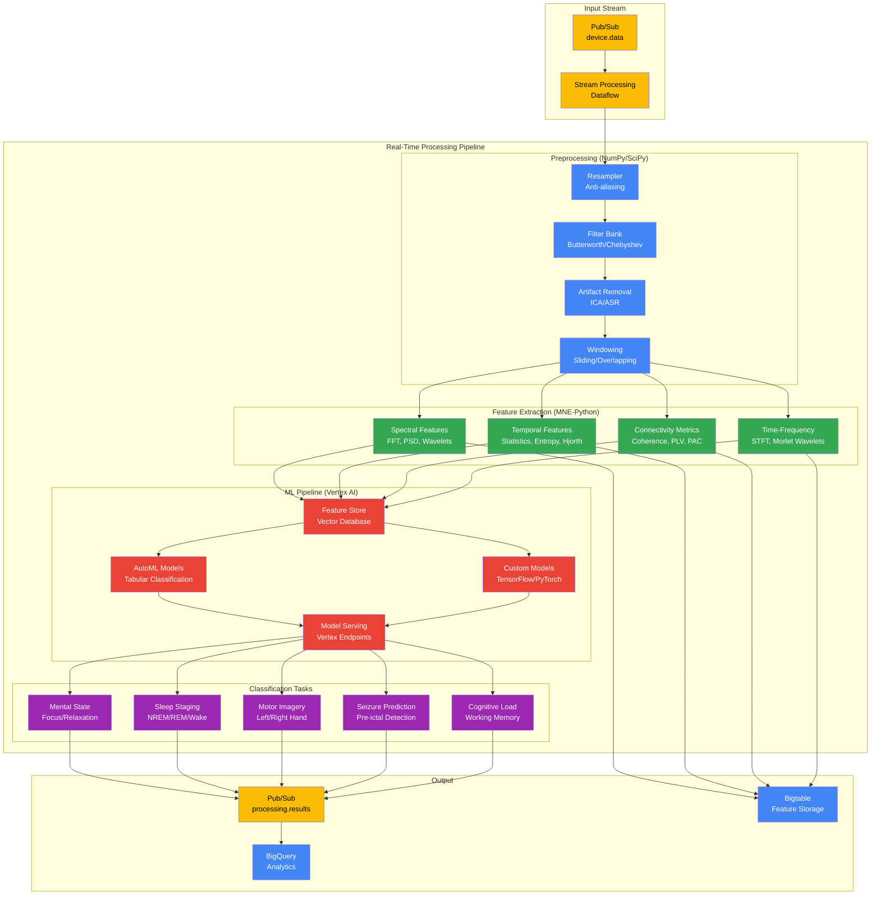
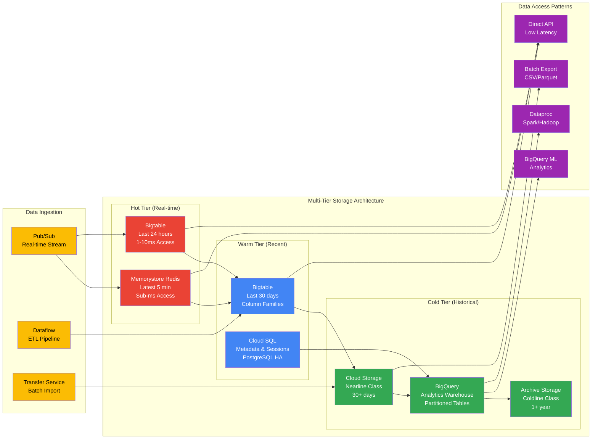
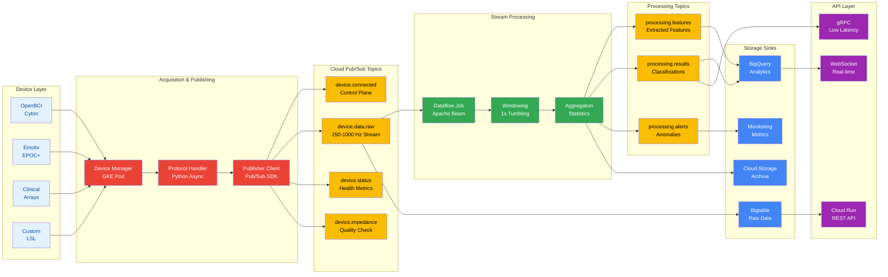
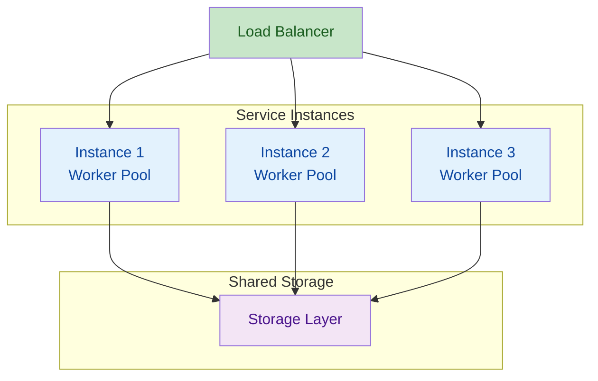
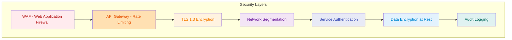
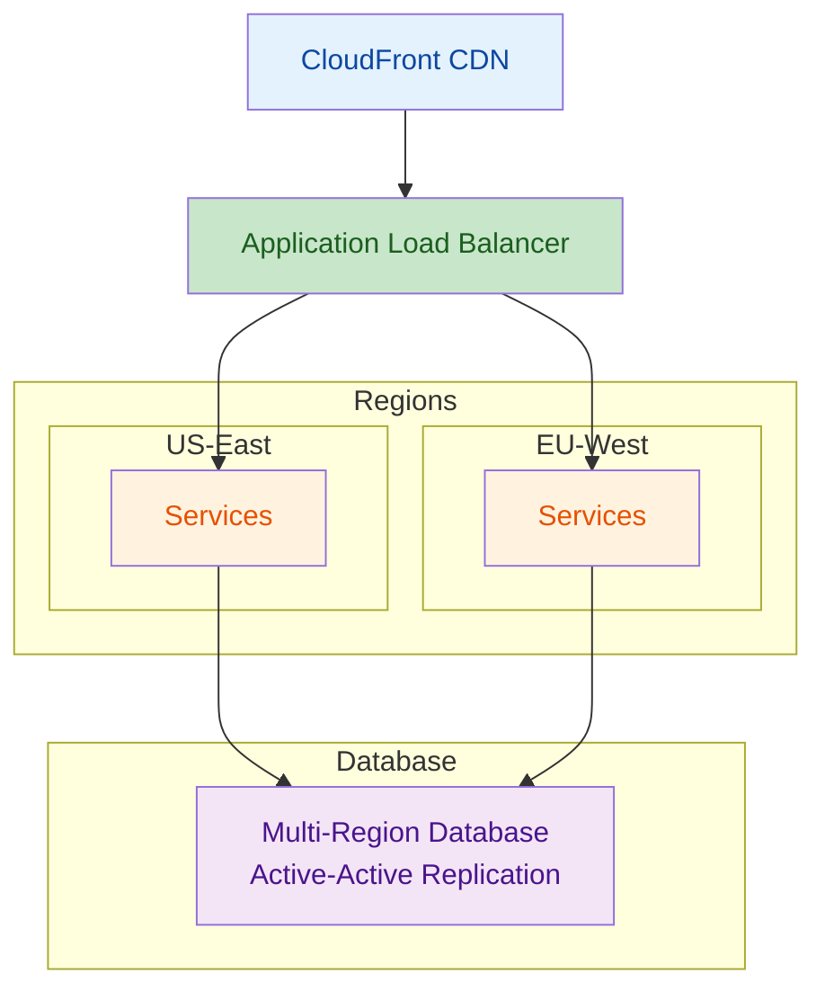
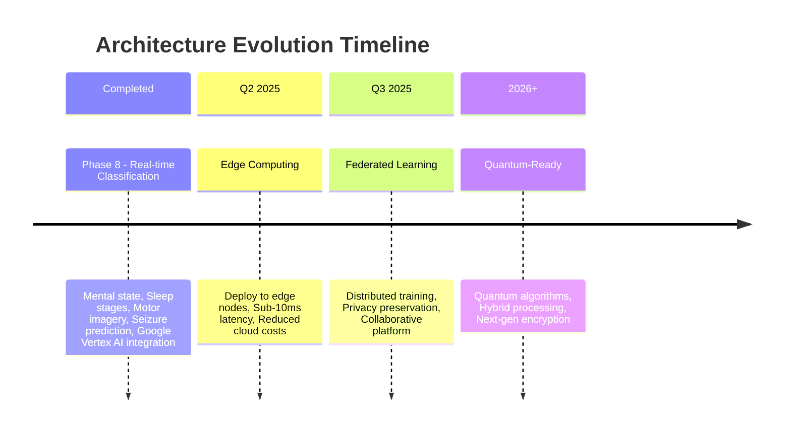

import { Tabs, Callout, Table } from 'nextra/components'

# Architecture

NeuraScale is built as a cloud-native, microservices-based platform designed for real-time neural data processing at scale. The architecture prioritizes low latency, high throughput, and clinical-grade reliability.

## Core Design Principles

1. **Microservices Architecture** - Loosely coupled services with clear domain boundaries
2. **Event-Driven Communication** - Asynchronous messaging for scalability
3. **Data Locality** - Process data close to the source to minimize latency
4. **Horizontal Scalability** - Stateless services that scale linearly
5. **Fault Tolerance** - Circuit breakers, retries, and graceful degradation

## System Architecture



## Service Architecture

### Device Service

The Device Service manages all device-related operations and real-time data acquisition.



**Technical Specifications:**
- Written in Python 3.12 with asyncio
- Uses lock-free ring buffers for data
- Implements backpressure mechanisms
- Sub-100ms latency guarantee

### Processing Service

The Processing Service handles all signal processing and feature extraction operations using GCP AI/ML services.



### Data Service

The Data Service manages data persistence, retrieval, and analytics using GCP's multi-tier storage architecture.



## Data Flow & Latency

### Real-Time Data Pipeline



### Latency Budget

<Table>
  <thead>
    <Table.Tr>
      <Table.Th>Stage</Table.Th>
      <Table.Th>Budget</Table.Th>
      <Table.Th>Actual</Table.Th>
      <Table.Th>Notes</Table.Th>
    </Table.Tr>
  </thead>
  <tbody>
    <Table.Tr>
      <Table.Td>Device Acquisition</Table.Td>
      <Table.Td>20ms</Table.Td>
      <Table.Td>10-15ms</Table.Td>
      <Table.Td>Hardware dependent</Table.Td>
    </Table.Tr>
    <Table.Tr>
      <Table.Td>Network Transfer</Table.Td>
      <Table.Td>15ms</Table.Td>
      <Table.Td>5-10ms</Table.Td>
      <Table.Td>Optimized protocols</Table.Td>
    </Table.Tr>
    <Table.Tr>
      <Table.Td>Buffering</Table.Td>
      <Table.Td>5ms</Table.Td>
      <Table.Td>&lt;2ms</Table.Td>
      <Table.Td>Lock-free queues</Table.Td>
    </Table.Tr>
    <Table.Tr>
      <Table.Td>Feature Extraction</Table.Td>
      <Table.Td>15ms</Table.Td>
      <Table.Td>10-15ms</Table.Td>
      <Table.Td>SIMD optimized</Table.Td>
    </Table.Tr>
    <Table.Tr>
      <Table.Td>ML Classification</Table.Td>
      <Table.Td>15ms</Table.Td>
      <Table.Td>5-10ms</Table.Td>
      <Table.Td>TensorRT/ONNX</Table.Td>
    </Table.Tr>
    <Table.Tr>
      <Table.Td>Processing</Table.Td>
      <Table.Td>10ms</Table.Td>
      <Table.Td>5-10ms</Table.Td>
      <Table.Td>Parallel pipelines</Table.Td>
    </Table.Tr>
    <Table.Tr>
      <Table.Td>Storage Write</Table.Td>
      <Table.Td>10ms</Table.Td>
      <Table.Td>5-8ms</Table.Td>
      <Table.Td>Async writes</Table.Td>
    </Table.Tr>
    <Table.Tr>
      <Table.Td>API Response</Table.Td>
      <Table.Td>10ms</Table.Td>
      <Table.Td>5-8ms</Table.Td>
      <Table.Td>Cached responses</Table.Td>
    </Table.Tr>
  </tbody>
</Table>

## Scalability

### Horizontal Scaling Architecture



### Resource Allocation

<Tabs items={['Device Service', 'Processing Service', 'Data Service']}>
  <Tabs.Tab>
    **Device Service Resources:**
    - CPU: 2-8 cores
    - Memory: 4-16 GB
    - Network: 1-10 Gbps
    - Scaling: By device count
  </Tabs.Tab>

  <Tabs.Tab>
    **Processing Service Resources:**
    - CPU: 8-32 cores
    - Memory: 32-128 GB
    - GPU: Optional (CUDA)
    - Scaling: By channel count
  </Tabs.Tab>

  <Tabs.Tab>
    **Data Service Resources:**
    - CPU: 4-16 cores
    - Memory: 16-64 GB
    - Storage: NVMe SSD
    - Scaling: By write throughput
  </Tabs.Tab>
</Tabs>

## Security Architecture

### Defense in Depth



### Compliance Features

<Tabs items={['HIPAA', 'GDPR']}>
  <Tabs.Tab>
    **HIPAA Compliance:**
    - End-to-end encryption (AES-256)
    - Audit logging with immutability
    - Access controls (RBAC + ABAC)
    - Data retention policies
    - Business Associate Agreements
  </Tabs.Tab>

  <Tabs.Tab>
    **GDPR Compliance:**
    - Consent management
    - Right to deletion
    - Data portability
    - Privacy by design
    - Data minimization
  </Tabs.Tab>
</Tabs>

## Technology Stack

<Table>
  <thead>
    <Table.Tr>
      <Table.Th>Component</Table.Th>
      <Table.Th>Technology</Table.Th>
      <Table.Th>Justification</Table.Th>
    </Table.Tr>
  </thead>
  <tbody>
    <Table.Tr>
      <Table.Td>Backend</Table.Td>
      <Table.Td>Python 3.12 + FastAPI</Table.Td>
      <Table.Td>Async performance, ecosystem</Table.Td>
    </Table.Tr>
    <Table.Tr>
      <Table.Td>Real-time</Table.Td>
      <Table.Td>WebSocket + gRPC</Table.Td>
      <Table.Td>Low latency, bidirectional</Table.Td>
    </Table.Tr>
    <Table.Tr>
      <Table.Td>Message Bus</Table.Td>
      <Table.Td>Kafka + Redis Pub/Sub</Table.Td>
      <Table.Td>Scalability, persistence</Table.Td>
    </Table.Tr>
    <Table.Tr>
      <Table.Td>Time Series</Table.Td>
      <Table.Td>TimescaleDB</Table.Td>
      <Table.Td>PostgreSQL compatibility</Table.Td>
    </Table.Tr>
    <Table.Tr>
      <Table.Td>Object Store</Table.Td>
      <Table.Td>S3/MinIO</Table.Td>
      <Table.Td>Standard API, scalability</Table.Td>
    </Table.Tr>
    <Table.Tr>
      <Table.Td>Search</Table.Td>
      <Table.Td>Elasticsearch</Table.Td>
      <Table.Td>Full-text, aggregations</Table.Td>
    </Table.Tr>
    <Table.Tr>
      <Table.Td>ML Inference</Table.Td>
      <Table.Td>ONNX Runtime + TensorRT</Table.Td>
      <Table.Td>Optimized inference</Table.Td>
    </Table.Tr>
    <Table.Tr>
      <Table.Td>Monitoring</Table.Td>
      <Table.Td>Prometheus + Grafana</Table.Td>
      <Table.Td>Industry standard</Table.Td>
    </Table.Tr>
  </tbody>
</Table>

## Deployment Architecture

### Multi-Region Deployment



### Disaster Recovery

<Callout type="info">
  **RTO/RPO Targets:**
  - RTO (Recovery Time Objective): &lt;1 hour
  - RPO (Recovery Point Objective): &lt;5 minutes
</Callout>

**Backup Strategy:**
- Continuous replication to standby region
- Point-in-time recovery for 30 days
- Automated failover with health checks
- Regular DR drills

## Performance Optimization

### Optimization Techniques

<Tabs items={['Zero-Copy', 'SIMD', 'GPU', 'Async I/O']}>
  <Tabs.Tab>
    **Zero-Copy Data Transfer**
    ```python
    # Shared memory segments
    buffer = mmap.mmap(-1, size)
    # Direct memory access
    numpy_array = np.frombuffer(buffer)
    ```
  </Tabs.Tab>

  <Tabs.Tab>
    **SIMD Vectorization**
    ```python
    # NumPy with MKL backend
    # AVX2/AVX-512 instructions
    filtered = np.convolve(data, kernel, mode='same')
    ```
  </Tabs.Tab>

  <Tabs.Tab>
    **GPU Acceleration**
    ```python
    # CuPy for GPU processing
    import cupy as cp
    gpu_data = cp.asarray(cpu_data)
    gpu_fft = cp.fft.fft(gpu_data)
    ```
  </Tabs.Tab>

  <Tabs.Tab>
    **Async I/O**
    ```python
    # AsyncIO for concurrent operations
    async def process_streams(devices):
        tasks = [process_device(d) for d in devices]
        await asyncio.gather(*tasks)
    ```
  </Tabs.Tab>
</Tabs>

## Future Enhancements

### Roadmap



### Research Areas

- **Neuromorphic Computing** - Brain-inspired hardware integration
- **Spiking Neural Networks** - Event-based processing
- **Reservoir Computing** - Efficient temporal processing
- **Brain-Computer Interface Standards** - Industry standardization

## Related Documentation

- [API Documentation](/api-documentation) - Complete API reference
- [Neural Management System](/neural-management-system) - Neural Engine details
- [Security](/security) - Security and compliance details
- [Contributing Guide](/contributing) - Development guidelines
