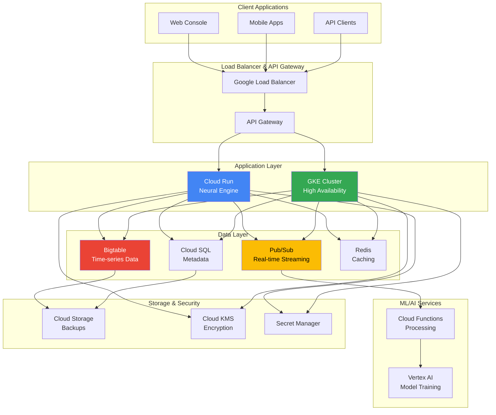

import { Steps, Tabs, Callout } from 'nextra/components'

# Deployment Guide

This guide covers deploying NeuraScale across different environments, from local development to production-ready cloud infrastructure on Google Cloud Platform (GCP).

## Deployment Overview

NeuraScale uses a multi-environment deployment strategy with infrastructure as code:

<div className="nx-grid nx-mt-6 nx-gap-4 md:nx-grid-cols-3">
  <div className="nx-border nx-border-gray-200 dark:nx-border-gray-800 nx-rounded-lg nx-p-4">
    <h3 className="nx-font-semibold nx-mb-2">Development</h3>
    <div className="nx-text-sm nx-text-gray-600 dark:nx-text-gray-400 nx-mb-2">
      Local Docker Compose setup for rapid development
    </div>
    <a href="#local-development" className="nx-text-primary-600 nx-text-sm">
      Setup Guide →
    </a>
  </div>

  <div className="nx-border nx-border-gray-200 dark:nx-border-gray-800 nx-rounded-lg nx-p-4">
    <h3 className="nx-font-semibold nx-mb-2">Staging</h3>
    <div className="nx-text-sm nx-text-gray-600 dark:nx-text-gray-400 nx-mb-2">
      GCP Cloud Run for testing and validation
    </div>
    <a href="#staging-deployment" className="nx-text-primary-600 nx-text-sm">
      Deploy →
    </a>
  </div>

  <div className="nx-border nx-border-gray-200 dark:nx-border-gray-800 nx-rounded-lg nx-p-4">
    <h3 className="nx-font-semibold nx-mb-2">Production</h3>
    <div className="nx-text-sm nx-text-gray-600 dark:nx-text-gray-400 nx-mb-2">
      GKE with Helm charts for high availability
    </div>
    <a href="#production-deployment" className="nx-text-primary-600 nx-text-sm">
      Deploy →
    </a>
  </div>
</div>

## Architecture Overview



## Local Development

For rapid development and testing, use Docker Compose to run all services locally.

<Steps>
### Prerequisites

Ensure you have:
- Docker & Docker Compose
- Python 3.12.11
- Node.js 18+
- Git

### Clone and Setup

```bash
git clone https://github.com/identity-wael/neurascale.git
cd neurascale

# Setup virtual environments
./scripts/dev-tools/setup-venvs.sh
```

### Start Infrastructure Services

```bash
# Start all infrastructure services
docker-compose up -d

# Verify services are running
docker-compose ps
```

**Services Started:**
- **TimescaleDB**: Time-series neural data storage
- **Redis**: Caching and real-time features
- **PostgreSQL**: Application metadata
- **MCP Server**: AI assistant integration
- **Pub/Sub Emulator**: Message queue for testing

### Start Neural Engine

```bash
cd neural-engine
source venv/bin/activate
python -m src.main
```

The Neural Engine will be available at: http://localhost:8000

### Start Console (Optional)

```bash
cd console
npm install
npm run dev
```

The Console will be available at: http://localhost:3000

### Verify Installation

```bash
# Health check
curl http://localhost:8000/health

# Create test device
curl -X POST http://localhost:8000/api/v1/devices \
  -H "Content-Type: application/json" \
  -d '{"device_id": "test-001", "device_type": "synthetic"}'

# Start streaming
curl -X POST http://localhost:8000/api/v1/devices/test-001/stream/start
```
</Steps>

## Staging Deployment

Staging environment uses GCP Cloud Run for easy deployment and testing with production-like infrastructure.

<Steps>
### Setup GCP Project

```bash
# Set staging project
gcloud config set project staging-neurascale

# Enable required APIs
gcloud services enable \
  run.googleapis.com \
  bigtable.googleapis.com \
  pubsub.googleapis.com \
  sql-component.googleapis.com \
  secretmanager.googleapis.com
```

### Deploy Infrastructure

```bash
cd neural-engine/terraform

# Initialize Terraform for staging
terraform init -backend-config=backend-configs/staging.hcl

# Plan deployment
terraform plan -var-file="environments/staging.tfvars"

# Apply infrastructure
terraform apply -var-file="environments/staging.tfvars"
```

**Resources Created:**
- Cloud Run service for Neural Engine
- Bigtable instance for time-series data
- Cloud SQL (PostgreSQL) for metadata
- Pub/Sub topics for real-time streaming
- Secret Manager for configuration
- Redis instance for caching

### Deploy Application

```bash
# Build and deploy to Cloud Run
gcloud run deploy neural-engine \
  --source . \
  --platform managed \
  --region us-central1 \
  --allow-unauthenticated \
  --set-env-vars ENV=staging \
  --memory 2Gi \
  --cpu 2 \
  --max-instances 10
```

### Configure Secrets

```bash
# Store database connection string
gcloud secrets create db-connection-string \
  --data-file=staging-db-config.txt

# Store API keys
gcloud secrets create api-keys \
  --data-file=staging-api-keys.json

# Grant Cloud Run access to secrets
gcloud run services add-iam-policy-binding neural-engine \
  --member=serviceAccount:neural-engine@staging-neurascale.iam.gserviceaccount.com \
  --role=roles/secretmanager.secretAccessor
```

### Test Deployment

```bash
# Get service URL
SERVICE_URL=$(gcloud run services describe neural-engine \
  --region=us-central1 \
  --format='value(status.url)')

# Health check
curl $SERVICE_URL/health

# API test
curl $SERVICE_URL/api/v1/status
```
</Steps>

## Production Deployment

Production deployment uses Google Kubernetes Engine (GKE) with Helm charts for high availability, auto-scaling, and production-grade features.

<Steps>
### Setup Production Environment

```bash
# Set production project
gcloud config set project production-neurascale

# Enable required APIs
gcloud services enable \
  container.googleapis.com \
  bigtable.googleapis.com \
  sql-component.googleapis.com \
  monitoring.googleapis.com \
  logging.googleapis.com
```

### Deploy Infrastructure

```bash
cd neural-engine/terraform

# Initialize for production
terraform init -backend-config=backend-configs/production.hcl

# Plan with production variables
terraform plan -var-file="environments/production.tfvars"

# Apply infrastructure (requires approval)
terraform apply -var-file="environments/production.tfvars"
```

**Production Infrastructure:**
- **GKE Cluster**: 3 nodes, auto-scaling 1-10
- **Bigtable Cluster**: Multi-region replication
- **Cloud SQL**: High availability with read replicas
- **Redis Cluster**: 3 nodes with failover
- **Load Balancer**: Global HTTPS load balancer
- **Monitoring**: Cloud Monitoring and Alerting
- **Backup**: Automated daily backups

### Connect to GKE Cluster

```bash
# Get cluster credentials
gcloud container clusters get-credentials neural-engine-prod \
  --region us-central1

# Verify connection
kubectl get nodes
```

### Deploy with Helm

```bash
cd kubernetes/helm

# Add dependencies
helm dependency update neural-engine/

# Install Neural Engine
helm install neural-engine ./neural-engine/ \
  --namespace neural-engine \
  --create-namespace \
  --values neural-engine/values-production.yaml \
  --set image.tag=$IMAGE_TAG \
  --set database.host=$DB_HOST \
  --set bigtable.project=$GCP_PROJECT
```

### Configure Production Secrets

```bash
# Create Kubernetes secrets
kubectl create secret generic neural-engine-secrets \
  --from-literal=db-password=$DB_PASSWORD \
  --from-literal=jwt-secret=$JWT_SECRET \
  --from-literal=api-key=$API_KEY \
  --namespace neural-engine

# Create TLS certificate secret
kubectl create secret tls neural-engine-tls \
  --cert=tls.crt \
  --key=tls.key \
  --namespace neural-engine
```

### Setup Monitoring

```bash
# Deploy monitoring stack
kubectl apply -f infrastructure/k8s/monitoring/

# Port forward to Grafana
kubectl port-forward svc/grafana 3000:3000 -n monitoring

# Access Grafana at http://localhost:3000
# Default: admin/admin
```

### Configure Auto-scaling

```bash
# Apply HPA (Horizontal Pod Autoscaler)
kubectl apply -f - <<EOF
apiVersion: autoscaling/v2
kind: HorizontalPodAutoscaler
metadata:
  name: neural-engine-hpa
  namespace: neural-engine
spec:
  scaleTargetRef:
    apiVersion: apps/v1
    kind: Deployment
    name: neural-engine
  minReplicas: 3
  maxReplicas: 20
  metrics:
  - type: Resource
    resource:
      name: cpu
      target:
        type: Utilization
        averageUtilization: 70
  - type: Resource
    resource:
      name: memory
      target:
        type: Utilization
        averageUtilization: 80
EOF
```

### Verify Production Deployment

```bash
# Check deployment status
kubectl get deployments -n neural-engine

# Check pods
kubectl get pods -n neural-engine

# Check services
kubectl get services -n neural-engine

# Check ingress
kubectl get ingress -n neural-engine

# View logs
kubectl logs -f deployment/neural-engine -n neural-engine

# Test external access
curl https://api.neurascale.io/health
```
</Steps>

## Deployment Environments

### Environment Configuration

<Tabs items={['Development', 'Staging', 'Production']}>
  <Tabs.Tab>
    **Development Environment**

    | Resource | Configuration | Purpose |
    |----------|---------------|---------|
    | **Compute** | Docker Compose | Local development |
    | **Database** | PostgreSQL container | Quick setup |
    | **Time-series** | TimescaleDB container | Local testing |
    | **Cache** | Redis container | Fast iteration |
    | **Message Queue** | Pub/Sub emulator | Offline development |
    | **Storage** | Local filesystem | No cloud costs |

    ```yaml
    # docker-compose.yml
    version: '3.8'
    services:
      postgresql:
        image: postgres:15
        environment:
          POSTGRES_DB: neurascale_dev
          POSTGRES_USER: neurascale
          POSTGRES_PASSWORD: dev_password
        ports:
          - "5432:5432"

      timescaledb:
        image: timescale/timescaledb:latest-pg15
        environment:
          POSTGRES_DB: timeseries_dev
          POSTGRES_USER: timescale
          POSTGRES_PASSWORD: dev_password
        ports:
          - "5433:5432"

      redis:
        image: redis:7-alpine
        ports:
          - "6379:6379"
    ```
  </Tabs.Tab>

  <Tabs.Tab>
    **Staging Environment**

    | Resource | Configuration | Purpose |
    |----------|---------------|---------|
    | **Compute** | Cloud Run (2 CPU, 2GB) | Integration testing |
    | **Database** | Cloud SQL (db-n1-standard-2) | Production-like |
    | **Time-series** | Bigtable (1 node) | Scalability testing |
    | **Cache** | Memorystore Redis (1GB) | Performance testing |
    | **Message Queue** | Pub/Sub | Real message queue |
    | **Storage** | Cloud Storage | Cloud integration |

    ```bash
    # Terraform variables for staging
    project_id = "staging-neurascale"
    region = "us-central1"
    environment = "staging"

    # Cloud Run
    cloud_run_cpu = 2
    cloud_run_memory = "2Gi"
    cloud_run_max_instances = 10

    # Bigtable
    bigtable_num_nodes = 1
    bigtable_storage_type = "HDD"

    # Cloud SQL
    db_tier = "db-n1-standard-2"
    db_disk_size = 20
    db_backup_enabled = true
    ```
  </Tabs.Tab>

  <Tabs.Tab>
    **Production Environment**

    | Resource | Configuration | Purpose |
    |----------|---------------|---------|
    | **Compute** | GKE (3-20 nodes) | High availability |
    | **Database** | Cloud SQL HA (db-n1-standard-4) | Mission critical |
    | **Time-series** | Bigtable cluster (3 nodes) | High performance |
    | **Cache** | Redis cluster (3 nodes) | High availability |
    | **Message Queue** | Pub/Sub (multi-region) | Reliability |
    | **Storage** | Cloud Storage (multi-region) | Data durability |

    ```bash
    # Terraform variables for production
    project_id = "production-neurascale"
    region = "us-central1"
    environment = "production"

    # GKE
    gke_num_nodes = 3
    gke_min_nodes = 1
    gke_max_nodes = 20
    gke_machine_type = "n1-standard-4"
    gke_preemptible = false

    # Bigtable
    bigtable_num_nodes = 3
    bigtable_storage_type = "SSD"
    bigtable_replication_enabled = true

    # Cloud SQL
    db_tier = "db-n1-standard-4"
    db_disk_size = 100
    db_ha_enabled = true
    db_backup_retention_days = 30
    ```
  </Tabs.Tab>
</Tabs>

## CI/CD Pipeline

### GitHub Actions Workflow

```yaml
# .github/workflows/deploy.yml
name: Deploy NeuraScale

on:
  push:
    branches: [main, develop]
  pull_request:
    branches: [main]

jobs:
  test:
    runs-on: ubuntu-latest
    steps:
      - uses: actions/checkout@v4
      - name: Setup Python 3.12.11
        uses: actions/setup-python@v4
        with:
          python-version: '3.12.11'

      - name: Install dependencies
        run: |
          cd neural-engine
          pip install -r requirements.txt
          pip install -r requirements-dev.txt

      - name: Run tests
        run: |
          cd neural-engine
          pytest tests/ --cov=src --cov-report=xml

      - name: Upload coverage
        uses: codecov/codecov-action@v3

  deploy-staging:
    if: github.ref == 'refs/heads/develop'
    needs: test
    runs-on: ubuntu-latest
    steps:
      - uses: actions/checkout@v4

      - name: Setup Google Cloud
        uses: google-github-actions/auth@v1
        with:
          credentials_json: ${{ secrets.GCP_SA_KEY_STAGING }}

      - name: Deploy to Cloud Run
        run: |
          gcloud run deploy neural-engine \
            --source . \
            --platform managed \
            --region us-central1 \
            --project staging-neurascale

  deploy-production:
    if: github.ref == 'refs/heads/main'
    needs: test
    runs-on: ubuntu-latest
    environment: production
    steps:
      - uses: actions/checkout@v4

      - name: Setup Google Cloud
        uses: google-github-actions/auth@v1
        with:
          credentials_json: ${{ secrets.GCP_SA_KEY_PRODUCTION }}

      - name: Setup Helm
        uses: azure/setup-helm@v3
        with:
          version: '3.12.0'

      - name: Deploy to GKE
        run: |
          gcloud container clusters get-credentials neural-engine-prod \
            --region us-central1 \
            --project production-neurascale

          helm upgrade --install neural-engine \
            kubernetes/helm/neural-engine/ \
            --namespace neural-engine \
            --create-namespace \
            --values kubernetes/helm/neural-engine/values-production.yaml \
            --set image.tag=${{ github.sha }}
```

## Rollback Procedures

### Cloud Run Rollback

```bash
# List revisions
gcloud run revisions list --service=neural-engine

# Rollback to previous revision
gcloud run services update-traffic neural-engine \
  --to-revisions=neural-engine-00042-xyz=100

# Zero-downtime rollback
gcloud run services update-traffic neural-engine \
  --to-revisions=neural-engine-00042-xyz=50,neural-engine-00043-abc=50

# Complete rollback after verification
gcloud run services update-traffic neural-engine \
  --to-revisions=neural-engine-00042-xyz=100
```

### GKE Rollback

```bash
# Check rollout history
kubectl rollout history deployment/neural-engine -n neural-engine

# Rollback to previous version
kubectl rollout undo deployment/neural-engine -n neural-engine

# Rollback to specific revision
kubectl rollout undo deployment/neural-engine \
  --to-revision=2 -n neural-engine

# Monitor rollback status
kubectl rollout status deployment/neural-engine -n neural-engine
```

### Helm Rollback

```bash
# List releases
helm list -n neural-engine

# Check release history
helm history neural-engine -n neural-engine

# Rollback to previous release
helm rollback neural-engine -n neural-engine

# Rollback to specific revision
helm rollback neural-engine 2 -n neural-engine
```

## Monitoring and Observability

### Health Checks

```bash
# Application health
curl https://api.neurascale.io/health

# Database connectivity
curl https://api.neurascale.io/health/database

# External dependencies
curl https://api.neurascale.io/health/dependencies

# Kubernetes liveness probe
kubectl describe pod neural-engine-xxx -n neural-engine
```

### Key Metrics to Monitor

| Metric | Threshold | Alert |
|--------|-----------|-------|
| **Response Time** | p99 < 500ms | Critical |
| **Error Rate** | < 1% | Warning |
| **CPU Utilization** | < 80% | Warning |
| **Memory Usage** | < 85% | Warning |
| **Disk Usage** | < 90% | Critical |
| **Active Connections** | < 1000 | Info |

### Log Aggregation

```bash
# View Cloud Run logs
gcloud logs read "resource.type=cloud_run_revision" \
  --project=production-neurascale \
  --format="value(textPayload)"

# View GKE logs
kubectl logs -f deployment/neural-engine -n neural-engine

# Search logs in Cloud Logging
gcloud logs read 'resource.type="k8s_container"
  resource.labels.namespace_name="neural-engine"' \
  --format="value(textPayload)"
```

<Callout type="info">
  For detailed monitoring setup, see our [Monitoring Guide](/docs/monitoring) with Grafana dashboards and alerting rules.
</Callout>

## Security Considerations

### Network Security

- **Private GKE cluster** with authorized networks
- **VPC firewall rules** restricting access
- **Cloud Armor** for DDoS protection
- **TLS termination** at load balancer

### Data Security

- **Encryption at rest** using Cloud KMS
- **Encryption in transit** with TLS 1.3
- **Secret management** with Secret Manager
- **IAM roles** with least privilege

### Compliance

- **HIPAA compliance** for medical data
- **SOC 2 Type II** certification
- **Audit logging** for all data access
- **Data retention** policies

## Disaster Recovery

### Backup Strategy

```bash
# Database backups (automated)
gcloud sql backups list --instance=neurascale-prod

# Manual backup
gcloud sql backups create --instance=neurascale-prod

# Bigtable backups
gcloud bigtable backups create backup-20240115 \
  --instance=neurascale-prod \
  --cluster=neurascale-cluster \
  --table=neural_data

# Application data backup
gsutil -m cp -r gs://neurascale-prod-data \
  gs://neurascale-backup/$(date +%Y%m%d)
```

### Recovery Procedures

1. **Database Recovery**
   ```bash
   # Restore from backup
   gcloud sql backups restore BACKUP_ID \
     --restore-instance=neurascale-prod
   ```

2. **Application Recovery**
   ```bash
   # Redeploy last known good version
   helm rollback neural-engine -n neural-engine
   ```

3. **Data Recovery**
   ```bash
   # Restore from backup
   gsutil -m cp -r gs://neurascale-backup/20240115 \
     gs://neurascale-prod-data
   ```

## Troubleshooting

### Common Issues

<Callout type="error" title="Deployment Fails">
  **Issue**: Deployment fails with resource limits

  **Solution**:
  ```bash
  # Check resource quotas
  gcloud compute project-info describe --project=production-neurascale

  # Request quota increase if needed
  gcloud alpha compute quotas update
  ```
</Callout>

<Callout type="error" title="Database Connection Errors">
  **Issue**: Cannot connect to Cloud SQL

  **Solution**:
  ```bash
  # Check Cloud SQL status
  gcloud sql instances describe neurascale-prod

  # Verify network connectivity
  gcloud sql instances describe neurascale-prod \
    --format="get(ipAddresses[0].ipAddress)"

  # Check IAM permissions
  gcloud projects get-iam-policy production-neurascale
  ```
</Callout>

<Callout type="error" title="Pod Startup Issues">
  **Issue**: Pods fail to start in GKE

  **Solution**:
  ```bash
  # Check pod status
  kubectl describe pod neural-engine-xxx -n neural-engine

  # Check events
  kubectl get events -n neural-engine --sort-by='.lastTimestamp'

  # Check resource limits
  kubectl top pods -n neural-engine
  ```
</Callout>

## Getting Help

- **Documentation**: [docs.neurascale.io/deployment](https://docs.neurascale.io/deployment)
- **GitHub Issues**: [Report deployment issues](https://github.com/identity-wael/neurascale/issues)
- **Support**: [support@neurascale.io](mailto:support@neurascale.io)
- **Emergency**: Use the incident response runbook in the repository

Ready to deploy NeuraScale? Start with local development and work your way up to production!
