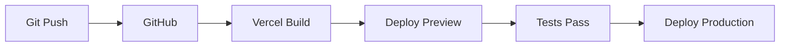

import { Steps, Tabs, Callout } from 'nextra/components'

# Deployment Guide

Complete guide for deploying NeuraScale to production using Vercel.

## Prerequisites

Before deploying, ensure you have:

- ✅ GitHub repository set up
- ✅ Vercel account created
- ✅ Environment variables ready
- ✅ Sanity project configured
- ✅ Domain name (optional)

## Deployment Options

### Deployment Methods

- **[🚀 One-Click Deploy](#option-1-one-click-deploy-recommended)** - Deploy with Vercel button - fastest setup
- **[📊 Vercel Dashboard](#option-2-vercel-dashboard)** - Import and configure through web interface
- **[💻 Vercel CLI](#option-3-vercel-cli)** - Deploy from command line

### Option 1: One-Click Deploy (Recommended)

[](https://vercel.com/new/clone?repository-url=https://github.com/identity-wael/neurascale&env=NEXT_PUBLIC_SANITY_PROJECT_ID,NEXT_PUBLIC_SANITY_DATASET,NEXT_PUBLIC_SANITY_API_VERSION&root-directory=apps/web)

<Steps>
### Click the Deploy Button
Click the button above to start deployment

### Connect GitHub Account
Authorize Vercel to access your GitHub

### Configure Environment Variables
Add your Sanity project credentials

### Deploy
Click deploy and wait for completion
</Steps>

### Option 2: Vercel Dashboard

<Steps>
### Import Project

- Go to [vercel.com/new](https://vercel.com/new)
- Import Git Repository
- Select `neurascale` repository

### Configure Project

```
Root Directory: apps/web
Framework Preset: Next.js
Build Command: (auto-detected)
Output Directory: (auto-detected)
Install Command: (auto-detected)
```

### Environment Variables

Add required variables:
- `NEXT_PUBLIC_SANITY_PROJECT_ID`
- `NEXT_PUBLIC_SANITY_DATASET`
- `NEXT_PUBLIC_SANITY_API_VERSION`

### Deploy

Click "Deploy" and wait for completion
</Steps>

### Option 3: Vercel CLI

```bash
# Install Vercel CLI
npm i -g vercel

# Login to Vercel
vercel login

# Deploy from project root
cd neurascale
vercel --cwd apps/web

# Follow prompts:
# - Set up and deploy: Y
# - Which scope: (your-account)
# - Link to existing project: N
# - Project name: neurascale
# - Root directory: ./apps/web
# - Override settings: N
```

## Configuration Details

### Build Settings

```json filename="vercel.json"
{
  "buildCommand": "npm run build",
  "outputDirectory": ".next",
  "devCommand": "npm run dev",
  "installCommand": "npm install",
  "framework": "nextjs"
}
```

### Root Directory Structure

```
apps/web/           # ← Set as root directory
├── app/
├── components/
├── public/
├── src/
├── package.json
└── next.config.ts
```

### Environment Variables

<Tabs items={['Production', 'Development']}>
  <Tabs.Tab>
```bash
# Required
NEXT_PUBLIC_SANITY_PROJECT_ID=vvsy01fb
NEXT_PUBLIC_SANITY_DATASET=production
NEXT_PUBLIC_SANITY_API_VERSION=2024-01-01

# Optional
SANITY_API_TOKEN=sk...
EMAIL_USER=contact@neurascale.com
# EMAIL_PASS - See environment variables documentation
NEXT_PUBLIC_GOOGLE_MAPS_API_KEY=AIza...
NEXT_PUBLIC_GA4_MEASUREMENT_ID=G-XXXXXXXX
```
  </Tabs.Tab>
  <Tabs.Tab>
```bash
# Development overrides
NEXT_PUBLIC_SANITY_DATASET=development
VERCEL_ENV=development
```
  </Tabs.Tab>
</Tabs>

#### Variable Scopes

- **Production**: Live site
- **Preview**: PR previews
- **Development**: Local dev overrides

## Domain Configuration

### Adding Custom Domain

<Steps>
### In Vercel Dashboard

- Go to Project Settings → Domains
- Add your domain: `neurascale.com`
- Add www subdomain: `www.neurascale.com`

### DNS Configuration

```
# A Records (for apex domain)
@ A 76.76.21.21

# CNAME (for subdomains)
www CNAME cname.vercel-dns.com
```

### SSL Certificate

- Automatic via Let's Encrypt
- No configuration needed
</Steps>

### Domain Providers

<Tabs items={['Cloudflare', 'Namecheap']}>
  <Tabs.Tab>
1. Set SSL/TLS to "Full"
2. Disable proxying initially
3. Add Vercel's IPs
  </Tabs.Tab>
  <Tabs.Tab>
1. Use custom DNS
2. Point to Vercel nameservers
3. Wait for propagation
  </Tabs.Tab>
</Tabs>

## Deployment Workflow

### Automatic Deployments



### Branch Deployments

| Branch      | URL                    | Purpose    |
| ----------- | ---------------------- | ---------- |
| `main`      | neurascale.com         | Production |
| `develop`   | develop.neurascale.com | Staging    |
| PR branches | pr-123.neurascale.com  | Preview    |

### Preview Deployments

Every PR gets:

- Unique preview URL
- Isolated environment
- Comment with links
- Automatic updates

## Performance Optimization

### Image Optimization

```typescript filename="next.config.ts"
module.exports = {
  images: {
    domains: ["cdn.sanity.io"],
    formats: ["image/avif", "image/webp"],
  },
};
```

### Edge Functions

```typescript filename="app/api/edge/route.ts"
export const runtime = "edge";

export async function GET() {
  return new Response("Hello from the edge!");
}
```

### Caching Strategy

```typescript
// ISR (Incremental Static Regeneration)
export const revalidate = 3600; // 1 hour

// On-demand revalidation
export async function POST() {
  revalidatePath("/");
  return Response.json({ revalidated: true });
}
```

## Monitoring & Analytics

### Vercel Analytics

<Steps>
### Enable in Dashboard
Go to project settings and enable analytics

### No Code Changes
Analytics work automatically

### View Metrics
- Real User Metrics (RUM)
- Web Vitals tracking
</Steps>

### Speed Insights

```bash
# Install
npm i @vercel/speed-insights
```

```typescript filename="app/layout.tsx"
import { SpeedInsights } from '@vercel/speed-insights/next'

export default function RootLayout() {
  return (
    <html>
      <body>
        {children}
        <SpeedInsights />
      </body>
    </html>
  )
}
```

### Custom Analytics

```typescript filename="lib/analytics.ts"
export function trackEvent(name: string, properties?: any) {
  if (typeof window !== "undefined") {
    // Google Analytics
    window.gtag?.("event", name, properties);

    // Vercel Analytics
    window.va?.("event", { name, ...properties });
  }
}
```

## Troubleshooting

### Build Failures

<Callout type="error">
**"Module not found"**

```bash
# Clear cache and reinstall
rm -rf node_modules package-lock.json
npm install
```
</Callout>

<Callout type="error">
**"Build exceeded memory limit"**

```json filename="vercel.json"
{
  "functions": {
    "app/api/*": {
      "maxDuration": 60,
      "memory": 3008
    }
  }
}
```
</Callout>

<Callout type="warning">
**Environment Variable Issues**

- Check variable names (case-sensitive)
- Ensure no trailing spaces
- Verify in Function Logs
</Callout>

### Runtime Errors

#### 500 Errors

1. Check Function Logs
2. Verify environment variables
3. Test locally with production build

#### CORS Issues

```typescript filename="next.config.ts"
module.exports = {
  async headers() {
    return [
      {
        source: "/api/:path*",
        headers: [{ key: "Access-Control-Allow-Origin", value: "*" }],
      },
    ];
  },
};
```

## Security Checklist

- [ ] Environment variables set correctly
- [ ] API routes protected
- [ ] CORS configured properly
- [ ] Content Security Policy (CSP) headers
- [ ] Rate limiting implemented
- [ ] Secrets rotated regularly

### Security Headers

```typescript filename="next.config.ts"
const securityHeaders = [
  {
    key: "X-Frame-Options",
    value: "SAMEORIGIN",
  },
  {
    key: "X-Content-Type-Options",
    value: "nosniff",
  },
  {
    key: "Referrer-Policy",
    value: "origin-when-cross-origin",
  },
];
```

## Rollback Strategy

### Instant Rollback

<Steps>
### Go to Vercel Dashboard
Navigate to your project deployments

### Select Previous Deployment
Find the stable deployment

### Promote to Production
Click "..." menu → "Promote to Production"
</Steps>

### Git Revert

```bash
# Revert last commit
git revert HEAD
git push origin main

# Revert specific commit
git revert <commit-hash>
git push origin main
```

## Cost Optimization

### Vercel Pricing

| Plan       | Price     | Use Case           |
| ---------- | --------- | ------------------ |
| Hobby      | Free      | Personal projects  |
| Pro        | $20/month | Commercial use     |
| Enterprise | Custom    | Large scale        |

### Optimization Tips

1. **Use ISR instead of SSR**
2. **Implement proper caching**
3. **Optimize images**
4. **Minimize API calls**
5. **Use Edge Functions**

## CI/CD Integration

### GitHub Actions

```yaml filename=".github/workflows/deploy.yml"
name: Deploy to Vercel
on:
  push:
    branches: [main]

jobs:
  deploy:
    runs-on: ubuntu-latest
    steps:
      - uses: actions/checkout@v3
      - uses: vercel/action@v25
        with:
          vercel-token: ${{ secrets.VERCEL_TOKEN }}
          vercel-org-id: ${{ secrets.ORG_ID }}
          vercel-project-id: ${{ secrets.PROJECT_ID }}
```

## Resources

- [Vercel Documentation](https://vercel.com/docs)
- [Next.js Deployment](https://nextjs.org/docs/deployment)
- [Vercel CLI Reference](https://vercel.com/docs/cli)
- [Troubleshooting Guide](https://vercel.com/docs/troubleshooting)
