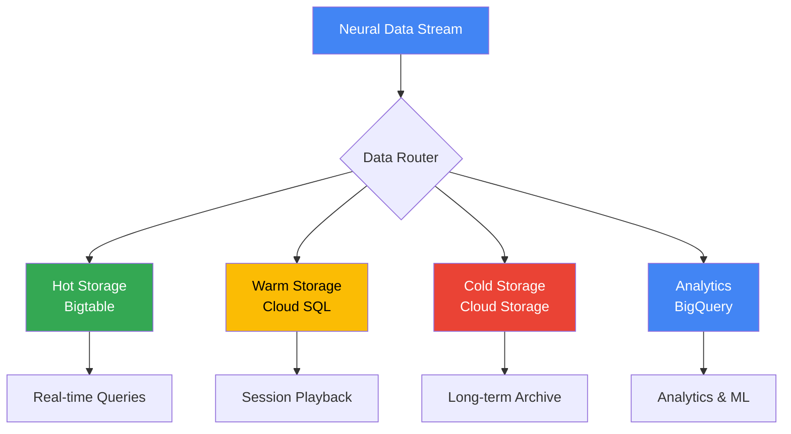
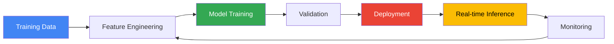
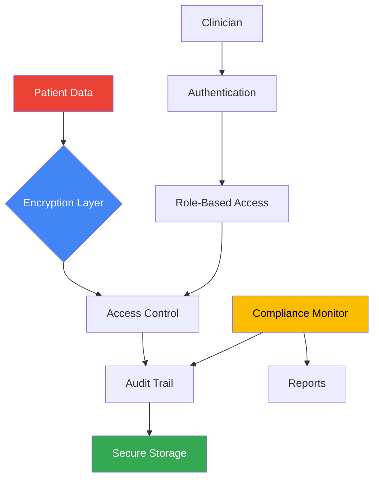
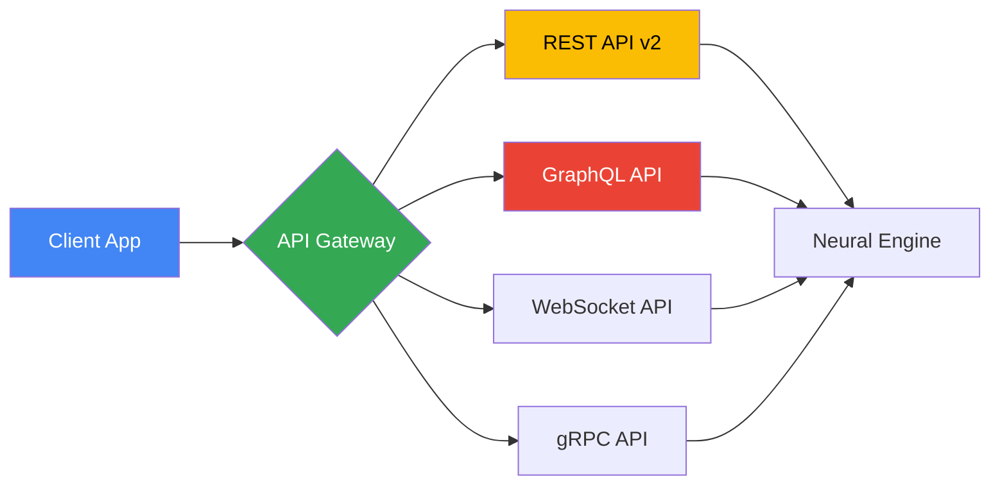

import { Tabs, Callout } from 'nextra/components'

# Platform Features

NeuraScale provides a comprehensive suite of features designed for researchers, clinicians, and developers working with brain-computer interfaces. Our platform combines cutting-edge neural signal processing with enterprise-grade infrastructure.

## Feature Categories

<div className="nx-grid nx-mt-6 nx-gap-4 md:nx-grid-cols-2 lg:nx-grid-cols-3">
  <div className="nx-border nx-border-gray-200 dark:nx-border-gray-800 nx-rounded-lg nx-p-4">
    <h3 className="nx-font-semibold nx-mb-2">Device Integration</h3>
    <div className="nx-text-sm nx-text-gray-600 dark:nx-text-gray-400 nx-mb-2">
      Universal support for 30+ BCI devices with plug-and-play connectivity
    </div>
    <a href="#device-integration" className="nx-text-primary-600 nx-text-sm">
      Learn more →
    </a>
  </div>

  <div className="nx-border nx-border-gray-200 dark:nx-border-gray-800 nx-rounded-lg nx-p-4">
    <h3 className="nx-font-semibold nx-mb-2">Data Processing</h3>
    <div className="nx-text-sm nx-text-gray-600 dark:nx-text-gray-400 nx-mb-2">
      Real-time signal processing with sub-100ms latency
    </div>
    <a href="#data-processing" className="nx-text-primary-600 nx-text-sm">
      Learn more →
    </a>
  </div>

  <div className="nx-border nx-border-gray-200 dark:nx-border-gray-800 nx-rounded-lg nx-p-4">
    <h3 className="nx-font-semibold nx-mb-2">Storage & Analytics</h3>
    <div className="nx-text-sm nx-text-gray-600 dark:nx-text-gray-400 nx-mb-2">
      Scalable time-series storage with advanced analytics
    </div>
    <a href="#storage-analytics" className="nx-text-primary-600 nx-text-sm">
      Learn more →
    </a>
  </div>

  <div className="nx-border nx-border-gray-200 dark:nx-border-gray-800 nx-rounded-lg nx-p-4">
    <h3 className="nx-font-semibold nx-mb-2">ML/AI Capabilities</h3>
    <div className="nx-text-sm nx-text-gray-600 dark:nx-text-gray-400 nx-mb-2">
      Real-time classification and custom model deployment
    </div>
    <a href="#mlai-capabilities" className="nx-text-primary-600 nx-text-sm">
      Learn more →
    </a>
  </div>

  <div className="nx-border nx-border-gray-200 dark:nx-border-gray-800 nx-rounded-lg nx-p-4">
    <h3 className="nx-font-semibold nx-mb-2">Clinical Features</h3>
    <div className="nx-text-sm nx-text-gray-600 dark:nx-text-gray-400 nx-mb-2">
      HIPAA-compliant data handling for medical applications
    </div>
    <a href="#clinical-features" className="nx-text-primary-600 nx-text-sm">
      Learn more →
    </a>
  </div>

  <div className="nx-border nx-border-gray-200 dark:nx-border-gray-800 nx-rounded-lg nx-p-4">
    <h3 className="nx-font-semibold nx-mb-2">Developer Tools</h3>
    <div className="nx-text-sm nx-text-gray-600 dark:nx-text-gray-400 nx-mb-2">
      Comprehensive APIs, SDKs, and integration options
    </div>
    <a href="#developer-tools" className="nx-text-primary-600 nx-text-sm">
      Learn more →
    </a>
  </div>
</div>

## Device Integration

### Supported Devices

<Tabs items={['Consumer', 'Research', 'Clinical', 'Custom']}>
  <Tabs.Tab>
    **Consumer-Grade Devices**
    - Emotiv EPOC X (14 channels)
    - Emotiv Insight (5 channels)
    - NeuroSky MindWave
    - Muse 2 (4 channels)
    - OpenBCI Cyton (8/16 channels)
    - OpenBCI Ganglion (4 channels)

    <Callout type="info">
      Consumer devices are perfect for prototyping and educational purposes
    </Callout>
  </Tabs.Tab>

  <Tabs.Tab>
    **Research-Grade Devices**
    - g.tec g.USBamp (up to 256 channels)
    - BrainProducts actiCHamp (up to 160 channels)
    - ANT Neuro eego (up to 256 channels)
    - Cognionics Quick-20/30
    - mBrainTrain SMARTING (24 channels)
    - Wearable Sensing DSI-24

    <Callout type="info">
      Research devices offer higher channel counts and sampling rates
    </Callout>
  </Tabs.Tab>

  <Tabs.Tab>
    **Clinical-Grade Devices**
    - Natus Quantum Amplifier
    - Nihon Kohden EEG systems
    - Cadwell EEG systems
    - Compumedics Grael (up to 256 channels)
    - Clinical TMS systems
    - tDCS/tACS stimulators

    <Callout type="warning">
      Clinical devices require proper certification and trained operators
    </Callout>
  </Tabs.Tab>

  <Tabs.Tab>
    **Custom Integration**
    - Lab Streaming Layer (LSL) compatible devices
    - Custom hardware via SDK
    - Arduino/Raspberry Pi based systems
    - Research prototypes
    - Proprietary systems via adapter

    ```python
    # Example custom device integration
    from neurascale.devices import CustomDevice

    class MyCustomBCI(CustomDevice):
        def __init__(self):
            super().__init__(
                channels=32,
                sampling_rate=1000,
                device_type="EEG"
            )
    ```
  </Tabs.Tab>
</Tabs>

### Key Integration Features

- **Auto-Discovery**: Automatic device detection via USB, Bluetooth, or network
- **Plug-and-Play**: Zero-configuration setup for supported devices
- **Hot-Swapping**: Connect/disconnect devices without restarting
- **Multi-Device**: Simultaneous connection to multiple devices
- **Impedance Check**: Real-time electrode impedance monitoring
- **Calibration**: Automated and manual calibration workflows

## Data Processing

### Real-Time Signal Processing Pipeline


### Processing Capabilities

<Tabs items={['Filtering', 'Feature Extraction', 'Artifact Removal', 'Real-Time Analysis']}>
  <Tabs.Tab>
    **Digital Filtering Options**

    - **Bandpass Filters**
      - Butterworth (2nd-8th order)
      - Chebyshev Type I & II
      - Elliptic filters
      - Custom frequency bands

    - **Notch Filters**
      - 50/60 Hz powerline noise
      - Harmonic removal
      - Adaptive notch filtering

    - **Specialized Filters**
      - Wavelet denoising
      - Kalman filtering
      - Savitzky-Golay smoothing

    ```python
    # Example filter configuration
    filter_config = {
        "type": "butterworth",
        "order": 4,
        "lowcut": 0.5,
        "highcut": 100,
        "sampling_rate": 1000
    }
    ```
  </Tabs.Tab>

  <Tabs.Tab>
    **Feature Extraction Methods**

    - **Time Domain**
      - Statistical features (mean, variance, skewness)
      - Peak detection and counting
      - Zero-crossing rate
      - Hjorth parameters

    - **Frequency Domain**
      - Power Spectral Density (PSD)
      - Band power (Delta, Theta, Alpha, Beta, Gamma)
      - Spectral edge frequency
      - Peak frequency analysis

    - **Time-Frequency**
      - Short-Time Fourier Transform (STFT)
      - Continuous Wavelet Transform (CWT)
      - Hilbert-Huang Transform
      - Wigner-Ville Distribution

    - **Connectivity**
      - Coherence analysis
      - Phase Locking Value (PLV)
      - Granger causality
      - Transfer entropy
  </Tabs.Tab>

  <Tabs.Tab>
    **Artifact Detection & Removal**

    - **EOG Artifacts**
      - Automatic eye blink detection
      - Regression-based removal
      - ICA-based correction

    - **EMG Artifacts**
      - High-frequency muscle noise
      - Jaw clenching detection
      - Adaptive filtering

    - **Motion Artifacts**
      - Accelerometer-based correction
      - Reference electrode subtraction
      - Template matching

    - **Environmental Noise**
      - Common mode rejection
      - Spatial filtering
      - Shielding effectiveness monitoring

    <Callout type="info">
      Our artifact removal preserves neural signal integrity while removing up to 95% of common artifacts
    </Callout>
  </Tabs.Tab>

  <Tabs.Tab>
    **Real-Time Analysis Tools**

    - **Event Detection**
      - Spike detection (Less than 1ms latency)
      - Seizure onset detection
      - Sleep stage classification
      - P300/SSVEP detection

    - **State Monitoring**
      - Vigilance/drowsiness detection
      - Cognitive load estimation
      - Emotional state classification
      - Meditation depth tracking

    - **Neurofeedback**
      - Real-time band power feedback
      - Coherence training
      - SMR/Beta enhancement
      - Alpha/Theta training

    - **Performance Metrics**
      - Processing latency: Less than 100ms
      - Throughput: 10,000+ channels
      - Accuracy: Greater than 95% for trained models
      - CPU usage: Less than 30% per 1000 channels
  </Tabs.Tab>
</Tabs>

### Processing Performance

| Metric | Performance | Notes |
|--------|------------|-------|
| Latency | Less than 100ms | End-to-end processing |
| Throughput | 10,000+ channels | With GPU acceleration |
| Sampling Rates | Up to 40 kHz | Device dependent |
| Filter Delay | Less than 10ms | For real-time filters |
| Feature Extraction | Less than 50ms | 1-second windows |

## Storage & Analytics

### Data Storage Architecture



### Storage Features

<Tabs items={['Time-Series Storage', 'Session Management', 'Data Export', 'Analytics']}>
  <Tabs.Tab>
    **High-Performance Time-Series Storage**

    - **Google Bigtable Integration**
      - Sub-millisecond latency reads
      - Automatic sharding and replication
      - Petabyte-scale capacity
      - Row-key optimization for time-series

    - **Data Organization**
      - Channel-based partitioning
      - Time-based indexing
      - Compression ratios up to 10:1
      - Automatic data tiering

    - **Performance Specs**
      - Write throughput: 1M+ samples/second
      - Read latency: Less than 1ms (hot data)
      - Storage efficiency: 2 bytes/sample
      - Retention: Configurable (1 day to 10 years)

    ```python
    # Example data access
    from neurascale.storage import TimeSeriesDB

    ts_db = TimeSeriesDB()
    data = ts_db.query(
        session_id="sess_123",
        channels=[1, 2, 3],
        start_time="2024-01-01T00:00:00",
        end_time="2024-01-01T01:00:00"
    )
    ```
  </Tabs.Tab>

  <Tabs.Tab>
    **Session Recording & Management**

    - **Session Features**
      - Automatic session detection
      - Metadata tagging
      - Multi-device synchronization
      - Session splitting/merging

    - **Playback Capabilities**
      - Variable speed playback (0.1x - 10x)
      - Synchronized multi-modal data
      - Annotation overlay
      - Event markers

    - **Session Analytics**
      - Duration statistics
      - Quality metrics
      - Data completeness
      - Artifact percentage

    - **Search & Discovery**
      - Full-text metadata search
      - Tag-based filtering
      - Date range queries
      - Patient/device grouping
  </Tabs.Tab>

  <Tabs.Tab>
    **Data Export Options**

    - **Standard Formats**
      - EDF/EDF+ (European Data Format)
      - BDF (BioSemi Data Format)
      - GDF (General Data Format)
      - HDF5 with metadata
      - CSV/TSV for analysis
      - MAT files for MATLAB

    - **Custom Exports**
      - Filtered/processed data
      - Downsampled versions
      - Event-triggered epochs
      - Feature matrices

    - **Batch Export**
      - Scheduled exports
      - Multi-session bundles
      - Compressed archives
      - Cloud storage integration

    ```bash
    # CLI export example
    neurascale export \
      --session-id sess_123 \
      --format edf \
      --channels 1-32 \
      --output ./exports/
    ```
  </Tabs.Tab>

  <Tabs.Tab>
    **Analytics Dashboard**

    - **Real-Time Metrics**
      - Active sessions count
      - Data throughput graphs
      - Device status overview
      - Error rate monitoring

    - **Historical Analytics**
      - Usage trends
      - Session statistics
      - Device utilization
      - Data quality metrics

    - **Custom Dashboards**
      - Drag-and-drop widgets
      - Custom visualizations
      - Shareable views
      - Export to PDF/PNG

    - **BigQuery Integration**
      - SQL queries on neural data
      - Custom aggregations
      - ML model training data
      - Cross-session analysis
  </Tabs.Tab>
</Tabs>

### Storage Performance

| Storage Tier | Latency | Cost | Use Case |
|-------------|---------|------|----------|
| Hot (Bigtable) | Less than 1ms | $$$ | Real-time streaming |
| Warm (Cloud SQL) | Less than 10ms | $$ | Recent sessions |
| Cold (Cloud Storage) | Less than 100ms | $ | Long-term archive |
| Analytics (BigQuery) | 1-5s | $$ | Complex queries |

## ML/AI Capabilities

### Machine Learning Pipeline



### AI/ML Features

<Tabs items={['Pre-trained Models', 'Custom Training', 'Real-time Inference', 'AutoML']}>
  <Tabs.Tab>
    **Ready-to-Use Models**

    - **Motor Imagery Classification**
      - Left/Right hand movement
      - Foot movement detection
      - Tongue movement
      - 4-class motor imagery
      - Accuracy: Greater than 85%

    - **Cognitive State Detection**
      - Attention/focus level
      - Cognitive workload
      - Drowsiness detection
      - Stress level monitoring
      - Accuracy: Greater than 90%

    - **Clinical Applications**
      - Seizure prediction (10-30min warning)
      - Sleep stage classification
      - Anesthesia depth monitoring
      - Pain level assessment

    - **BCI Paradigms**
      - P300 speller
      - SSVEP detection
      - Error-related potentials
      - Slow cortical potentials

    <Callout type="info">
      All models are validated on diverse datasets and include confidence scores
    </Callout>
  </Tabs.Tab>

  <Tabs.Tab>
    **Custom Model Training**

    - **Training Infrastructure**
      - GPU-accelerated training (V100/A100)
      - Distributed training support
      - Hyperparameter optimization
      - Cross-validation pipelines

    - **Supported Frameworks**
      - TensorFlow/Keras
      - PyTorch
      - Scikit-learn
      - XGBoost/LightGBM
      - Custom Python models

    - **Training Features**
      - Data augmentation
      - Transfer learning
      - Online learning
      - Federated learning support

    ```python
    # Custom model example
    from neurascale.ml import ModelTrainer

    trainer = ModelTrainer()
    model = trainer.train(
        data=training_data,
        labels=labels,
        model_type="cnn",
        epochs=100,
        validation_split=0.2
    )

    # Deploy trained model
    model.deploy(name="custom_classifier_v1")
    ```
  </Tabs.Tab>

  <Tabs.Tab>
    **Real-time Inference Engine**

    - **Performance Specs**
      - Latency: Less than 50ms end-to-end
      - Throughput: 10,000+ predictions/sec
      - Batch processing support
      - Auto-scaling based on load

    - **Inference Features**
      - Model versioning
      - A/B testing support
      - Fallback models
      - Ensemble predictions

    - **Edge Deployment**
      - Model quantization
      - ONNX export
      - TensorFlow Lite
      - Edge TPU support

    - **Monitoring**
      - Prediction latency tracking
      - Model drift detection
      - Feature importance
      - Accuracy monitoring
  </Tabs.Tab>

  <Tabs.Tab>
    **AutoML Capabilities**

    - **Automated Pipeline**
      - Feature selection
      - Model architecture search
      - Hyperparameter tuning
      - Ensemble creation

    - **Supported Tasks**
      - Binary classification
      - Multi-class classification
      - Regression
      - Time-series forecasting
      - Anomaly detection

    - **AutoML Process**
      1. Upload labeled data
      2. Select target metric
      3. Set time/resource budget
      4. Review and deploy best model

    - **Results Dashboard**
      - Model comparison
      - Feature importance
      - Confusion matrices
      - ROC/PR curves
      - Export to production
  </Tabs.Tab>
</Tabs>

### ML Performance Metrics

| Model Type | Latency | Accuracy | Use Case |
|------------|---------|----------|----------|
| Linear Models | Less than 10ms | 70-80% | Simple classification |
| Deep Learning | Less than 50ms | 85-95% | Complex patterns |
| Ensemble | Less than 100ms | 90-98% | High accuracy needs |
| Edge Models | Less than 20ms | 80-90% | Local processing |

## Clinical Features

### HIPAA-Compliant Infrastructure



### Clinical Compliance Features

<Tabs items={['Data Security', 'Patient Management', 'Clinical Workflows', 'Regulatory']}>
  <Tabs.Tab>
    **Healthcare Data Security**

    - **Encryption**
      - AES-256 at rest (Cloud KMS)
      - TLS 1.3 in transit
      - End-to-end encryption option
      - Key rotation every 90 days

    - **Access Control**
      - Multi-factor authentication
      - Role-based permissions
      - IP whitelisting
      - Session management

    - **Data Isolation**
      - Patient data segregation
      - Multi-tenancy support
      - Geographic restrictions
      - Data residency compliance

    - **Security Monitoring**
      - Real-time threat detection
      - Anomaly detection
      - Failed access alerts
      - Security audit reports
  </Tabs.Tab>

  <Tabs.Tab>
    **Patient Data Management**

    - **Patient Records**
      - Unique patient identifiers
      - Demographic information
      - Medical history integration
      - Consent management

    - **Data Privacy**
      - De-identification tools
      - Pseudonymization support
      - Right to deletion (GDPR)
      - Data portability

    - **Integration**
      - HL7 FHIR support
      - EHR/EMR connectivity
      - DICOM compatibility
      - Clinical trial systems

    ```python
    # Patient data example
    from neurascale.clinical import PatientManager

    pm = PatientManager()
    patient = pm.create_patient(
        external_id="MRN123456",
        consent_level="research",
        data_retention_days=365
    )
    ```
  </Tabs.Tab>

  <Tabs.Tab>
    **Clinical Workflow Support**

    - **Session Templates**
      - Pre-operative mapping
      - Seizure monitoring
      - Sleep studies
      - Cognitive assessment
      - Rehabilitation tracking

    - **Clinical Annotations**
      - Event marking tools
      - Seizure detection
      - Artifact notation
      - Clinical observations

    - **Reporting**
      - Automated report generation
      - Customizable templates
      - PDF/DICOM export
      - Integration with PACS

    - **Collaboration**
      - Multi-user sessions
      - Real-time consultation
      - Case sharing
      - Second opinion workflow
  </Tabs.Tab>

  <Tabs.Tab>
    **Regulatory Compliance**

    - **Certifications**
      - HIPAA compliant
      - GDPR compliant
      - SOC 2 Type II
      - ISO 27001
      - FDA 510(k) ready

    - **Audit Trail**
      - Complete action logging
      - User activity tracking
      - Data access history
      - Change management

    - **Quality Management**
      - IEC 62304 compliance
      - Risk management (ISO 14971)
      - Clinical validation
      - Performance verification

    - **Documentation**
      - Compliance reports
      - Security assessments
      - Privacy impact assessments
      - Breach notification procedures
  </Tabs.Tab>
</Tabs>

### Clinical Performance

| Feature | Specification | Compliance |
|---------|--------------|------------|
| Encryption | AES-256 | HIPAA §164.312(a)(2)(iv) |
| Access Logs | 7-year retention | HIPAA §164.312(b) |
| Audit Trail | Immutable ledger | 21 CFR Part 11 |
| Backup | Daily, 30-day retention | HIPAA §164.308(a)(7) |

## Developer Tools

### API Architecture



### Developer Features

<Tabs items={['APIs', 'SDKs', 'Tools', 'Integration']}>
  <Tabs.Tab>
    **Comprehensive APIs**

    - **REST API v2**
      - OpenAPI 3.0 specification
      - Pagination and filtering
      - Rate limiting (1000 req/min)
      - Webhook support

    - **GraphQL API**
      - Type-safe queries
      - Real-time subscriptions
      - DataLoader optimization
      - Schema introspection

    - **WebSocket API**
      - Real-time data streaming
      - Bi-directional communication
      - Automatic reconnection
      - Binary protocol support

    - **gRPC API**
      - High-performance streaming
      - Protocol buffers
      - Multi-language support
      - Load balancing

    ```bash
    # API example
    curl -X POST https://api.neurascale.io/v2/sessions \
      -H "Authorization: Bearer YOUR_API_KEY" \
      -H "Content-Type: application/json" \
      -d '{"device_id": "dev_123", "patient_id": "pat_456"}'
    ```
  </Tabs.Tab>

  <Tabs.Tab>
    **Software Development Kits**

    - **Python SDK**
      ```python
      from neurascale import NeuraScale

      ns = NeuraScale(api_key="YOUR_API_KEY")

      # Start recording
      session = ns.sessions.create(
          device_id="dev_123",
          patient_id="pat_456"
      )

      # Stream data
      for chunk in session.stream():
          print(f"Received {len(chunk)} samples")
      ```

    - **JavaScript/TypeScript SDK**
      ```typescript
      import { NeuraScale } from '@neurascale/sdk';

      const ns = new NeuraScale({ apiKey: 'YOUR_API_KEY' });

      const session = await ns.sessions.create({
        deviceId: 'dev_123',
        patientId: 'pat_456'
      });
      ```

    - **Other SDKs**
      - Java/Kotlin
      - C#/.NET
      - Go
      - Rust
      - MATLAB toolbox
      - R package
  </Tabs.Tab>

  <Tabs.Tab>
    **Development Tools**

    - **NeuraScale CLI**
      - Device management
      - Data export/import
      - Session monitoring
      - Performance testing

    - **Development Console**
      - API key management
      - Usage analytics
      - Webhook configuration
      - Log viewing

    - **Testing Tools**
      - Synthetic data generator
      - Device simulator
      - Load testing suite
      - Integration tests

    - **Debugging**
      - Real-time log streaming
      - Event replay
      - Performance profiler
      - Error tracking

    ```bash
    # CLI examples
    neurascale device list
    neurascale session start --device dev_123
    neurascale export --format edf --output ./data/
    neurascale simulate --type eeg --channels 32
    ```
  </Tabs.Tab>

  <Tabs.Tab>
    **Integration Options**

    - **Cloud Platforms**
      - Google Cloud native
      - AWS integration
      - Azure compatibility
      - Docker/Kubernetes

    - **Data Science**
      - Jupyter notebook support
      - Google Colab integration
      - Databricks connectors
      - Apache Spark support

    - **BCI Frameworks**
      - BCI2000 compatibility
      - OpenViBE integration
      - LSL (Lab Streaming Layer)
      - Psychopy/Psychtoolbox

    - **Third-Party Services**
      - Slack notifications
      - Email alerts
      - SMS notifications
      - Custom webhooks
      - Zapier integration
      - IFTTT recipes
  </Tabs.Tab>
</Tabs>

### Developer Resources

| Resource | Description | Link |
|----------|-------------|------|
| API Documentation | Complete API reference | [docs.neurascale.io/api](https://docs.neurascale.io/api) |
| SDK Examples | Code samples and tutorials | [github.com/neurascale/examples](https://github.com/neurascale/examples) |
| Developer Forum | Community support | [forum.neurascale.io](https://forum.neurascale.io) |
| Status Page | Service availability | [status.neurascale.io](https://status.neurascale.io) |

## Performance Summary

### Platform Capabilities

<div className="nx-grid nx-mt-6 nx-gap-4 md:nx-grid-cols-2">
  <div className="nx-border nx-border-gray-200 dark:nx-border-gray-800 nx-rounded-lg nx-p-4">
    <h4 className="nx-font-semibold nx-mb-2">🚀 Speed</h4>
    <ul className="nx-text-sm nx-space-y-1">
      <li>• End-to-end latency: Less than 100ms</li>
      <li>• Real-time processing: 10,000+ channels</li>
      <li>• ML inference: Less than 50ms</li>
      <li>• Data writes: 1M+ samples/sec</li>
    </ul>
  </div>

  <div className="nx-border nx-border-gray-200 dark:nx-border-gray-800 nx-rounded-lg nx-p-4">
    <h4 className="nx-font-semibold nx-mb-2">📊 Scale</h4>
    <ul className="nx-text-sm nx-space-y-1">
      <li>• Concurrent sessions: 1,000+</li>
      <li>• Storage capacity: Petabyte-scale</li>
      <li>• Device support: 30+ models</li>
      <li>• API rate limit: 1,000 req/min</li>
    </ul>
  </div>

  <div className="nx-border nx-border-gray-200 dark:nx-border-gray-800 nx-rounded-lg nx-p-4">
    <h4 className="nx-font-semibold nx-mb-2">🔒 Security</h4>
    <ul className="nx-text-sm nx-space-y-1">
      <li>• HIPAA compliant</li>
      <li>• GDPR compliant</li>
      <li>• SOC 2 Type II certified</li>
      <li>• End-to-end encryption</li>
    </ul>
  </div>

  <div className="nx-border nx-border-gray-200 dark:nx-border-gray-800 nx-rounded-lg nx-p-4">
    <h4 className="nx-font-semibold nx-mb-2">🧠 Intelligence</h4>
    <ul className="nx-text-sm nx-space-y-1">
      <li>• Pre-trained models: 15+</li>
      <li>• Custom model support</li>
      <li>• AutoML capabilities</li>
      <li>• Real-time classification</li>
    </ul>
  </div>
</div>
