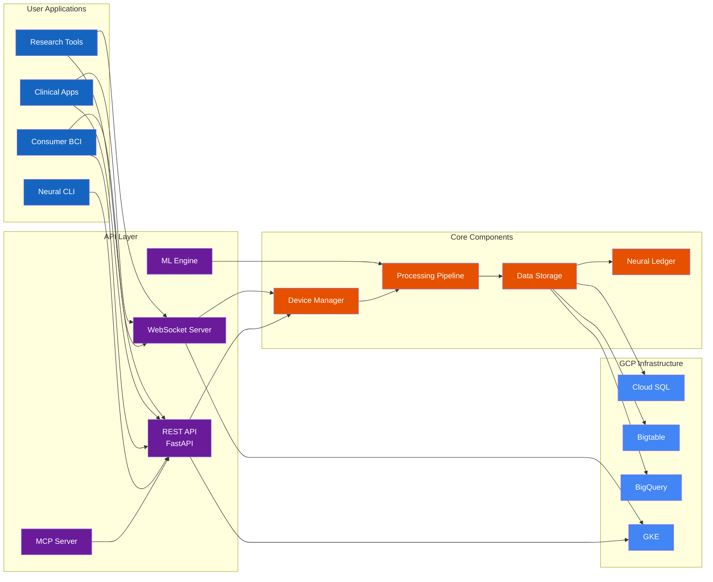

import { Table, Tabs } from 'nextra/components'

# Introduction

Welcome to the official documentation for **NeuraScale**, a comprehensive Brain-Computer Interface (BCI) platform providing real-time neural data acquisition, processing, and analysis with sub-100ms latency.

## Platform Overview

### What is NeuraScale?

NeuraScale is a production-ready BCI platform deployed on Google Cloud Platform that enables:

- **Universal Device Support**: 30+ BCI devices from consumer to research grade
- **Real-Time Processing**: Sub-100ms latency via Bigtable and Pub/Sub
- **Massive Scalability**: Handle 10,000+ channels with autoscaling infrastructure
- **Clinical Compliance**: HIPAA/GDPR compliant with Secret Manager and KMS encryption
- **ML Integration**: Real-time inference with GPU-enabled GKE clusters
- **Multi-Environment**: Separate development, staging, and production projects
- **Infrastructure as Code**: Full Terraform automation with modular architecture

### Core Architecture

## Documentation Sections

### Getting Started

- **[Quick Start Guide](/docs/get-started)** - Set up NeuraScale in minutes
- **[System Architecture](/docs/architecture)** - Understand the platform design
- **[Platform Features](/docs/features)** - Explore comprehensive capabilities

### Development & Integration

- **[API Documentation](/docs/api)** - REST, GraphQL, WebSocket, and gRPC APIs
- **[System Modeling](/docs/system-modeling)** - Diagrams and technical specifications
- **[Device Integration](/docs/features#device-integration)** - Connect 30+ BCI devices
- **[ML/AI Capabilities](/docs/features#mlai-capabilities)** - Real-time neural classification

### Technical Specifications

#### Supported Devices

**Consumer BCIs**

- OpenBCI (Cyton, Ganglion, Cyton+Daisy)
- Emotiv (EPOC+, Insight)
- Muse (Muse 2, Muse S)
- NeuroSky MindWave

**Research Systems**

- g.tec (g.USBamp, g.Nautilus)
- BrainProducts (actiCHamp, LiveAmp)
- ANT Neuro (eego™)
- BioSemi ActiveTwo

**Clinical Arrays**

- Blackrock (Utah Array, CerePlex)
- Plexon OmniPlex
- Custom LSL streams

#### Performance Metrics

<Table>
  <thead>
    <Table.Tr>
      <Table.Th>Metric</Table.Th>
      <Table.Th>Specification</Table.Th>
    </Table.Tr>
  </thead>
  <tbody>
    <Table.Tr>
      <Table.Td>Latency</Table.Td>
      <Table.Td>50-80ms (typical), &lt;100ms (guaranteed)</Table.Td>
    </Table.Tr>
    <Table.Tr>
      <Table.Td>Sampling Rates</Table.Td>
      <Table.Td>Up to 30 kHz (spikes), 1-2 kHz (LFP), 250-500 Hz (EEG)</Table.Td>
    </Table.Tr>
    <Table.Tr>
      <Table.Td>Channel Count</Table.Td>
      <Table.Td>8 to 10,000+ channels</Table.Td>
    </Table.Tr>
    <Table.Tr>
      <Table.Td>Data Throughput</Table.Td>
      <Table.Td>40 MB/s sustained</Table.Td>
    </Table.Tr>
    <Table.Tr>
      <Table.Td>Storage Compression</Table.Td>
      <Table.Td>10:1 with lossless algorithms</Table.Td>
    </Table.Tr>
  </tbody>
</Table>

### Operations & Deployment

- **[Deployment Guide](/docs/deployment)** - Local, staging, and production environments
- **[Security Best Practices](/docs/security)** - HIPAA/GDPR compliance and data protection
- **[Clinical Workflows](/docs/features#clinical-features)** - Healthcare-compliant operations
- **[Storage & Analytics](/docs/features#storage-analytics)** - Time-series data management

### Infrastructure

- **[Architecture Overview](/docs/architecture)** - System design and components
- **[System Modeling](/docs/system-modeling)** - Visual diagrams and technical flows
- **[Data Processing](/docs/features#data-processing)** - Real-time signal processing pipeline
- **[Performance Metrics](/docs/features#performance-summary)** - Platform capabilities and benchmarks

### Advanced Features

- **[Real-time Data Streaming](/docs/features#data-processing)** - Sub-100ms latency processing
- **[Machine Learning Integration](/docs/features#mlai-capabilities)** - Pre-trained models and custom training
- **[Developer Tools](/docs/features#developer-tools)** - APIs, SDKs, and integration options
- **[Clinical Compliance](/docs/features#clinical-features)** - HIPAA-compliant infrastructure

## Use Cases

### Research Applications

- **Motor Imagery**: Decode movement intentions
- **P300 Spellers**: Brain-controlled typing
- **SSVEP**: Steady-state visual stimuli
- **Neurofeedback**: Real-time brain training

### Clinical Applications

- **Seizure Detection**: Real-time epilepsy monitoring
- **Sleep Staging**: Automatic sleep analysis
- **Stroke Rehabilitation**: Motor recovery training
- **Locked-in Syndrome**: Communication interfaces

### Consumer Applications

- **Meditation Apps**: Track mental states
- **Gaming**: Mind-controlled games
- **Productivity**: Focus and attention monitoring
- **Wellness**: Stress and relaxation tracking

## Platform Status

### Roadmap

<Tabs items={['Completed', 'In Progress', 'Upcoming']} defaultIndex={0}>
  <Tabs.Tab>
    #### Foundation & Integration (Phases 1-8)

    - **Phase 1**: Core Infrastructure Setup
    - **Phase 2**: Data Models & Storage Layer
    - **Phase 3**: Basic Signal Processing Pipeline
    - **Phase 4**: User Management & Authentication
    - **Phase 5**: Device Interfaces & LSL Integration
    - **Phase 6**: Clinical Workflow Management
    - **Phase 7**: Advanced Signal Processing
    - **Phase 8**: Real-time Classification & Prediction

    #### Intelligence (Phases 9-12)

    - **Phase 9**: Performance Monitoring & Analytics
    - **Phase 10**: Security & Compliance Layer
    - **Phase 11**: NVIDIA Omniverse Integration
    - **Phase 12**: API Implementation & Enhancement

    #### Infrastructure (Phases 13-16)

    - **Phase 13**: MCP Server Implementation
    - **Phase 14**: Terraform Infrastructure on GCP
      - Bigtable for time-series neural data (with autoscaling)
      - Pub/Sub topics for signal types (EEG, EMG, ECG, etc.)
      - Cloud Run for MCP Server deployment
      - Artifact Registry for container images
      - Secret Manager for secure configuration
    - **Phase 15**: Kubernetes Deployment on GKE
      - Helm charts for Neural Engine services
      - Autoscaling with HPA and node pools
      - GPU support for ML workloads
      - Ingress with TLS termination
    - **Phase 16**: CI/CD Pipeline Enhancement
      - GitHub Actions with Workload Identity
      - Multi-environment deployment (dev/staging/prod)
      - Automated testing and validation
      - Infrastructure as Code with Terraform
  </Tabs.Tab>

  <Tabs.Tab>
    #### Currently In Progress

    No phases currently in active development. See upcoming phases for planned work.
  </Tabs.Tab>

  <Tabs.Tab>
    #### Phase 17: CI/CD Pipeline (Q1 2026)

    - GitHub Actions workflows
    - GitLab CI integration
    - ArgoCD for GitOps
    - Automated testing pipelines
    - Multi-environment deployments

    #### Phases 18-20: Quality Assurance (Q2 2026)

    - Comprehensive Unit Testing Suite
    - Integration Testing Framework
    - Performance Testing & Benchmarks
    - Load Testing Infrastructure
    - Security Testing Suite

    #### Phases 21-22: Delivery (Q3 2026)

    - Complete Documentation & Training Materials
    - Full System Integration Testing
    - Production Readiness Review
    - Launch Preparation
    - Post-Launch Support Plan
  </Tabs.Tab>
</Tabs>

## Community & Support

### Getting Help

- **[Documentation](https://docs.neurascale.io)** - Comprehensive guides
- **[GitHub Discussions](https://github.com/identity-wael/neurascale/discussions)** - Ask questions
- **[Issue Tracker](https://github.com/identity-wael/neurascale/issues)** - Report bugs
- **[Email Support](mailto:support@neurascale.io)** - Direct assistance

### Contributing

We welcome contributions! See our [Contributing Guide](/contributing) for:

- Code style guidelines
- Development workflow
- Testing requirements
- Pull request process

### Roadmap

Track our progress and upcoming features:

- [GitHub Project Board](https://github.com/identity-wael/neurascale/projects/1)
- [Milestone Tracking](https://github.com/identity-wael/neurascale/milestones)
- [Release Notes](https://github.com/identity-wael/neurascale/releases)

## License

NeuraScale is open source under the MIT License. See [LICENSE](https://github.com/identity-wael/neurascale/blob/main/LICENSE) for details.

---

**Built by the NeuraScale Team**

_Bridging Mind and World Through Advanced Neural Cloud Technology_

_Last updated: February 2, 2025_
