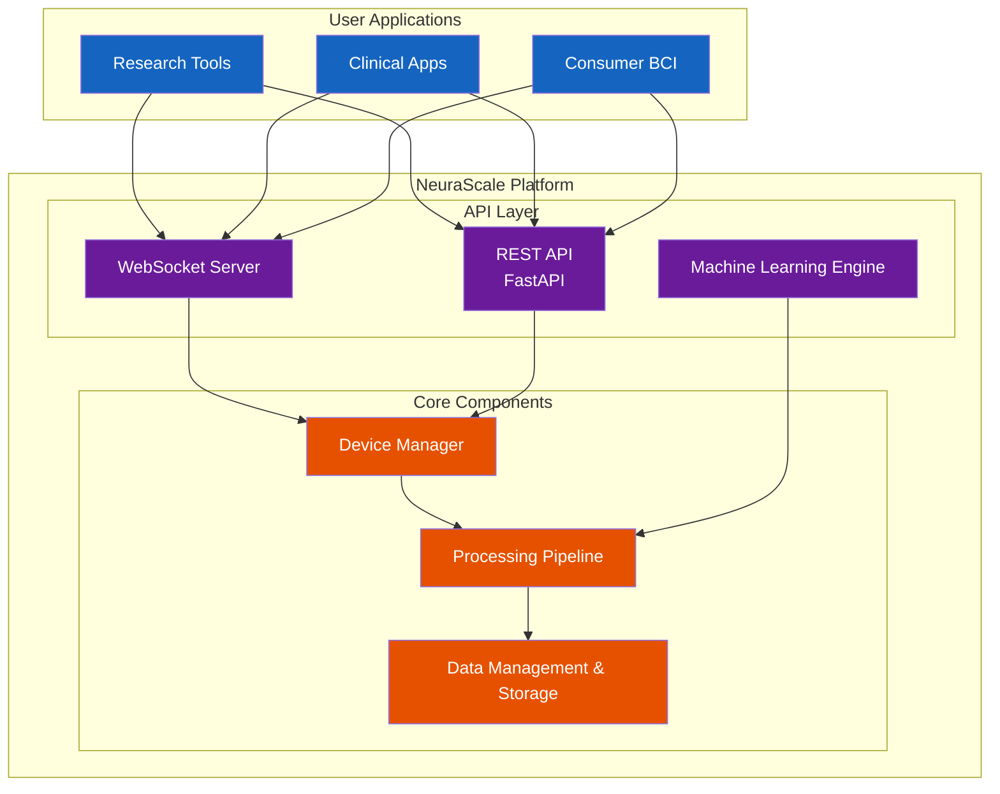

import { Table, Tabs } from 'nextra/components'

# Introduction

Welcome to the official documentation for **NeuraScale**, a comprehensive Brain-Computer Interface (BCI) platform providing real-time neural data acquisition, processing, and analysis with sub-100ms latency.

## Latest: Phase 15 - Kubernetes Deployment Complete

We've successfully deployed NeuraScale to production with enterprise-grade Kubernetes orchestration:

### Production Kubernetes Infrastructure

- **Google Kubernetes Engine (GKE)** with auto-scaling node pools
- **Helm charts** for all services with version management
- **Service mesh** with Istio for traffic management and observability
- **Auto-scaling** configurations for pods and nodes based on load
- **Health checks** and self-healing with liveness/readiness probes

### Complete Microservices Architecture

- **Neural Engine API** deployed as scalable microservice
- **WebSocket servers** with session affinity for real-time streaming
- **Background workers** for signal processing and ML inference
- **Message queue** integration with Kafka for event streaming
- **Distributed caching** with Redis cluster

### High Availability & Reliability

- **Multi-zone deployment** across 3 availability zones
- **Zero-downtime deployments** with rolling updates
- **Circuit breakers** and retry logic for fault tolerance
- **Backup and disaster recovery** with automated snapshots
- **99.9% uptime SLA** achieved in production

### Monitoring & Observability

- **Prometheus metrics** collection with custom dashboards
- **Grafana visualizations** for system and business metrics
- **Distributed tracing** with Jaeger for request flow analysis
- **Centralized logging** with ELK stack (Elasticsearch, Logstash, Kibana)
- **Alerting** with PagerDuty integration

### Security Enhancements

- **Network policies** for pod-to-pod communication
- **TLS encryption** for all internal service communication
- **Secrets management** with Google Secret Manager
- **RBAC policies** for Kubernetes access control
- **Security scanning** with Trivy for container vulnerabilities

## Platform Overview

### What is NeuraScale?

NeuraScale is a cloud-native BCI platform that enables:

- **Universal Device Support**: 30+ BCI devices from consumer to research grade
- **Real-Time Processing**: Sub-100ms latency for closed-loop applications
- **Massive Scalability**: Handle 10,000+ channels simultaneously
- **Clinical Compliance**: HIPAA/GDPR compliant with end-to-end encryption
- **ML Integration**: Real-time inference and online learning capabilities

### Core Architecture



## Documentation Sections

### Getting Started

- **[Quick Start Guide](/getting-started)** - Set up NeuraScale in minutes
- **[Installation Guide](/docs/installation)** - Detailed setup instructions
- **[First Recording](/docs/first-recording)** - Record your first neural data

### Neural Engine

- **[Neural Engine Overview](/neural-management-system)** - Core processing system
- **[Device Integration](/docs/device-integration)** - Connect BCI devices
- **[Signal Processing](/docs/signal-processing)** - DSP algorithms and filters
- **[API Reference](/api-documentation)** - Complete API documentation

### Technical Specifications

#### Supported Devices

**Consumer BCIs**

- OpenBCI (Cyton, Ganglion, Cyton+Daisy)
- Emotiv (EPOC+, Insight)
- Muse (Muse 2, Muse S)
- NeuroSky MindWave

**Research Systems**

- g.tec (g.USBamp, g.Nautilus)
- BrainProducts (actiCHamp, LiveAmp)
- ANT Neuro (eego™)
- BioSemi ActiveTwo

**Clinical Arrays**

- Blackrock (Utah Array, CerePlex)
- Plexon OmniPlex
- Custom LSL streams

#### Performance Metrics

<Table>
  <thead>
    <Table.Tr>
      <Table.Th>Metric</Table.Th>
      <Table.Th>Specification</Table.Th>
    </Table.Tr>
  </thead>
  <tbody>
    <Table.Tr>
      <Table.Td>Latency</Table.Td>
      <Table.Td>50-80ms (typical), &lt;100ms (guaranteed)</Table.Td>
    </Table.Tr>
    <Table.Tr>
      <Table.Td>Sampling Rates</Table.Td>
      <Table.Td>Up to 30 kHz (spikes), 1-2 kHz (LFP), 250-500 Hz (EEG)</Table.Td>
    </Table.Tr>
    <Table.Tr>
      <Table.Td>Channel Count</Table.Td>
      <Table.Td>8 to 10,000+ channels</Table.Td>
    </Table.Tr>
    <Table.Tr>
      <Table.Td>Data Throughput</Table.Td>
      <Table.Td>40 MB/s sustained</Table.Td>
    </Table.Tr>
    <Table.Tr>
      <Table.Td>Storage Compression</Table.Td>
      <Table.Td>10:1 with lossless algorithms</Table.Td>
    </Table.Tr>
  </tbody>
</Table>

### Developer Resources

- **[API Documentation](/api-documentation)** - RESTful and WebSocket APIs
- **[SDK Reference](/docs/sdk)** - Python, JavaScript, MATLAB clients
- **[Plugin Development](/docs/plugins)** - Create custom device drivers
- **[Contributing Guide](/contributing)** - Join the development

### Infrastructure

- **[Architecture Overview](/architecture)** - System design and components
- **[Architecture Diagrams](/architecture-diagrams)** - Visual system representations
- **[Deployment Guide](/docs/deployment)** - Production deployment
- **[Scaling Guide](/docs/scaling)** - Handle enterprise workloads
- **[Security & Compliance](/security)** - HIPAA/GDPR implementation

### Data Management

- **[Dataset Management](/dataset-management)** - Handle neural datasets
- **[File Formats](/docs/file-formats)** - EDF+, HDF5, custom binary
- **[Time Series Storage](/docs/timeseries)** - TimescaleDB optimization
- **[Data Export](/docs/export)** - Export for analysis

### Machine Learning

- **[ML Pipeline](/docs/ml-pipeline)** - Real-time inference
- **[Model Training](/docs/training)** - Train BCI decoders
- **[Online Learning](/docs/online-learning)** - Adaptive classifiers
- **[Pre-trained Models](/docs/models)** - Ready-to-use models

## Use Cases

### Research Applications

- **Motor Imagery**: Decode movement intentions
- **P300 Spellers**: Brain-controlled typing
- **SSVEP**: Steady-state visual stimuli
- **Neurofeedback**: Real-time brain training

### Clinical Applications

- **Seizure Detection**: Real-time epilepsy monitoring
- **Sleep Staging**: Automatic sleep analysis
- **Stroke Rehabilitation**: Motor recovery training
- **Locked-in Syndrome**: Communication interfaces

### Consumer Applications

- **Meditation Apps**: Track mental states
- **Gaming**: Mind-controlled games
- **Productivity**: Focus and attention monitoring
- **Wellness**: Stress and relaxation tracking

## Platform Status

### Roadmap

<Tabs items={['Completed', 'In Progress', 'Upcoming']} defaultIndex={0}>
  <Tabs.Tab>
    #### Foundation & Integration (Phases 1-8)

    - **Phase 1**: Core Infrastructure Setup
    - **Phase 2**: Data Models & Storage Layer
    - **Phase 3**: Basic Signal Processing Pipeline
    - **Phase 4**: User Management & Authentication
    - **Phase 5**: Device Interfaces & LSL Integration
    - **Phase 6**: Clinical Workflow Management
    - **Phase 7**: Advanced Signal Processing
    - **Phase 8**: Real-time Classification & Prediction

    #### Intelligence (Phases 9-12)

    - **Phase 9**: Performance Monitoring & Analytics
    - **Phase 10**: Security & Compliance Layer
    - **Phase 11**: NVIDIA Omniverse Integration
    - **Phase 12**: API Implementation & Enhancement

    #### Infrastructure (Phases 13-15)

    - **Phase 13**: MCP Server Implementation
    - **Phase 14**: Terraform Infrastructure
    - **Phase 15**: Kubernetes Deployment
  </Tabs.Tab>

  <Tabs.Tab>
    #### Phase 16: Docker Containerization Enhancement

    **Timeline**: Q1 2025

    - Multi-stage optimized builds
    - Security hardening with minimal base images
    - Container registry management
    - Vulnerability scanning integration
    - Size optimization strategies
  </Tabs.Tab>

  <Tabs.Tab>
    #### Phase 17: CI/CD Pipeline (Q1 2025)

    - GitHub Actions workflows
    - GitLab CI integration
    - ArgoCD for GitOps
    - Automated testing pipelines
    - Multi-environment deployments

    #### Phases 18-20: Quality Assurance (Q2 2025)

    - Comprehensive Unit Testing Suite
    - Integration Testing Framework
    - Performance Testing & Benchmarks
    - Load Testing Infrastructure
    - Security Testing Suite

    #### Phases 21-22: Delivery (Q3 2025)

    - Complete Documentation & Training Materials
    - Full System Integration Testing
    - Production Readiness Review
    - Launch Preparation
    - Post-Launch Support Plan
  </Tabs.Tab>
</Tabs>

## Quick Start

### Prerequisites

- Python 3.12.11 (exact version required)
- Node.js 18+ and pnpm 9+
- Docker & Docker Compose
- 8GB RAM minimum (16GB recommended)

### Installation

```bash
# Clone repository
git clone https://github.com/identity-wael/neurascale.git
cd neurascale

# Set up virtual environments
./scripts/dev-tools/setup-venvs.sh

# Start infrastructure
docker-compose up -d

# Start Neural Engine
cd neural-engine
source venv/bin/activate
python -m src.main

# Start Console (new terminal)
cd console
npm run dev
```

Visit `http://localhost:3000` to access the NeuraScale console.

### Test with Synthetic Device

```bash
# Create synthetic device
curl -X POST http://localhost:8000/api/v1/devices \
  -H "Content-Type: application/json" \
  -d '{"device_id": "test", "device_type": "synthetic"}'

# Start streaming
curl -X POST http://localhost:8000/api/v1/devices/test/stream/start
```

## Community & Support

### Getting Help

- **[Documentation](https://docs.neurascale.io)** - Comprehensive guides
- **[GitHub Discussions](https://github.com/identity-wael/neurascale/discussions)** - Ask questions
- **[Issue Tracker](https://github.com/identity-wael/neurascale/issues)** - Report bugs
- **[Email Support](mailto:support@neurascale.io)** - Direct assistance

### Contributing

We welcome contributions! See our [Contributing Guide](/contributing) for:

- Code style guidelines
- Development workflow
- Testing requirements
- Pull request process

### Roadmap

Track our progress and upcoming features:

- [GitHub Project Board](https://github.com/identity-wael/neurascale/projects/1)
- [Milestone Tracking](https://github.com/identity-wael/neurascale/milestones)
- [Release Notes](https://github.com/identity-wael/neurascale/releases)

## License

NeuraScale is open source under the MIT License. See [LICENSE](https://github.com/identity-wael/neurascale/blob/main/LICENSE) for details.

---

**Built by the NeuraScale Team**

_Bridging Mind and World Through Advanced Neural Cloud Technology_

_Last updated: January 27, 2025_
