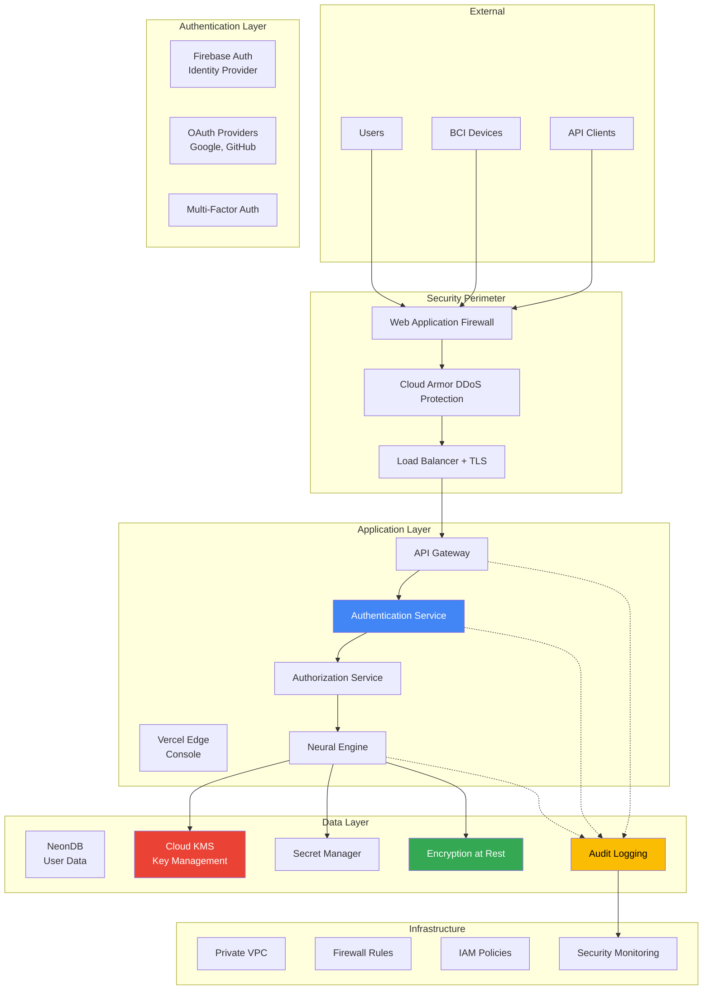
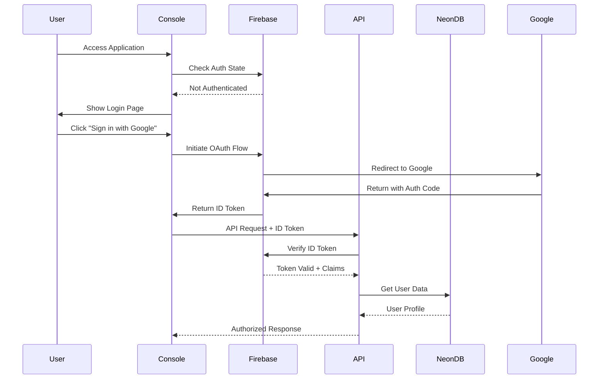

import { Steps, Tabs, Callout } from 'nextra/components'

# Security Best Practices

NeuraScale handles sensitive neural data and medical information, requiring robust security measures. This guide covers security best practices for deployment, development, and operations.

## Security Framework Overview

NeuraScale implements defense-in-depth security with multiple layers of protection:

<div className="nx-grid nx-mt-6 nx-gap-4 md:nx-grid-cols-2 lg:nx-grid-cols-3">
  <div className="nx-border nx-border-gray-200 dark:nx-border-gray-800 nx-rounded-lg nx-p-4">
    <h3 className="nx-font-semibold nx-mb-2">Data Protection</h3>
    <div className="nx-text-sm nx-text-gray-600 dark:nx-text-gray-400 nx-mb-2">
      End-to-end encryption and data classification
    </div>
    <a href="#data-protection" className="nx-text-primary-600 nx-text-sm">
      Learn more →
    </a>
  </div>

  <div className="nx-border nx-border-gray-200 dark:nx-border-gray-800 nx-rounded-lg nx-p-4">
    <h3 className="nx-font-semibold nx-mb-2">Access Control</h3>
    <div className="nx-text-sm nx-text-gray-600 dark:nx-text-gray-400 nx-mb-2">
      Authentication, authorization, and audit logging
    </div>
    <a href="#access-control" className="nx-text-primary-600 nx-text-sm">
      Learn more →
    </a>
  </div>

  <div className="nx-border nx-border-gray-200 dark:nx-border-gray-800 nx-rounded-lg nx-p-4">
    <h3 className="nx-font-semibold nx-mb-2">Network Security</h3>
    <div className="nx-text-sm nx-text-gray-600 dark:nx-text-gray-400 nx-mb-2">
      Secure communication and network isolation
    </div>
    <a href="#network-security" className="nx-text-primary-600 nx-text-sm">
      Learn more →
    </a>
  </div>

  <div className="nx-border nx-border-gray-200 dark:nx-border-gray-800 nx-rounded-lg nx-p-4">
    <h3 className="nx-font-semibold nx-mb-2">Compliance</h3>
    <div className="nx-text-sm nx-text-gray-600 dark:nx-text-gray-400 nx-mb-2">
      HIPAA, GDPR, and SOC 2 compliance
    </div>
    <a href="#compliance" className="nx-text-primary-600 nx-text-sm">
      Learn more →
    </a>
  </div>

  <div className="nx-border nx-border-gray-200 dark:nx-border-gray-800 nx-rounded-lg nx-p-4">
    <h3 className="nx-font-semibold nx-mb-2">Incident Response</h3>
    <div className="nx-text-sm nx-text-gray-600 dark:nx-text-gray-400 nx-mb-2">
      Detection, response, and recovery procedures
    </div>
    <a href="#incident-response" className="nx-text-primary-600 nx-text-sm">
      Learn more →
    </a>
  </div>

  <div className="nx-border nx-border-gray-200 dark:nx-border-gray-800 nx-rounded-lg nx-p-4">
    <h3 className="nx-font-semibold nx-mb-2">Secure Development</h3>
    <div className="nx-text-sm nx-text-gray-600 dark:nx-text-gray-400 nx-mb-2">
      Secure coding and DevSecOps practices
    </div>
    <a href="#secure-development" className="nx-text-primary-600 nx-text-sm">
      Learn more →
    </a>
  </div>
</div>

## Security Architecture



## Data Protection

### Data Classification

NeuraScale implements a comprehensive data classification system:

| Classification | Description | Examples | Security Requirements |
|----------------|-------------|----------|---------------------|
| **Public** | Non-sensitive information | Documentation, marketing | Standard protection |
| **Internal** | Business information | System logs, metrics | Access control required |
| **Confidential** | Sensitive business data | User profiles, API keys | Encryption + access control |
| **Restricted** | Highly sensitive data | Neural data, medical records | Full encryption + audit + compliance |

### Encryption at Rest

<Tabs items={['Database Encryption', 'File Storage', 'Backup Encryption']}>
  <Tabs.Tab>
    **Database Encryption Implementation**

    ```python
    # Field-level encryption for sensitive data
    from cryptography.fernet import Fernet
    from sqlalchemy_utils import EncryptedType
    from sqlalchemy_utils.types.encrypted.encrypted_type import AesEngine

    class Patient(db.Model):
        id = db.Column(db.String(36), primary_key=True)

        # Encrypted PII fields
        name = db.Column(EncryptedType(db.String(255), secret_key, AesEngine, 'pkcs5'))
        email = db.Column(EncryptedType(db.String(255), secret_key, AesEngine, 'pkcs5'))
        medical_record_number = db.Column(EncryptedType(db.String(100), secret_key, AesEngine, 'pkcs5'))

        # Non-sensitive fields (not encrypted)
        created_at = db.Column(db.DateTime)
        study_id = db.Column(db.String(50))  # De-identified

    # Cloud SQL encryption configuration
    resource "google_sql_database_instance" "neurascale" {
      name             = "neurascale-prod"
      database_version = "POSTGRES_15"
      region          = "us-central1"

      settings {
        tier = "db-n1-standard-4"

        # Encryption with customer-managed keys
        disk_encryption_configuration {
          kms_key_name = google_kms_crypto_key.sql_key.id
        }

        backup_configuration {
          enabled = true
          point_in_time_recovery_enabled = true
          # Backups encrypted with same key
        }
      }
    }
    ```

    **Best Practices:**
    - Use separate encryption keys per environment
    - Rotate encryption keys quarterly
    - Implement key escrow for data recovery
    - Monitor key usage and access patterns
  </Tabs.Tab>

  <Tabs.Tab>
    **File Storage Encryption**

    ```yaml
    # Bigtable encryption configuration
    resource "google_bigtable_instance" "neurascale" {
      name = "neurascale-prod"

      cluster {
        cluster_id   = "neurascale-cluster"
        zone         = "us-central1-a"
        num_nodes    = 3
        storage_type = "SSD"

        # Encryption with CMEK
        kms_key_name = google_kms_crypto_key.bigtable_key.id
      }
    }

    # Cloud Storage bucket encryption
    resource "google_storage_bucket" "neural_data" {
      name     = "neurascale-neural-data-prod"
      location = "US"

      encryption {
        default_kms_key_name = google_kms_crypto_key.storage_key.id
      }

      # Object lifecycle for compliance
      lifecycle_rule {
        condition {
          age = 365  # 1 year retention
        }
        action {
          type = "Delete"
        }
      }
    }
    ```

    **Application-level encryption:**

    ```python
    # Encrypt neural data before storage
    class NeuralDataEncryption:
        def __init__(self, kms_client):
            self.kms_client = kms_client
            self.key_name = "projects/neurascale-prod/locations/global/keyRings/neural-data/cryptoKeys/data-encryption"

        def encrypt_neural_data(self, data: np.ndarray, session_id: str) -> bytes:
            # Convert numpy array to bytes
            data_bytes = data.tobytes()

            # Create data encryption key (DEK)
            dek = secrets.token_bytes(32)  # 256-bit key

            # Encrypt data with DEK
            cipher = Fernet(base64.urlsafe_b64encode(dek))
            encrypted_data = cipher.encrypt(data_bytes)

            # Encrypt DEK with KMS
            kms_response = self.kms_client.encrypt(
                request={
                    "name": self.key_name,
                    "plaintext": dek,
                    "additional_authenticated_data": session_id.encode()
                }
            )

            # Return encrypted data + encrypted DEK
            return {
                "encrypted_data": encrypted_data,
                "encrypted_dek": kms_response.ciphertext,
                "session_id": session_id
            }

        def decrypt_neural_data(self, encrypted_package: dict) -> np.ndarray:
            # Decrypt DEK with KMS
            kms_response = self.kms_client.decrypt(
                request={
                    "name": self.key_name,
                    "ciphertext": encrypted_package["encrypted_dek"],
                    "additional_authenticated_data": encrypted_package["session_id"].encode()
                }
            )

            # Decrypt data with DEK
            cipher = Fernet(base64.urlsafe_b64encode(kms_response.plaintext))
            decrypted_data = cipher.decrypt(encrypted_package["encrypted_data"])

            # Convert back to numpy array
            return np.frombuffer(decrypted_data, dtype=np.float32)
    ```
  </Tabs.Tab>

  <Tabs.Tab>
    **Backup Encryption Strategy**

    ```bash
    # Automated encrypted backups
    #!/bin/bash

    # Database backup with encryption
    BACKUP_DATE=$(date +%Y%m%d_%H%M%S)
    BACKUP_FILE="neurascale_backup_${BACKUP_DATE}.sql"

    # Create encrypted backup
    pg_dump neurascale_prod | \
    gzip | \
    gpg --cipher-algo AES256 --compress-algo 1 --symmetric --output ${BACKUP_FILE}.gpg

    # Upload to encrypted Cloud Storage bucket
    gsutil cp ${BACKUP_FILE}.gpg gs://neurascale-backups-prod/database/

    # Verify backup integrity
    gsutil hash gs://neurascale-backups-prod/database/${BACKUP_FILE}.gpg

    # Clean up local backup
    shred -u ${BACKUP_FILE}.gpg
    ```

    **Backup Retention Policy:**

    ```yaml
    # Terraform configuration for backup lifecycle
    resource "google_storage_bucket" "backups" {
      name     = "neurascale-backups-prod"
      location = "US"

      # Encryption
      encryption {
        default_kms_key_name = google_kms_crypto_key.backup_key.id
      }

      # Lifecycle management
      lifecycle_rule {
        condition {
          age = 30
        }
        action {
          type          = "SetStorageClass"
          storage_class = "COLDLINE"
        }
      }

      lifecycle_rule {
        condition {
          age = 365
        }
        action {
          type          = "SetStorageClass"
          storage_class = "ARCHIVE"
        }
      }

      lifecycle_rule {
        condition {
          age = 2555  # 7 years for HIPAA compliance
        }
        action {
          type = "Delete"
        }
      }
    }
    ```

    **Recovery Testing:**

    ```python
    # Automated backup validation
    import pytest
    from datetime import datetime, timedelta

    class BackupValidator:
        def test_backup_availability(self):
            """Verify backups exist for the last 30 days"""
            for i in range(30):
                backup_date = datetime.now() - timedelta(days=i)
                backup_pattern = f"neurascale_backup_{backup_date.strftime('%Y%m%d')}_*.sql.gpg"

                # Check if backup exists
                result = subprocess.run([
                    'gsutil', 'ls', f'gs://neurascale-backups-prod/database/{backup_pattern}'
                ], capture_output=True)

                assert result.returncode == 0, f"Missing backup for {backup_date.date()}"

        def test_backup_restoration(self):
            """Test restoration process with latest backup"""
            # Get latest backup
            latest_backup = self.get_latest_backup()

            # Test restoration to temporary database
            self.restore_to_temp_db(latest_backup)

            # Verify data integrity
            assert self.verify_data_integrity()
    ```
  </Tabs.Tab>
</Tabs>

### Encryption in Transit

All communication uses TLS 1.3 with perfect forward secrecy:

```yaml
# TLS configuration for Cloud Load Balancer
resource "google_compute_ssl_certificate" "neurascale" {
  name_prefix = "neurascale-ssl"
  private_key = file("private-key.pem")
  certificate = file("certificate.pem")

  lifecycle {
    create_before_destroy = true
  }
}

resource "google_compute_target_https_proxy" "neurascale" {
  name             = "neurascale-https-proxy"
  url_map          = google_compute_url_map.neurascale.id
  ssl_certificates = [google_compute_ssl_certificate.neurascale.id]

  # TLS 1.3 only
  ssl_policy = google_compute_ssl_policy.modern.id
}

resource "google_compute_ssl_policy" "modern" {
  name            = "neurascale-modern-tls"
  profile         = "MODERN"
  min_tls_version = "TLS_1_2"  # Minimum TLS 1.2
}
```

## Access Control

### Firebase Authentication

NeuraScale uses Firebase Authentication for the console, providing secure, scalable user management with support for multiple authentication providers.

#### Authentication Architecture



#### Firebase Configuration

<Tabs items={['Client SDK', 'Admin SDK', 'Security Rules']}>
  <Tabs.Tab>
    **Client-Side Configuration**

    ```typescript
    // lib/firebase/config.ts
    import { initializeApp, getApps } from 'firebase/app'
    import { getAuth, connectAuthEmulator } from 'firebase/auth'
    import { getAnalytics } from 'firebase/analytics'

    const firebaseConfig = {
      apiKey: process.env.NEXT_PUBLIC_FIREBASE_API_KEY,
      authDomain: process.env.NEXT_PUBLIC_FIREBASE_AUTH_DOMAIN,
      projectId: process.env.NEXT_PUBLIC_FIREBASE_PROJECT_ID,
      storageBucket: process.env.NEXT_PUBLIC_FIREBASE_STORAGE_BUCKET,
      messagingSenderId: process.env.NEXT_PUBLIC_FIREBASE_MESSAGING_SENDER_ID,
      appId: process.env.NEXT_PUBLIC_FIREBASE_APP_ID,
      measurementId: process.env.NEXT_PUBLIC_FIREBASE_MEASUREMENT_ID
    }

    // Initialize Firebase
    const app = getApps().length ? getApps()[0] : initializeApp(firebaseConfig)
    const auth = getAuth(app)

    // Use emulator in development
    if (process.env.NODE_ENV === 'development') {
      connectAuthEmulator(auth, 'http://localhost:9099')
    }

    // Enable analytics in production
    const analytics = typeof window !== 'undefined' &&
      process.env.NODE_ENV === 'production' ?
      getAnalytics(app) : null

    export { app, auth, analytics }
    ```
  </Tabs.Tab>

  <Tabs.Tab>
    **Server-Side Admin SDK**

    ```typescript
    // lib/firebase/admin.ts
    import { initializeApp, cert, getApps } from 'firebase-admin/app'
    import { getAuth } from 'firebase-admin/auth'

    const adminApp = getApps().length ? getApps()[0] : initializeApp({
      credential: cert({
        projectId: process.env.FIREBASE_ADMIN_PROJECT_ID,
        clientEmail: process.env.FIREBASE_ADMIN_CLIENT_EMAIL,
        privateKey: process.env.FIREBASE_ADMIN_PRIVATE_KEY?.replace(/\\n/g, '\n')
      })
    })

    export const adminAuth = getAuth(adminApp)

    // Middleware to verify tokens
    export async function verifyIdToken(token: string) {
      try {
        const decodedToken = await adminAuth.verifyIdToken(token)
        return {
          uid: decodedToken.uid,
          email: decodedToken.email,
          emailVerified: decodedToken.email_verified,
          customClaims: decodedToken
        }
      } catch (error) {
        console.error('Token verification failed:', error)
        throw new Error('Invalid authentication token')
      }
    }

    // Set custom claims for role-based access
    export async function setUserRole(uid: string, role: string) {
      await adminAuth.setCustomUserClaims(uid, {
        role,
        permissions: getRolePermissions(role)
      })
    }

    function getRolePermissions(role: string) {
      const permissions = {
        admin: ['read', 'write', 'delete', 'manage_users'],
        researcher: ['read', 'write', 'export'],
        clinician: ['read', 'write'],
        viewer: ['read']
      }
      return permissions[role] || []
    }
    ```
  </Tabs.Tab>

  <Tabs.Tab>
    **Firebase Security Rules**

    ```javascript
    // firestore.rules
    rules_version = '2';
    service cloud.firestore {
      match /databases/{database}/documents {
        // Helper functions
        function isAuthenticated() {
          return request.auth != null;
        }

        function isOwner(userId) {
          return isAuthenticated() && request.auth.uid == userId;
        }

        function hasRole(role) {
          return isAuthenticated() &&
            request.auth.token.role == role;
        }

        function hasPermission(permission) {
          return isAuthenticated() &&
            permission in request.auth.token.permissions;
        }

        // User profiles
        match /users/{userId} {
          allow read: if isOwner(userId) || hasRole('admin');
          allow write: if isOwner(userId) &&
            request.resource.data.role == resource.data.role; // Can't change own role
          allow write: if hasRole('admin');
        }

        // Experiments
        match /experiments/{experimentId} {
          allow read: if isAuthenticated() &&
            (resource.data.userId == request.auth.uid ||
             request.auth.uid in resource.data.sharedWith ||
             hasRole('admin'));
          allow create: if isAuthenticated();
          allow update: if isOwner(resource.data.userId);
          allow delete: if isOwner(resource.data.userId) || hasRole('admin');
        }

        // Sessions
        match /sessions/{sessionId} {
          allow read: if isAuthenticated();
          allow write: if hasPermission('write');
        }
      }
    }
    ```
  </Tabs.Tab>
</Tabs>

#### Authentication Providers

<Steps>
### Configure OAuth Providers

**Google Authentication**
```typescript
import { GoogleAuthProvider, signInWithPopup } from 'firebase/auth'

const googleProvider = new GoogleAuthProvider()
googleProvider.addScope('profile')
googleProvider.addScope('email')

export async function signInWithGoogle() {
  try {
    const result = await signInWithPopup(auth, googleProvider)
    const user = result.user

    // Get ID token for API calls
    const idToken = await user.getIdToken()

    // Store in secure HTTP-only cookie
    await fetch('/api/auth/session', {
      method: 'POST',
      headers: { 'Content-Type': 'application/json' },
      body: JSON.stringify({ idToken })
    })

    return user
  } catch (error) {
    console.error('Google sign-in failed:', error)
    throw error
  }
}
```

### Implement Email/Password Authentication

```typescript
import {
  createUserWithEmailAndPassword,
  signInWithEmailAndPassword,
  sendEmailVerification
} from 'firebase/auth'

export async function signUpWithEmail(email: string, password: string) {
  try {
    // Create account
    const { user } = await createUserWithEmailAndPassword(auth, email, password)

    // Send verification email
    await sendEmailVerification(user)

    // Create user profile in database
    await fetch('/api/users', {
      method: 'POST',
      headers: {
        'Content-Type': 'application/json',
        'Authorization': `Bearer ${await user.getIdToken()}`
      },
      body: JSON.stringify({
        uid: user.uid,
        email: user.email,
        createdAt: new Date().toISOString()
      })
    })

    return user
  } catch (error) {
    if (error.code === 'auth/email-already-in-use') {
      throw new Error('Email already registered')
    }
    throw error
  }
}
```

### Add Multi-Factor Authentication

```typescript
import {
  multiFactor,
  PhoneAuthProvider,
  PhoneMultiFactorGenerator
} from 'firebase/auth'

export async function enrollMFA(phoneNumber: string) {
  const user = auth.currentUser
  if (!user) throw new Error('No authenticated user')

  const multiFactorSession = await multiFactor(user).getSession()

  // Send verification code
  const phoneAuthCredential = PhoneAuthProvider.credential(
    verificationId,
    verificationCode
  )

  const multiFactorAssertion = PhoneMultiFactorGenerator.assertion(
    phoneAuthCredential
  )

  // Enroll MFA
  await multiFactor(user).enroll(multiFactorAssertion, 'Phone Number')
}
```
</Steps>

### Traditional Authentication (Neural Engine)

For the Neural Engine API, we use JWT tokens with the following implementation:

<Steps>
### Multi-Factor Authentication

```python
# MFA implementation with TOTP
from pyotp import TOTP
import qrcode

class MFAService:
    def setup_mfa(self, user_id: str) -> dict:
        # Generate secret key
        secret = pyotp.random_base32()

        # Create TOTP object
        totp = TOTP(secret)

        # Generate QR code for authenticator app
        provisioning_uri = totp.provisioning_uri(
            name=user.email,
            issuer_name="NeuraScale"
        )

        qr = qrcode.QRCode()
        qr.add_data(provisioning_uri)
        qr.make(fit=True)

        # Store secret (encrypted)
        user.mfa_secret = self.encrypt_secret(secret)
        user.mfa_enabled = True
        db.session.commit()

        return {
            "secret": secret,
            "qr_code": qr.make_image(),
            "backup_codes": self.generate_backup_codes(user_id)
        }

    def verify_mfa(self, user_id: str, token: str) -> bool:
        user = User.query.get(user_id)
        if not user.mfa_enabled:
            return True

        secret = self.decrypt_secret(user.mfa_secret)
        totp = TOTP(secret)

        # Allow 30-second window
        return totp.verify(token, valid_window=1)

    def generate_backup_codes(self, user_id: str) -> list:
        """Generate single-use backup codes"""
        codes = [secrets.token_hex(4) for _ in range(10)]

        # Store hashed backup codes
        for code in codes:
            backup_code = BackupCode(
                user_id=user_id,
                code_hash=bcrypt.hashpw(code.encode(), bcrypt.gensalt()),
                used=False
            )
            db.session.add(backup_code)

        db.session.commit()
        return codes
```

### JWT Token Management

```python
# Secure JWT implementation
import jwt
from datetime import datetime, timedelta
from cryptography.hazmat.primitives import serialization

class JWTService:
    def __init__(self, private_key_path: str, public_key_path: str):
        # Load RSA keys
        with open(private_key_path, 'rb') as f:
            self.private_key = serialization.load_pem_private_key(
                f.read(), password=None
            )

        with open(public_key_path, 'rb') as f:
            self.public_key = serialization.load_pem_public_key(f.read())

    def generate_tokens(self, user: User) -> dict:
        now = datetime.utcnow()

        # Access token (short-lived)
        access_payload = {
            'sub': str(user.id),
            'email': user.email,
            'role': user.role,
            'permissions': user.get_permissions(),
            'iat': now,
            'exp': now + timedelta(hours=1),
            'iss': 'neurascale.io',
            'aud': 'neurascale-api',
            'jti': str(uuid.uuid4()),  # Unique token ID
            'type': 'access'
        }

        # Refresh token (long-lived)
        refresh_payload = {
            'sub': str(user.id),
            'iat': now,
            'exp': now + timedelta(days=30),
            'iss': 'neurascale.io',
            'aud': 'neurascale-api',
            'jti': str(uuid.uuid4()),
            'type': 'refresh'
        }

        access_token = jwt.encode(
            access_payload,
            self.private_key,
            algorithm='RS256'
        )

        refresh_token = jwt.encode(
            refresh_payload,
            self.private_key,
            algorithm='RS256'
        )

        # Store refresh token in database
        self.store_refresh_token(user.id, refresh_payload['jti'])

        return {
            'access_token': access_token,
            'refresh_token': refresh_token,
            'expires_in': 3600,
            'token_type': 'Bearer'
        }

    def verify_token(self, token: str) -> dict:
        try:
            payload = jwt.decode(
                token,
                self.public_key,
                algorithms=['RS256'],
                audience='neurascale-api',
                issuer='neurascale.io'
            )

            # Check if token is blacklisted
            if self.is_token_blacklisted(payload['jti']):
                raise jwt.InvalidTokenError("Token has been revoked")

            return payload

        except jwt.ExpiredSignatureError:
            raise jwt.InvalidTokenError("Token has expired")
        except jwt.InvalidTokenError as e:
            raise jwt.InvalidTokenError(f"Invalid token: {str(e)}")
```

### Role-Based Access Control

```python
# RBAC implementation
from enum import Enum
from functools import wraps

class Role(Enum):
    ADMIN = "admin"
    CLINICIAN = "clinician"
    RESEARCHER = "researcher"
    TECHNICIAN = "technician"
    PATIENT = "patient"

class Permission(Enum):
    # Device permissions
    DEVICE_READ = "device:read"
    DEVICE_WRITE = "device:write"
    DEVICE_STREAM = "device:stream"

    # Session permissions
    SESSION_CREATE = "session:create"
    SESSION_READ = "session:read"
    SESSION_UPDATE = "session:update"
    SESSION_DELETE = "session:delete"

    # Data permissions
    DATA_READ = "data:read"
    DATA_EXPORT = "data:export"
    DATA_ANALYZE = "data:analyze"

    # Admin permissions
    USER_MANAGE = "user:manage"
    SYSTEM_CONFIG = "system:config"
    AUDIT_VIEW = "audit:view"

# Role-permission mapping
ROLE_PERMISSIONS = {
    Role.ADMIN: [p for p in Permission],  # All permissions
    Role.CLINICIAN: [
        Permission.DEVICE_READ,
        Permission.DEVICE_STREAM,
        Permission.SESSION_CREATE,
        Permission.SESSION_READ,
        Permission.SESSION_UPDATE,
        Permission.DATA_READ,
        Permission.DATA_ANALYZE,
    ],
    Role.RESEARCHER: [
        Permission.SESSION_READ,
        Permission.DATA_READ,
        Permission.DATA_EXPORT,
        Permission.DATA_ANALYZE,
    ],
    Role.TECHNICIAN: [
        Permission.DEVICE_READ,
        Permission.DEVICE_WRITE,
        Permission.SESSION_READ,
    ],
    Role.PATIENT: [
        Permission.SESSION_READ,  # Own sessions only
        Permission.DATA_READ,     # Own data only
    ],
}

def require_permission(permission: Permission):
    """Decorator to enforce permission-based access control"""
    def decorator(f):
        @wraps(f)
        def decorated_function(*args, **kwargs):
            # Get current user from JWT token
            current_user = get_current_user()

            if not current_user:
                abort(401, "Authentication required")

            # Check if user has required permission
            user_permissions = ROLE_PERMISSIONS.get(current_user.role, [])

            if permission not in user_permissions:
                audit_log.log_access_denied(
                    user_id=current_user.id,
                    resource=f.__name__,
                    permission=permission.value,
                    ip_address=request.remote_addr
                )
                abort(403, f"Permission denied: {permission.value}")

            # Log successful access
            audit_log.log_access_granted(
                user_id=current_user.id,
                resource=f.__name__,
                permission=permission.value,
                ip_address=request.remote_addr
            )

            return f(*args, **kwargs)
        return decorated_function
    return decorator

# Usage example
@app.route('/api/v1/devices/<device_id>/stream/start', methods=['POST'])
@require_permission(Permission.DEVICE_STREAM)
def start_device_stream(device_id):
    # Implementation here
    pass
```
</Steps>

### Authorization Policies

```python
# Resource-based authorization
class ResourcePolicy:
    def __init__(self, user: User):
        self.user = user

    def can_access_session(self, session: Session) -> bool:
        """Check if user can access specific session"""

        # Admin can access all sessions
        if self.user.role == Role.ADMIN:
            return True

        # Clinician can access sessions they created or are assigned to
        if self.user.role == Role.CLINICIAN:
            return (session.created_by == self.user.id or
                   self.user.id in session.assigned_clinicians)

        # Researcher can access sessions in their studies
        if self.user.role == Role.RESEARCHER:
            return session.study_id in self.user.authorized_studies

        # Patient can only access their own sessions
        if self.user.role == Role.PATIENT:
            return session.patient_id == self.user.patient_profile.id

        return False

    def can_export_data(self, session: Session) -> bool:
        """Check if user can export session data"""

        # Must have basic session access first
        if not self.can_access_session(session):
            return False

        # Additional restrictions for data export
        if self.user.role == Role.PATIENT:
            return False  # Patients cannot export raw data

        # Check data use agreement
        if not self.user.has_signed_data_use_agreement():
            return False

        return True

    def get_data_access_level(self, session: Session) -> str:
        """Determine level of data access for session"""

        if not self.can_access_session(session):
            return "none"

        if self.user.role in [Role.ADMIN, Role.CLINICIAN]:
            return "full"  # Access to raw data and PII

        if self.user.role == Role.RESEARCHER:
            return "de_identified"  # De-identified data only

        if self.user.role == Role.PATIENT:
            return "summary"  # High-level summaries only

        return "none"
```

## Network Security

### VPC Configuration

```yaml
# Secure VPC setup
resource "google_compute_network" "neurascale_vpc" {
  name                    = "neurascale-vpc"
  auto_create_subnetworks = false
}

# Private subnet for application servers
resource "google_compute_subnetwork" "private_subnet" {
  name          = "neurascale-private"
  ip_cidr_range = "10.0.1.0/24"
  region        = "us-central1"
  network       = google_compute_network.neurascale_vpc.id

  # Enable private Google access
  private_ip_google_access = true

  # Secondary range for pods and services
  secondary_ip_range {
    range_name    = "pods"
    ip_cidr_range = "10.1.0.0/16"
  }

  secondary_ip_range {
    range_name    = "services"
    ip_cidr_range = "10.2.0.0/16"
  }
}

# Firewall rules
resource "google_compute_firewall" "allow_internal" {
  name    = "neurascale-allow-internal"
  network = google_compute_network.neurascale_vpc.name

  allow {
    protocol = "tcp"
    ports    = ["0-65535"]
  }

  source_ranges = ["10.0.0.0/8"]
}

resource "google_compute_firewall" "allow_https" {
  name    = "neurascale-allow-https"
  network = google_compute_network.neurascale_vpc.name

  allow {
    protocol = "tcp"
    ports    = ["443"]
  }

  source_ranges = ["0.0.0.0/0"]
  target_tags   = ["https-server"]
}

# Deny all other inbound traffic
resource "google_compute_firewall" "deny_all" {
  name    = "neurascale-deny-all"
  network = google_compute_network.neurascale_vpc.name

  deny {
    protocol = "all"
  }

  source_ranges = ["0.0.0.0/0"]
  priority      = 1000
}
```

### Cloud Armor Security

```yaml
# DDoS protection and Web Application Firewall
resource "google_compute_security_policy" "neurascale_policy" {
  name = "neurascale-security-policy"

  # Rate limiting rule
  rule {
    action   = "throttle"
    priority = "1000"

    match {
      versioned_expr = "SRC_IPS_V1"
      config {
        src_ip_ranges = ["*"]
      }
    }

    rate_limit_options {
      conform_action = "allow"
      exceed_action  = "deny(429)"

      rate_limit_threshold {
        count        = 100
        interval_sec = 60
      }
    }
  }

  # Block known bad IPs
  rule {
    action   = "deny(403)"
    priority = "2000"

    match {
      versioned_expr = "SRC_IPS_V1"
      config {
        src_ip_ranges = [
          "192.0.2.0/24",  # Example bad IP range
        ]
      }
    }
  }

  # OWASP ModSecurity Core Rule Set
  rule {
    action   = "deny(403)"
    priority = "3000"

    match {
      expr {
        expression = "evaluatePreconfiguredExpr('xss-stable')"
      }
    }
  }

  rule {
    action   = "deny(403)"
    priority = "3001"

    match {
      expr {
        expression = "evaluatePreconfiguredExpr('sqli-stable')"
      }
    }
  }

  # Default allow rule
  rule {
    action   = "allow"
    priority = "2147483647"

    match {
      versioned_expr = "SRC_IPS_V1"
      config {
        src_ip_ranges = ["*"]
      }
    }
  }
}
```

## Compliance

### HIPAA Compliance

NeuraScale implements comprehensive HIPAA safeguards:

<Tabs items={['Administrative', 'Physical', 'Technical']}>
  <Tabs.Tab>
    **Administrative Safeguards**

    | Requirement | Implementation | Evidence |
    |-------------|---------------|----------|
    | **Security Officer** | Dedicated CISO and security team | Org chart, responsibilities |
    | **Workforce Training** | Annual security training program | Training records, certificates |
    | **Access Management** | Role-based access control | User access logs, reviews |
    | **Incident Response** | 24/7 security operations center | Incident response plan, logs |
    | **Business Associate** | HIPAA agreements with vendors | Signed BAAs on file |
    | **Risk Assessment** | Annual security risk assessments | Risk assessment reports |

    ```python
    # HIPAA audit logging
    class HIPAAAuditLogger:
        def __init__(self):
            self.logger = logging.getLogger('hipaa_audit')
            self.logger.setLevel(logging.INFO)

            # Send to Cloud Logging with long retention
            handler = google.cloud.logging.handlers.CloudLoggingHandler(
                client=google.cloud.logging.Client(),
                name='hipaa-audit-log'
            )
            self.logger.addHandler(handler)

        def log_phi_access(self, user_id: str, patient_id: str,
                          action: str, resource: str):
            """Log access to Protected Health Information"""
            audit_event = {
                'event_type': 'PHI_ACCESS',
                'timestamp': datetime.utcnow().isoformat(),
                'user_id': user_id,
                'patient_id': patient_id,
                'action': action,
                'resource': resource,
                'ip_address': request.remote_addr,
                'user_agent': request.headers.get('User-Agent'),
                'session_id': session.get('session_id'),
                'compliance_framework': 'HIPAA'
            }

            self.logger.info('PHI Access Event', extra=audit_event)

        def log_data_export(self, user_id: str, export_details: dict):
            """Log data export events"""
            audit_event = {
                'event_type': 'DATA_EXPORT',
                'timestamp': datetime.utcnow().isoformat(),
                'user_id': user_id,
                'export_format': export_details.get('format'),
                'record_count': export_details.get('record_count'),
                'date_range': export_details.get('date_range'),
                'purpose': export_details.get('purpose'),
                'retention_schedule': export_details.get('retention')
            }

            self.logger.info('Data Export Event', extra=audit_event)
    ```
  </Tabs.Tab>

  <Tabs.Tab>
    **Physical Safeguards**

    | Requirement | Implementation | Evidence |
    |-------------|---------------|----------|
    | **Facility Access** | GCP data centers with biometric access | SOC 2 attestations |
    | **Workstation Use** | Secure development environments | Security policies |
    | **Device Controls** | Mobile device management (MDM) | MDM compliance reports |
    | **Media Controls** | Encrypted storage and secure disposal | Data destruction certificates |

    ```bash
    # Secure workstation configuration
    #!/bin/bash

    # Endpoint security script for developer workstations

    # Enable disk encryption
    if [[ "$OSTYPE" == "darwin"* ]]; then
        # macOS FileVault
        sudo fdesetup enable
    elif [[ "$OSTYPE" == "linux-gnu"* ]]; then
        # Linux LUKS encryption
        cryptsetup luksFormat /dev/sda2
    fi

    # Install security tools
    brew install --cask \
        1password \
        malwarebytes \
        little-snitch \
        lulu

    # Configure automatic screen lock
    defaults write com.apple.screensaver askForPassword -int 1
    defaults write com.apple.screensaver askForPasswordDelay -int 0

    # Enable firewall
    sudo /usr/libexec/ApplicationFirewall/socketfilterfw --setglobalstate on

    # Disable unused services
    sudo launchctl disable system/com.apple.alf
    sudo launchctl disable system/com.apple.telnetd
    ```
  </Tabs.Tab>

  <Tabs.Tab>
    **Technical Safeguards**

    | Requirement | Implementation | Evidence |
    |-------------|---------------|----------|
    | **Access Control** | Multi-factor authentication | Access logs, MFA metrics |
    | **Audit Controls** | Comprehensive audit logging | Audit log retention |
    | **Integrity** | Data integrity monitoring | Integrity check reports |
    | **Transmission Security** | End-to-end encryption | TLS certificates, configs |

    ```python
    # HIPAA minimum necessary standard
    class MinimumNecessaryFilter:
        def __init__(self, user: User):
            self.user = user

        def filter_patient_data(self, patient_data: dict) -> dict:
            """Apply minimum necessary filtering based on user role"""

            if self.user.role == Role.ADMIN:
                return patient_data  # Full access for admin

            filtered_data = {}

            # Always include de-identified fields
            safe_fields = [
                'id', 'study_id', 'session_count',
                'age_range', 'diagnosis_category'
            ]

            for field in safe_fields:
                if field in patient_data:
                    filtered_data[field] = patient_data[field]

            # Clinician access to assigned patients
            if (self.user.role == Role.CLINICIAN and
                self.user.id in patient_data.get('assigned_clinicians', [])):

                clinical_fields = [
                    'name', 'medical_record_number',
                    'detailed_diagnosis', 'medications'
                ]

                for field in clinical_fields:
                    if field in patient_data:
                        filtered_data[field] = patient_data[field]

            # Researcher access (de-identified only)
            elif self.user.role == Role.RESEARCHER:
                research_fields = [
                    'anonymized_demographics', 'condition_category',
                    'treatment_response_metrics'
                ]

                for field in research_fields:
                    if field in patient_data:
                        filtered_data[field] = patient_data[field]

            return filtered_data

        def get_session_access_level(self, session: Session) -> str:
            """Determine session data access level"""

            if not self.can_access_session(session):
                return "none"

            # Clinical staff get full access to assigned patients
            if (self.user.role == Role.CLINICIAN and
                session.patient_id in self.user.assigned_patients):
                return "clinical"

            # Researchers get de-identified access
            if (self.user.role == Role.RESEARCHER and
                session.study_id in self.user.authorized_studies):
                return "research"

            return "summary"
    ```
  </Tabs.Tab>
</Tabs>

### Data Retention and Disposal

```python
# Automated data lifecycle management
class DataLifecycleManager:
    def __init__(self):
        self.retention_policies = {
            'clinical_data': timedelta(days=2555),  # 7 years for HIPAA
            'research_data': timedelta(days=3653),  # 10 years for research
            'audit_logs': timedelta(days=2555),     # 7 years for compliance
            'system_logs': timedelta(days=90),      # 90 days for operations
            'backup_data': timedelta(days=2555),    # 7 years for recovery
        }

    def apply_retention_policy(self):
        """Apply retention policies across all data types"""

        for data_type, retention_period in self.retention_policies.items():
            cutoff_date = datetime.utcnow() - retention_period

            if data_type == 'clinical_data':
                self.archive_clinical_data(cutoff_date)
            elif data_type == 'audit_logs':
                self.archive_audit_logs(cutoff_date)
            # ... handle other data types

    def secure_delete(self, file_path: str):
        """Securely delete files using DoD 5220.22-M standard"""

        # Three-pass overwrite
        with open(file_path, 'r+b') as f:
            file_size = f.seek(0, 2)
            f.seek(0)

            # Pass 1: Write random data
            f.write(os.urandom(file_size))
            f.flush()
            os.fsync(f.fileno())

            # Pass 2: Write complement
            f.seek(0)
            f.write(bytes([0xFF] * file_size))
            f.flush()
            os.fsync(f.fileno())

            # Pass 3: Write zeros
            f.seek(0)
            f.write(bytes([0x00] * file_size))
            f.flush()
            os.fsync(f.fileno())

        # Remove file
        os.remove(file_path)

        # Log destruction
        audit_log.log_data_destruction(
            file_path=file_path,
            destruction_method="DoD_5220.22-M",
            timestamp=datetime.utcnow()
        )
```

## Incident Response

### Detection and Monitoring

```python
# Security monitoring and alerting
class SecurityMonitor:
    def __init__(self):
        self.alert_thresholds = {
            'failed_logins': 5,
            'suspicious_api_calls': 100,
            'data_export_volume': 1000,  # MB
            'unusual_access_patterns': 10
        }

    def monitor_failed_logins(self):
        """Monitor for brute force attacks"""

        # Query recent failed logins
        recent_failures = db.session.query(AuditLog).filter(
            AuditLog.event_type == 'LOGIN_FAILED',
            AuditLog.timestamp > datetime.utcnow() - timedelta(minutes=15)
        ).all()

        # Group by IP address
        failures_by_ip = {}
        for failure in recent_failures:
            ip = failure.ip_address
            failures_by_ip[ip] = failures_by_ip.get(ip, 0) + 1

        # Alert on threshold breach
        for ip, count in failures_by_ip.items():
            if count >= self.alert_thresholds['failed_logins']:
                self.send_security_alert(
                    alert_type='BRUTE_FORCE_DETECTED',
                    details={
                        'ip_address': ip,
                        'failed_attempts': count,
                        'time_window': '15 minutes'
                    },
                    severity='HIGH'
                )

                # Temporarily block IP
                self.block_ip_address(ip, duration_minutes=60)

    def detect_anomalous_access(self, user_id: str):
        """Detect unusual access patterns"""

        # Get user's typical access patterns
        user_profile = self.get_user_access_profile(user_id)

        # Current session analysis
        current_session = self.get_current_session(user_id)

        anomalies = []

        # Check for unusual times
        if self.is_unusual_time(current_session.login_time, user_profile):
            anomalies.append('unusual_time')

        # Check for unusual location
        if self.is_unusual_location(current_session.ip_address, user_profile):
            anomalies.append('unusual_location')

        # Check for unusual data access volume
        if self.is_unusual_data_access(current_session, user_profile):
            anomalies.append('unusual_data_volume')

        if len(anomalies) >= 2:  # Multiple anomalies = high risk
            self.send_security_alert(
                alert_type='ANOMALOUS_ACCESS_DETECTED',
                details={
                    'user_id': user_id,
                    'anomalies': anomalies,
                    'session_id': current_session.id
                },
                severity='MEDIUM'
            )

            # Require additional authentication
            self.require_step_up_auth(user_id)

    def send_security_alert(self, alert_type: str, details: dict, severity: str):
        """Send security alerts to SOC team"""

        alert = {
            'timestamp': datetime.utcnow().isoformat(),
            'alert_type': alert_type,
            'severity': severity,
            'details': details,
            'source': 'neurascale-security-monitor'
        }

        # Send to Slack/PagerDuty
        if severity in ['HIGH', 'CRITICAL']:
            self.send_pagerduty_alert(alert)
        else:
            self.send_slack_alert(alert)

        # Log to security incident system
        self.log_security_incident(alert)
```

### Incident Response Playbook

<Callout type="error" title="Security Incident Response">
  **Immediate Actions (0-15 minutes)**

  1. **Identify and Contain**
     ```bash
     # Isolate affected systems
     kubectl scale deployment neural-engine --replicas=0

     # Block suspicious IP addresses
     gcloud compute firewall-rules create block-suspicious-ip \
       --direction=INGRESS \
       --action=DENY \
       --source-ranges=<SUSPICIOUS_IP>
     ```

  2. **Preserve Evidence**
     ```bash
     # Capture logs
     gcloud logging read "severity>=WARNING" \
       --format="value(textPayload)" > incident-logs.txt

     # Create disk snapshots
     gcloud compute disks snapshot <DISK_NAME> \
       --snapshot-names=incident-evidence-$(date +%Y%m%d-%H%M)
     ```

  3. **Notify Stakeholders**
     - Security team (immediate)
     - Legal/Compliance (within 1 hour)
     - Affected customers (as required)
     - Regulatory bodies (if PHI involved)
</Callout>

## Secure Development

### Secure Coding Practices

```python
# Input validation and sanitization
from marshmallow import Schema, fields, validate, ValidationError
import bleach

class NeuralDataSchema(Schema):
    device_id = fields.Str(
        required=True,
        validate=validate.Regexp(r'^[a-zA-Z0-9_-]+$'),
        error_messages={'invalid': 'Device ID contains invalid characters'}
    )

    sample_rate = fields.Int(
        required=True,
        validate=validate.Range(min=1, max=10000),
        error_messages={'invalid': 'Sample rate must be between 1 and 10000 Hz'}
    )

    channels = fields.List(
        fields.Int(validate=validate.Range(min=1, max=256)),
        validate=validate.Length(min=1, max=64),
        required=True
    )

    metadata = fields.Dict(
        keys=fields.Str(validate=validate.Length(max=50)),
        values=fields.Str(validate=validate.Length(max=500))
    )

def validate_and_sanitize_input(data: dict) -> dict:
    """Validate and sanitize all user inputs"""

    schema = NeuralDataSchema()

    try:
        # Validate structure and types
        validated_data = schema.load(data)

        # Sanitize string fields
        if 'metadata' in validated_data:
            for key, value in validated_data['metadata'].items():
                validated_data['metadata'][key] = bleach.clean(
                    value,
                    tags=[],  # No HTML tags allowed
                    strip=True
                )

        return validated_data

    except ValidationError as err:
        raise ValueError(f"Input validation failed: {err.messages}")

# SQL injection prevention
def get_user_sessions(user_id: str, start_date: datetime, end_date: datetime):
    """Safe database query using parameterized statements"""

    # Input validation
    if not isinstance(user_id, str) or not user_id.strip():
        raise ValueError("Invalid user_id")

    if start_date >= end_date:
        raise ValueError("start_date must be before end_date")

    # Parameterized query (prevents SQL injection)
    query = """
        SELECT id, name, start_time, end_time, status
        FROM sessions
        WHERE user_id = %s
          AND start_time >= %s
          AND start_time <= %s
        ORDER BY start_time DESC
        LIMIT 100
    """

    return db.session.execute(
        text(query),
        (user_id, start_date, end_date)
    ).fetchall()

# XSS prevention
def render_user_content(content: str) -> str:
    """Safely render user-generated content"""

    # Whitelist allowed HTML tags and attributes
    allowed_tags = ['p', 'br', 'strong', 'em', 'ul', 'ol', 'li']
    allowed_attributes = {}

    cleaned_content = bleach.clean(
        content,
        tags=allowed_tags,
        attributes=allowed_attributes,
        strip=True
    )

    return cleaned_content
```

### Security Testing

```python
# Security testing framework
import pytest
import requests
from selenium import webdriver
from zap import ZAPv2

class SecurityTestSuite:
    def __init__(self):
        self.base_url = "https://staging-api.neurascale.io"
        self.zap = ZAPv2()

    def test_authentication_bypass(self):
        """Test for authentication bypass vulnerabilities"""

        protected_endpoints = [
            '/api/v1/devices',
            '/api/v1/sessions',
            '/api/v1/users/profile'
        ]

        for endpoint in protected_endpoints:
            # Test without token
            response = requests.get(f"{self.base_url}{endpoint}")
            assert response.status_code == 401, f"Endpoint {endpoint} not properly protected"

            # Test with invalid token
            headers = {'Authorization': 'Bearer invalid_token'}
            response = requests.get(f"{self.base_url}{endpoint}", headers=headers)
            assert response.status_code == 401, f"Endpoint {endpoint} accepts invalid tokens"

    def test_sql_injection(self):
        """Test for SQL injection vulnerabilities"""

        # Common SQL injection payloads
        payloads = [
            "'; DROP TABLE users; --",
            "' OR '1'='1",
            "' UNION SELECT * FROM users --",
            "admin'/*",
            "'; EXEC xp_cmdshell('dir'); --"
        ]

        for payload in payloads:
            # Test in various parameters
            test_data = {
                'device_id': payload,
                'user_id': payload,
                'session_name': payload
            }

            response = requests.post(
                f"{self.base_url}/api/v1/sessions",
                json=test_data,
                headers={'Authorization': 'Bearer valid_test_token'}
            )

            # Should return 400 (validation error) not 500 (database error)
            assert response.status_code != 500, f"Potential SQL injection with payload: {payload}"

    def test_xss_prevention(self):
        """Test for XSS vulnerabilities"""

        xss_payloads = [
            "<script>alert('XSS')</script>",
            "",
            "javascript:alert('XSS')",
            "<svg onload=alert('XSS')>",
            "';alert('XSS');//"
        ]

        for payload in xss_payloads:
            # Test in session metadata
            test_data = {
                'name': f"Test Session {payload}",
                'description': f"Description with {payload}",
                'metadata': {'notes': payload}
            }

            response = requests.post(
                f"{self.base_url}/api/v1/sessions",
                json=test_data,
                headers={'Authorization': 'Bearer valid_test_token'}
            )

            if response.status_code == 201:
                # Verify payload was sanitized
                session_data = response.json()
                assert payload not in str(session_data), f"XSS payload not sanitized: {payload}"

    def test_rate_limiting(self):
        """Test rate limiting implementation"""

        # Rapid requests to test rate limiting
        responses = []
        for i in range(150):  # Exceed 100 req/min limit
            response = requests.get(f"{self.base_url}/api/v1/status")
            responses.append(response.status_code)

        # Should see 429 (Too Many Requests) responses
        assert 429 in responses, "Rate limiting not properly implemented"

    def run_zap_security_scan(self):
        """Run OWASP ZAP security scan"""

        # Start ZAP daemon
        self.zap.core.new_session()

        # Spider the application
        self.zap.spider.scan(self.base_url)

        # Wait for spider to complete
        while int(self.zap.spider.status()) < 100:
            time.sleep(1)

        # Active security scan
        self.zap.ascan.scan(self.base_url)

        # Wait for scan to complete
        while int(self.zap.ascan.status()) < 100:
            time.sleep(5)

        # Get results
        alerts = self.zap.core.alerts()

        # Filter high-risk issues
        high_risk_alerts = [
            alert for alert in alerts
            if alert['risk'] in ['High', 'Critical']
        ]

        assert len(high_risk_alerts) == 0, f"High-risk security issues found: {high_risk_alerts}"
```

## Security Monitoring

### Real-time Alerting

```yaml
# Cloud Monitoring alerting policies
resource "google_monitoring_alert_policy" "failed_login_attempts" {
  display_name = "High Failed Login Attempts"
  combiner     = "OR"

  conditions {
    display_name = "Failed login rate"

    condition_threshold {
      filter          = "resource.type=\"cloud_run_revision\" AND jsonPayload.event_type=\"LOGIN_FAILED\""
      duration        = "300s"
      comparison      = "COMPARISON_GT"
      threshold_value = 10

      aggregations {
        alignment_period   = "60s"
        per_series_aligner = "ALIGN_RATE"
      }
    }
  }

  notification_channels = [
    google_monitoring_notification_channel.pagerduty.name
  ]

  alert_strategy {
    auto_close = "1800s"
  }
}

resource "google_monitoring_alert_policy" "data_exfiltration" {
  display_name = "Unusual Data Export Volume"
  combiner     = "OR"

  conditions {
    display_name = "High data export rate"

    condition_threshold {
      filter          = "resource.type=\"cloud_run_revision\" AND jsonPayload.event_type=\"DATA_EXPORT\""
      duration        = "900s"
      comparison      = "COMPARISON_GT"
      threshold_value = 1000000000  # 1GB

      aggregations {
        alignment_period   = "300s"
        per_series_aligner = "ALIGN_SUM"
      }
    }
  }

  notification_channels = [
    google_monitoring_notification_channel.security_team.name
  ]
}
```

<Callout type="info">
  For more security guidance, see our [Security Architecture](/docs/architecture/security) documentation and [Compliance Checklist](/docs/compliance).
</Callout>

## Next Steps

1. **Review Security Policies**: Familiarize yourself with our security policies and procedures
2. **Complete Security Training**: All team members must complete annual security training
3. **Configure Development Environment**: Follow secure development setup guide
4. **Implement Security Controls**: Apply security controls appropriate for your role
5. **Regular Security Reviews**: Participate in quarterly security reviews

Remember: Security is everyone's responsibility. When in doubt, ask the security team for guidance.

For security incidents or questions: [security@neurascale.io](mailto:security@neurascale.io)
