import { Tabs, Callout, Table } from 'nextra/components'

# System Modeling

This section provides detailed system modeling diagrams that illustrate the internal workings of NeuraScale, including data flows, state machines, sequence diagrams, and entity relationships.

## Overview

The system modeling documentation uses industry-standard diagram types to represent:

1. **Flowcharts** - Step-by-step process flows for key operations
2. **Sequence Diagrams** - Time-ordered interactions between system components
3. **State Diagrams** - State transitions for devices, sessions, and processing pipelines
4. **Entity Relationship Diagrams** - Data model relationships and schemas
5. **Component Interaction Diagrams** - Detailed service communication patterns

## Process Flowcharts

### Device Connection Flow

This flowchart illustrates the complete process from device discovery to active data streaming, including error handling and recovery mechanisms.

```mermaid
flowchart TB
    Start([User Initiates Connection])

    Discovery{Device<br/>Discovery Mode}
    USB[USB Device<br/>Detection]
    BLE[BLE Device<br/>Scanning]
    WIFI[WiFi/LSL<br/>Network Scan]

    DeviceList[Display Available<br/>Devices List]

    SelectDevice{User Selects<br/>Device}

    CheckDriver{Driver<br/>Installed?}
    InstallDriver[Install Device<br/>Driver]

    InitConnection[Initialize<br/>Connection]

    Handshake{Protocol<br/>Handshake}

    Configure[Configure Device<br/>Parameters]
    SetSampleRate[Set Sample Rate<br/>250-1000 Hz]
    SetChannels[Select Active<br/>Channels]
    SetFilters[Configure<br/>Filters]

    Impedance{Impedance<br/>Check Required?}
    CheckImpedance[Run Impedance<br/>Check]
    ImpedanceOK{Impedance<br/><10kΩ?}

    StartBuffer[Initialize<br/>Ring Buffer]

    StartStream[Start Data<br/>Stream]

    Validate{Data<br/>Valid?}

    ProcessData[Process<br/>Incoming Data]
    PublishData[Publish to<br/>Pub/Sub]

    Streaming([Active Streaming])

    Error[Connection<br/>Error]
    Retry{Retry<br/>Connection?}

    Disconnect[Disconnect<br/>Device]

    End([Connection Ended])

    Start --> Discovery
    Discovery --> USB
    Discovery --> BLE
    Discovery --> WIFI

    USB --> DeviceList
    BLE --> DeviceList
    WIFI --> DeviceList

    DeviceList --> SelectDevice

    SelectDevice -->|No Device| End
    SelectDevice -->|Device Selected| CheckDriver

    CheckDriver -->|No| InstallDriver
    CheckDriver -->|Yes| InitConnection
    InstallDriver --> InitConnection

    InitConnection --> Handshake

    Handshake -->|Failed| Error
    Handshake -->|Success| Configure

    Configure --> SetSampleRate
    SetSampleRate --> SetChannels
    SetChannels --> SetFilters
    SetFilters --> Impedance

    Impedance -->|Yes| CheckImpedance
    Impedance -->|No| StartBuffer

    CheckImpedance --> ImpedanceOK
    ImpedanceOK -->|No| Error
    ImpedanceOK -->|Yes| StartBuffer

    StartBuffer --> StartStream
    StartStream --> Validate

    Validate -->|Invalid| Error
    Validate -->|Valid| ProcessData

    ProcessData --> PublishData
    PublishData --> Streaming

    Streaming -->|Data Flow| ProcessData
    Streaming -->|User Disconnect| Disconnect
    Streaming -->|Connection Lost| Error

    Error --> Retry
    Retry -->|Yes| InitConnection
    Retry -->|No| Disconnect

    Disconnect --> End

    style Start fill:#34a853,color:#fff
    style Streaming fill:#4285f4,color:#fff
    style Error fill:#ea4335,color:#fff
    style End fill:#9c27b0,color:#fff
    style ProcessData fill:#fbbc04,color:#000
    style PublishData fill:#fbbc04,color:#000
```

<Tabs items={['Process Steps', 'Error Handling', 'Implementation Details']}>
  <Tabs.Tab>
    **Key Process Steps:**

    1. **Discovery Phase**
       - USB devices detected via serial port enumeration
       - BLE devices found through active scanning
       - WiFi/LSL devices discovered via mDNS broadcast

    2. **Connection Setup**
       - Driver verification and installation if needed
       - Protocol-specific handshake (varies by device type)
       - Connection parameters negotiation

    3. **Configuration**
       - Sample rate selection (250Hz, 500Hz, 1000Hz)
       - Channel mapping and activation
       - Digital filter configuration (notch, bandpass)

    4. **Quality Assurance**
       - Optional impedance checking per channel
       - Signal quality validation
       - Automatic bad channel detection

    5. **Data Streaming**
       - Zero-copy ring buffer initialization
       - Real-time data validation
       - Asynchronous Pub/Sub publishing
  </Tabs.Tab>

  <Tabs.Tab>
    **Error Handling Mechanisms:**

    - **Connection Failures**: Exponential backoff retry strategy
    - **Driver Issues**: Automatic driver download and installation
    - **Protocol Errors**: Fallback to compatible protocol versions
    - **Data Validation**: Packet checksum and timestamp verification
    - **Network Issues**: Automatic reconnection with state preservation
    - **Buffer Overflow**: Backpressure handling and flow control

    **Recovery Strategies:**
    ```python
    # Retry configuration
    MAX_RETRIES = 3
    INITIAL_BACKOFF = 1.0  # seconds
    MAX_BACKOFF = 30.0     # seconds
    BACKOFF_MULTIPLIER = 2.0
    ```
  </Tabs.Tab>

  <Tabs.Tab>
    **Implementation References:**

    - **Device Discovery**: `neural-engine/src/devices/discovery_service.py`
    - **Connection Manager**: `neural-engine/src/devices/device_manager.py`
    - **Protocol Handlers**: `neural-engine/src/devices/protocols/`
    - **Ring Buffer**: `neural-engine/src/core/ring_buffer.py`
    - **Pub/Sub Client**: `neural-engine/src/messaging/pubsub_client.py`

    **Key Classes:**
    ```python
    class DeviceDiscoveryService:
        async def discover_devices(self) -> List[DeviceInfo]

    class DeviceManager:
        async def connect(self, device_id: str) -> Device
        async def configure(self, device: Device, config: DeviceConfig)
        async def start_streaming(self, device: Device)
    ```
  </Tabs.Tab>
</Tabs>

### Session Management Flow

This flowchart shows the complete lifecycle of a neural recording session from creation to completion.


## Sequence Diagrams

### Device Streaming Sequence

This sequence diagram shows the time-ordered interactions between components during real-time device streaming.

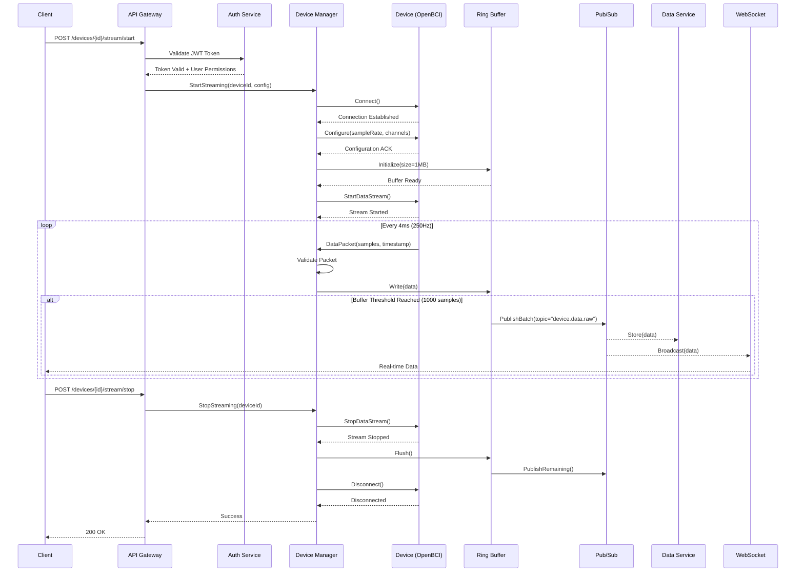

<Tabs items={['Timing Details', 'Message Formats', 'Error Scenarios']}>
  <Tabs.Tab>
    **Timing Specifications:**

    | Operation | Typical Latency | Max Latency | Notes |
    |-----------|----------------|-------------|--------|
    | JWT Validation | 5-10ms | 50ms | Cached tokens faster |
    | Device Connection | 100-500ms | 2000ms | USB fastest, BLE slowest |
    | Configuration | 20-50ms | 100ms | Depends on parameters |
    | Buffer Init | Less than 1ms | 5ms | Pre-allocated memory |
    | Data Packet | 4ms | 8ms | 250Hz sampling rate |
    | Pub/Sub Publish | 5-10ms | 20ms | Async operation |
    | WebSocket Broadcast | 2-5ms | 10ms | Direct connection |

    **Buffering Strategy:**
    - Ring buffer size: 1MB (holds ~10s of data)
    - Batch threshold: 1000 samples (~4 seconds)
    - Flush interval: 100ms (failsafe)
  </Tabs.Tab>

  <Tabs.Tab>
    **Key Message Formats:**

    ```python
    # Data Packet Structure
    class NeuralDataPacket:
        timestamp: datetime       # UTC timestamp
        device_id: str           # Unique device identifier
        sequence_number: int     # Packet sequence counter
        samples: np.ndarray      # Shape: (n_channels, n_samples)
        sample_rate: int         # Hz (250, 500, 1000)
        channel_mask: int        # Active channels bitmask
        battery_level: float     # 0.0 to 1.0
        signal_quality: List[float]  # Per-channel quality
    ```

    **Pub/Sub Message Format:**
    ```json
    {
        "topic": "device.data.raw",
        "device_id": "openbci_cyton_001",
        "timestamp": "2024-01-15T10:30:45.123Z",
        "data": {
            "packets": ["..."],
            "batch_size": 1000,
            "duration_ms": 4000
        }
    }
    ```

    **WebSocket Frame Format:**
    ```json
    {
        "type": "data",
        "device_id": "openbci_cyton_001",
        "channels": [1.23, 4.56, 7.89],
        "timestamp": 1705317045123,
        "quality": [0.98, 0.99, 0.97]
    }
    ```
  </Tabs.Tab>

  <Tabs.Tab>
    **Error Handling Sequences:**

    ```mermaid
    sequenceDiagram
        participant Client
        participant DM as Device Manager
        participant Device
        participant PS as Pub/Sub

        Note over Client,PS: Scenario 1: Connection Lost
        Device--xDM: Connection Lost
        DM->>DM: Detect Disconnection
        DM->>PS: Publish("device.disconnected")
        DM->>DM: Attempt Reconnection

        alt Reconnection Successful
            DM->>Device: Connect()
            Device-->>DM: Connected
            DM->>Device: Resume Stream
            DM->>PS: Publish("device.reconnected")
        else Reconnection Failed
            DM->>PS: Publish("device.error")
            DM-->>Client: Error Notification
        end

        Note over Client,PS: Scenario 2: Buffer Overflow
        Device->>DM: DataPacket
        DM->>DM: Buffer Full Check
        DM->>PS: EmergencyFlush()
        DM->>DM: Apply Backpressure
        DM-->>Device: Slow Down Signal
    ```
  </Tabs.Tab>
</Tabs>

## State Diagrams

### Device State Machine

This state diagram shows all possible device states and the transitions between them, including guards and actions.

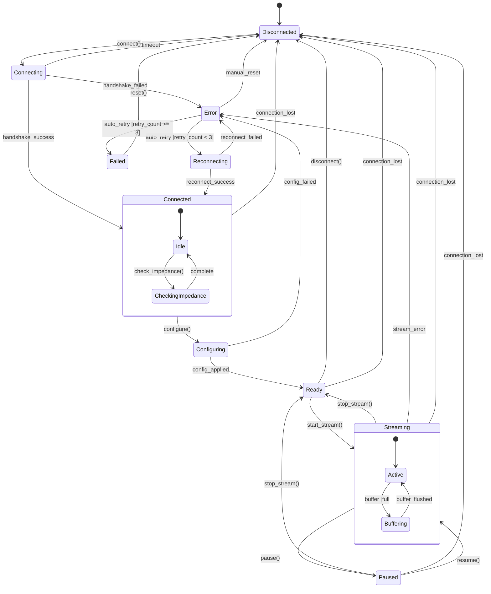

<Tabs items={['State Descriptions', 'Transition Events', 'Implementation']}>
  <Tabs.Tab>
    **Device States:**

    | State | Description | Allowed Actions |
    |-------|-------------|-----------------|
    | **Disconnected** | No active connection to device | Connect |
    | **Connecting** | Establishing connection | Cancel |
    | **Connected** | Connected but not configured | Configure, Disconnect, Check Impedance |
    | **Configuring** | Applying device settings | Cancel |
    | **Ready** | Configured and ready to stream | Start Stream, Disconnect |
    | **Streaming** | Actively receiving data | Pause, Stop, Monitor |
    | **Paused** | Streaming suspended | Resume, Stop |
    | **Error** | Recoverable error state | Retry, Reset |
    | **Reconnecting** | Attempting automatic recovery | Cancel |
    | **Failed** | Unrecoverable error | Manual Reset |

    **Composite States:**
    - **Connected**: Contains sub-states for impedance checking
    - **Streaming**: Contains sub-states for buffer management
  </Tabs.Tab>

  <Tabs.Tab>
    **State Transitions:**

    ```python
    # Transition Guards
    class TransitionGuards:
        @staticmethod
        def can_retry(device: Device) -> bool:
            return device.retry_count < MAX_RETRIES

        @staticmethod
        def has_valid_config(device: Device) -> bool:
            return device.validate_configuration()

        @staticmethod
        def buffer_available(device: Device) -> bool:
            return device.buffer.free_space > MIN_BUFFER_SIZE

    # Transition Actions
    class TransitionActions:
        @staticmethod
        async def on_connect(device: Device):
            device.retry_count = 0
            await device.initialize_driver()

        @staticmethod
        async def on_streaming_start(device: Device):
            await device.buffer.initialize()
            await device.start_data_thread()

        @staticmethod
        async def on_error(device: Device, error: Exception):
            await device.log_error(error)
            await device.notify_error_handlers(error)
            device.retry_count += 1
    ```

    **Event Triggers:**
    - User actions: `connect()`, `disconnect()`, `start_stream()`, `stop_stream()`
    - System events: `connection_lost`, `buffer_full`, `data_timeout`
    - Error events: `handshake_failed`, `config_failed`, `stream_error`
  </Tabs.Tab>

  <Tabs.Tab>
    **State Machine Implementation:**

    ```python
    from enum import Enum, auto
    from typing import Optional, Callable

    class DeviceState(Enum):
        DISCONNECTED = auto()
        CONNECTING = auto()
        CONNECTED = auto()
        CONFIGURING = auto()
        READY = auto()
        STREAMING = auto()
        PAUSED = auto()
        ERROR = auto()
        RECONNECTING = auto()
        FAILED = auto()

    class DeviceStateMachine:
        def __init__(self, device_id: str):
            self.device_id = device_id
            self.state = DeviceState.DISCONNECTED
            self.retry_count = 0
            self.state_handlers = {}
            self.transition_callbacks = []

        def register_state_handler(
            self,
            state: DeviceState,
            handler: Callable
        ):
            self.state_handlers[state] = handler

        async def transition_to(
            self,
            new_state: DeviceState,
            event: Optional[str] = None
        ):
            old_state = self.state

            # Validate transition
            if not self._is_valid_transition(old_state, new_state):
                raise InvalidTransitionError(
                    f"Cannot transition from {old_state} to {new_state}"
                )

            # Execute exit actions
            await self._execute_exit_actions(old_state)

            # Update state
            self.state = new_state

            # Execute entry actions
            await self._execute_entry_actions(new_state)

            # Notify callbacks
            for callback in self.transition_callbacks:
                await callback(old_state, new_state, event)
    ```

    **Usage Example:**
    ```python
    # neural-engine/src/devices/state_machine.py
    device_sm = DeviceStateMachine("openbci_001")
    device_sm.register_state_handler(
        DeviceState.STREAMING,
        handle_streaming_state
    )

    await device_sm.transition_to(DeviceState.CONNECTING)
    ```
  </Tabs.Tab>
</Tabs>

## Entity Relationship Diagrams

### Core Data Model

This ER diagram shows the relationships between core entities in the NeuraScale system.

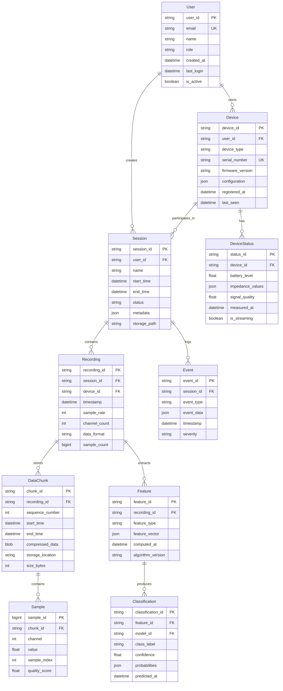

<Tabs items={['Entity Details', 'Relationships', 'Database Schema']}>
  <Tabs.Tab>
    **Core Entities:**

    | Entity | Description | Primary Storage |
    |--------|-------------|-----------------|
    | **User** | System users (researchers, clinicians) | PostgreSQL |
    | **Device** | Neural recording devices | PostgreSQL |
    | **Session** | Recording sessions | PostgreSQL |
    | **Recording** | Continuous data from a device | PostgreSQL + Bigtable |
    | **DataChunk** | Compressed time-series segments | Bigtable |
    | **Sample** | Individual data points | Bigtable |
    | **Feature** | Extracted features from recordings | BigQuery |
    | **Classification** | ML model predictions | BigQuery |
    | **Event** | Session events and markers | PostgreSQL |
    | **DeviceStatus** | Real-time device metrics | Redis + PostgreSQL |

    **Data Volume Estimates:**
    - Users: ~1,000
    - Devices: ~10,000
    - Sessions: ~100,000/month
    - Recordings: ~1M/month
    - Samples: ~100B/month (at 250Hz)
    - Features: ~10M/month
    - Classifications: ~10M/month
  </Tabs.Tab>

  <Tabs.Tab>
    **Relationship Cardinalities:**

    ```sql
    -- One-to-Many Relationships
    User (1) ----< (N) Session
    User (1) ----< (N) Device
    Device (1) ----< (N) Session
    Device (1) ----< (N) DeviceStatus
    Session (1) ----< (N) Recording
    Session (1) ----< (N) Event
    Recording (1) ----< (N) DataChunk
    Recording (1) ----< (N) Feature
    DataChunk (1) ----< (N) Sample
    Feature (1) ----< (N) Classification

    -- Many-to-Many Relationships (via junction tables)
    Device <----> Session (via Recording)
    User <----> Device (ownership can be transferred)
    ```

    **Referential Integrity Rules:**
    - CASCADE DELETE: Session → Recording → DataChunk → Sample
    - RESTRICT DELETE: User with active Sessions
    - SET NULL: Device deletion sets Recording.device_id to NULL
    - NO ACTION: Feature deletion prevents Classification deletion
  </Tabs.Tab>

  <Tabs.Tab>
    **Physical Database Schema:**

    ```sql
    -- PostgreSQL Tables
    CREATE TABLE users (
        user_id UUID PRIMARY KEY DEFAULT gen_random_uuid(),
        email VARCHAR(255) UNIQUE NOT NULL,
        name VARCHAR(255) NOT NULL,
        role VARCHAR(50) NOT NULL CHECK (role IN ('admin', 'researcher', 'clinician')),
        created_at TIMESTAMP WITH TIME ZONE DEFAULT NOW(),
        last_login TIMESTAMP WITH TIME ZONE,
        is_active BOOLEAN DEFAULT true
    );

    CREATE TABLE devices (
        device_id UUID PRIMARY KEY DEFAULT gen_random_uuid(),
        user_id UUID REFERENCES users(user_id),
        device_type VARCHAR(50) NOT NULL,
        serial_number VARCHAR(255) UNIQUE NOT NULL,
        firmware_version VARCHAR(50),
        configuration JSONB DEFAULT '{}',
        registered_at TIMESTAMP WITH TIME ZONE DEFAULT NOW(),
        last_seen TIMESTAMP WITH TIME ZONE,
        INDEX idx_user_devices (user_id),
        INDEX idx_device_type (device_type)
    );

    -- Bigtable Schema
    Table: neural_data
    Row Key: {recording_id}#{timestamp}#{channel}
    Column Families:
      - raw: raw_value, quality_score
      - meta: sample_rate, device_id
      - features: fft, psd, entropy

    -- BigQuery Schema
    Dataset: neurascale_analytics
    Tables:
      - features: Partitioned by DATE(computed_at)
      - classifications: Partitioned by DATE(predicted_at)
      - aggregated_metrics: Materialized views for dashboards
    ```
  </Tabs.Tab>
</Tabs>

### Authentication Sequence

This sequence diagram shows the complete authentication and authorization flow using JWT tokens.

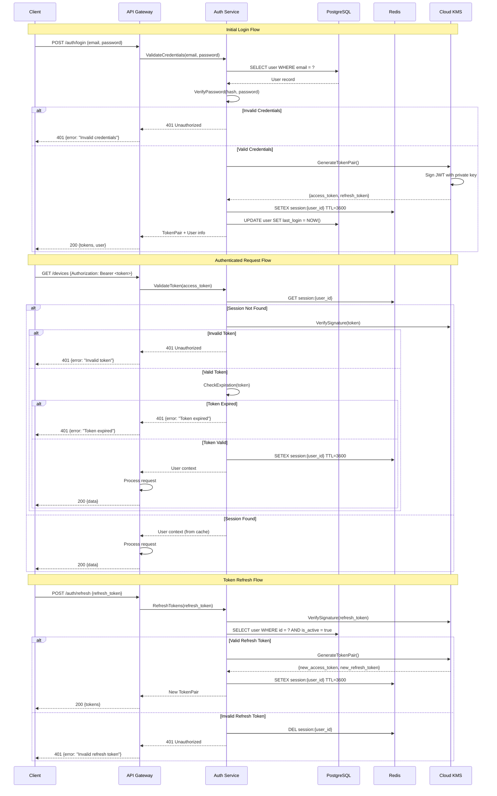

<Tabs items={['Token Details', 'Security Features', 'Implementation']}>
  <Tabs.Tab>
    **JWT Token Structure:**

    ```json
    {
      "header": {
        "alg": "RS256",
        "typ": "JWT",
        "kid": "key_id_2024"
      },
      "payload": {
        "sub": "user_uuid",
        "email": "user@example.com",
        "role": "researcher",
        "permissions": ["read:devices", "write:sessions"],
        "iat": 1705320000,
        "exp": 1705323600,
        "iss": "neurascale.io",
        "aud": "neurascale-api"
      },
      "signature": "..."
    }
    ```

    **Token Lifetimes:**
    - Access Token: 1 hour
    - Refresh Token: 30 days
    - Session Cache: 1 hour (sliding window)

    **Token Storage:**
    - Client: Secure storage (HttpOnly cookies or secure local storage)
    - Server: Redis for session caching
    - Keys: Cloud KMS for signing keys
  </Tabs.Tab>

  <Tabs.Tab>
    **Security Measures:**

    1. **Password Security**
       - Argon2id hashing (memory-hard)
       - Salt per password
       - Configurable work factors

    2. **Token Security**
       - RS256 asymmetric signing
       - Key rotation every 90 days
       - Token binding to IP/device

    3. **Rate Limiting**
       - Login: 5 attempts per 15 minutes
       - Token refresh: 10 per hour
       - API calls: 1000 per hour

    4. **Additional Protection**
       - CSRF tokens for web clients
       - Secure headers (HSTS, CSP)
       - Request signing for sensitive operations

    ```python
    # Rate limiting implementation
    @rate_limit(
        key=lambda: f"login:{request.remote_addr}",
        rate="5/15m",
        method="sliding_window"
    )
    async def login(credentials: LoginRequest):
        # Login logic
        pass
    ```
  </Tabs.Tab>

  <Tabs.Tab>
    **Authentication Service Implementation:**

    ```python
    from datetime import datetime, timedelta
    from typing import Optional, Tuple
    import jwt
    from argon2 import PasswordHasher
    from redis import Redis

    class AuthService:
        def __init__(self, kms_client, db, redis: Redis):
            self.kms = kms_client
            self.db = db
            self.redis = redis
            self.ph = PasswordHasher()

        async def authenticate(
            self,
            email: str,
            password: str
        ) -> Tuple[str, str]:
            # Fetch user
            user = await self.db.fetch_one(
                "SELECT * FROM users WHERE email = ?",
                email
            )

            if not user:
                raise AuthenticationError("Invalid credentials")

            # Verify password
            try:
                self.ph.verify(user.password_hash, password)
            except:
                raise AuthenticationError("Invalid credentials")

            # Generate tokens
            access_token = await self._generate_access_token(user)
            refresh_token = await self._generate_refresh_token(user)

            # Cache session
            await self._cache_session(user.id, {
                "user_id": user.id,
                "email": user.email,
                "role": user.role,
                "permissions": user.permissions
            })

            return access_token, refresh_token

        async def _generate_access_token(self, user) -> str:
            payload = {
                "sub": str(user.id),
                "email": user.email,
                "role": user.role,
                "permissions": user.permissions,
                "iat": datetime.utcnow(),
                "exp": datetime.utcnow() + timedelta(hours=1)
            }

            # Sign with KMS
            return await self.kms.sign_jwt(payload)
    ```
  </Tabs.Tab>
</Tabs>

### Processing Pipeline State Machine

This state diagram shows the states and transitions for the real-time neural data processing pipeline.

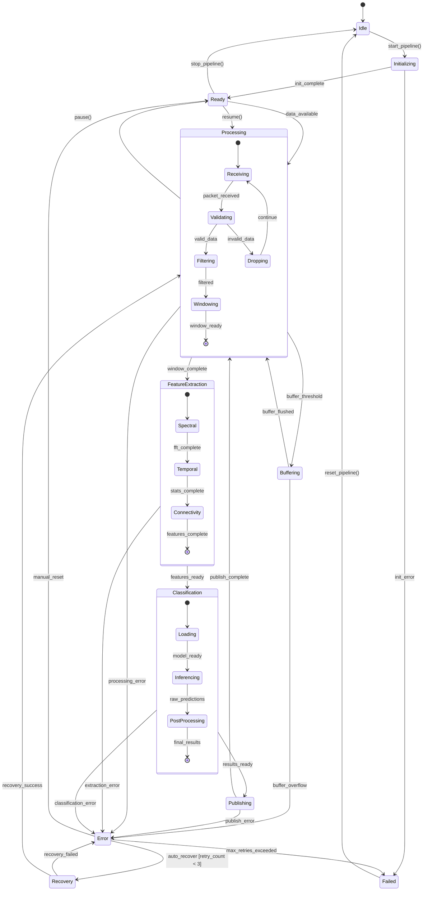

<Tabs items={['Pipeline States', 'Processing Details', 'Implementation']}>
  <Tabs.Tab>
    **Pipeline States:**

    | State | Description | Processing Rate |
    |-------|-------------|-----------------|
    | **Idle** | No active processing | 0 samples/s |
    | **Initializing** | Loading models, allocating buffers | N/A |
    | **Ready** | Waiting for data | 0 samples/s |
    | **Processing** | Active data processing | 250-1000 samples/s |
    | **Buffering** | Accumulating data for batch | Variable |
    | **FeatureExtraction** | Computing features | ~10 windows/s |
    | **Classification** | ML inference | ~10 predictions/s |
    | **Publishing** | Sending results | Async |
    | **Error** | Recoverable error state | 0 samples/s |
    | **Recovery** | Attempting auto-recovery | N/A |
    | **Failed** | Unrecoverable error | 0 samples/s |

    **Composite State Details:**
    - **Processing**: Receiving → Validating → Filtering → Windowing
    - **FeatureExtraction**: Spectral → Temporal → Connectivity analysis
    - **Classification**: Model loading → Inference → Post-processing
  </Tabs.Tab>

  <Tabs.Tab>
    **Processing Pipeline Stages:**

    ```python
    # Pipeline Configuration
    PIPELINE_CONFIG = {
        "buffer_size": 10000,        # samples
        "window_size": 1000,         # samples (4s at 250Hz)
        "window_overlap": 0.5,       # 50% overlap
        "batch_size": 10,            # windows per batch
        "feature_dims": 128,         # feature vector size
        "model_timeout": 100,        # ms
        "publish_timeout": 50,       # ms
    }

    # Processing Stages
    class ProcessingStages:
        RECEIVING = "receiving"
        VALIDATING = "validating"
        FILTERING = "filtering"
        WINDOWING = "windowing"
        SPECTRAL = "spectral_features"
        TEMPORAL = "temporal_features"
        CONNECTIVITY = "connectivity_features"
        INFERENCE = "ml_inference"
        PUBLISHING = "result_publishing"
    ```

    **Performance Metrics:**
    - Latency per stage: 1-5ms
    - Total pipeline latency: Less than 50ms
    - Throughput: 1000 samples/s per channel
    - Feature extraction: 10ms per window
    - ML inference: 5-10ms per batch
  </Tabs.Tab>

  <Tabs.Tab>
    **Pipeline State Machine Implementation:**

    ```python
    from enum import Enum, auto
    from dataclasses import dataclass
    from typing import Optional, List
    import asyncio

    class PipelineState(Enum):
        IDLE = auto()
        INITIALIZING = auto()
        READY = auto()
        PROCESSING = auto()
        BUFFERING = auto()
        FEATURE_EXTRACTION = auto()
        CLASSIFICATION = auto()
        PUBLISHING = auto()
        ERROR = auto()
        RECOVERY = auto()
        FAILED = auto()

    @dataclass
    class PipelineContext:
        buffer: RingBuffer
        feature_extractor: FeatureExtractor
        classifier: MLClassifier
        publisher: ResultPublisher
        error_count: int = 0
        current_window: Optional[np.ndarray] = None
        features: Optional[np.ndarray] = None
        predictions: Optional[dict] = None

    class ProcessingPipeline:
        def __init__(self, config: dict):
            self.config = config
            self.state = PipelineState.IDLE
            self.context = None
            self._state_handlers = self._setup_handlers()

        async def start(self):
            await self.transition_to(PipelineState.INITIALIZING)

        async def process_data(self, data: np.ndarray):
            if self.state != PipelineState.READY:
                raise InvalidStateError(
                    f"Cannot process data in state {self.state}"
                )

            self.context.buffer.write(data)

            if self.context.buffer.ready_for_window():
                await self.transition_to(PipelineState.PROCESSING)

        async def transition_to(
            self,
            new_state: PipelineState
        ):
            # Execute state transition
            old_state = self.state
            self.state = new_state

            # Call appropriate handler
            handler = self._state_handlers.get(new_state)
            if handler:
                try:
                    await handler()
                except Exception as e:
                    await self._handle_error(e)

        async def _handle_processing(self):
            # Get window from buffer
            window = self.context.buffer.get_window(
                size=self.config["window_size"],
                overlap=self.config["window_overlap"]
            )

            # Validate and filter
            if not self._validate_window(window):
                return await self.transition_to(PipelineState.READY)

            filtered = await self._filter_window(window)
            self.context.current_window = filtered

            # Move to feature extraction
            await self.transition_to(PipelineState.FEATURE_EXTRACTION)
    ```
  </Tabs.Tab>
</Tabs>

### GraphQL API Flow

This sequence diagram shows the complete flow of a GraphQL API request, including query parsing, resolution, and data fetching with DataLoader optimization.

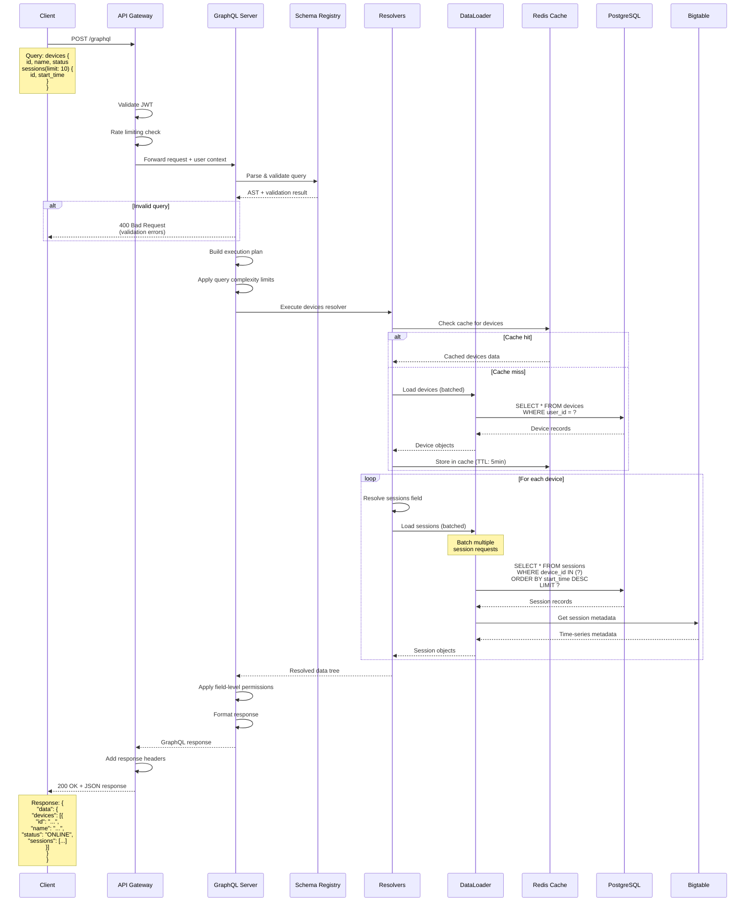

<Tabs items={['API Features', 'Query Examples', 'Performance']}>
  <Tabs.Tab>
    **GraphQL API Features:**

    | Feature | Description | Implementation |
    |---------|-------------|----------------|
    | **Type Safety** | Strongly typed schema | Strawberry GraphQL |
    | **Query Batching** | N+1 query prevention | DataLoader pattern |
    | **Caching** | Multi-level caching | Redis + in-memory |
    | **Subscriptions** | Real-time updates | WebSocket + Pub/Sub |
    | **Pagination** | Cursor-based pagination | Relay specification |
    | **Rate Limiting** | Per-user/per-IP limits | Token bucket algorithm |
    | **Query Complexity** | Prevent expensive queries | Depth + cost analysis |
    | **Field Permissions** | Fine-grained access control | Decorator-based |
    | **Error Handling** | Structured error responses | GraphQL error spec |
    | **Introspection** | Schema discovery | Disabled in production |

    **Security Features:**
    - JWT authentication with refresh tokens
    - Field-level authorization
    - Query depth limiting (max: 10 levels)
    - Query complexity scoring (max: 1000 points)
    - Rate limiting (100 req/min per user)
    - SQL injection prevention via parameterized queries
  </Tabs.Tab>

  <Tabs.Tab>
    **Common Query Patterns:**

    ```graphql
    # Device listing with nested data
    query GetDevices($filter: DeviceFilter, $pagination: PaginationInput) {
      devices(filter: $filter, pagination: $pagination) {
        edges {
          node {
            id
            name
            type
            status
            lastSeen
            sessions(first: 5) {
              edges {
                node {
                  id
                  startTime
                  status
                  patient {
                    id
                    externalId
                  }
                }
              }
            }
          }
        }
        pageInfo {
          hasNextPage
          endCursor
        }
      }
    }

    # Real-time subscriptions
    subscription StreamNeuralData($sessionId: ID!) {
      neuralDataStream(sessionId: $sessionId) {
        timestamp
        channel
        value
        sessionId
      }
    }

    # Mutations with nested returns
    mutation StartSession($input: StartSessionInput!) {
      startSession(input: $input) {
        session {
          id
          status
          device {
            id
            name
          }
        }
        errors {
          field
          message
        }
      }
    }
    ```

    **DataLoader Batching Example:**
    ```python
    # Without DataLoader: N+1 queries
    devices = get_devices()  # 1 query
    for device in devices:
        sessions = get_sessions(device.id)  # N queries

    # With DataLoader: 2 queries total
    devices = get_devices()  # 1 query
    session_loader.load_many([d.id for d in devices])  # 1 batched query
    ```
  </Tabs.Tab>

  <Tabs.Tab>
    **Performance Metrics:**

    | Operation | Response Time | Throughput |
    |-----------|---------------|------------|
    | Simple query (cached) | Less than 10ms | 10,000 req/s |
    | Simple query (DB) | Less than 50ms | 2,000 req/s |
    | Complex nested query | Less than 200ms | 500 req/s |
    | Subscription setup | Less than 100ms | 1,000 conn/s |
    | Data streaming | Less than 5ms/msg | 100,000 msg/s |

    **Optimization Strategies:**

    ```python
    # Efficient resolver with DataLoader
    @strawberry.field
    async def sessions(
        self,
        info: Info,
        first: int = 10,
        after: Optional[str] = None
    ) -> SessionConnection:
        # Use DataLoader for batching
        loader = info.context.dataloaders.session_loader

        # Apply cursor-based pagination
        sessions = await loader.load(
            SessionQuery(
                device_id=self.id,
                limit=first + 1,  # Extra for hasNextPage
                after_cursor=after
            )
        )

        # Build connection response
        has_next = len(sessions) > first
        edges = [
            SessionEdge(
                node=session,
                cursor=encode_cursor(session.id)
            )
            for session in sessions[:first]
        ]

        return SessionConnection(
            edges=edges,
            page_info=PageInfo(
                has_next_page=has_next,
                end_cursor=edges[-1].cursor if edges else None
            )
        )
    ```

    **Caching Strategy:**
    - L1 Cache: In-memory LRU (100MB, 1min TTL)
    - L2 Cache: Redis (1GB, 5min TTL)
    - Cache key pattern: `gql:{query_hash}:{variables_hash}`
    - Cache invalidation: Event-driven via Pub/Sub
  </Tabs.Tab>
</Tabs>

### Real-time Data Streaming Flow

This flowchart shows the complete real-time data streaming architecture, from device data acquisition through WebSocket delivery to clients.

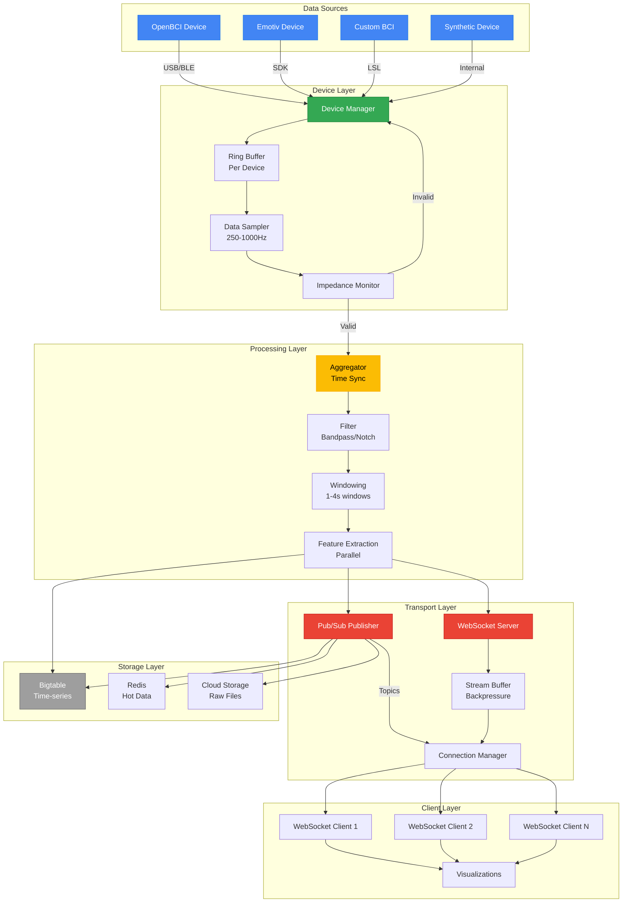

<Tabs items={['Streaming Architecture', 'WebSocket Protocol', 'Implementation']}>
  <Tabs.Tab>
    **Streaming Components:**

    | Component | Purpose | Capacity | Latency |
    |-----------|---------|----------|---------|
    | **Ring Buffer** | Per-device circular buffer | 10s of data | Less than 1ms write |
    | **Data Sampler** | Downsample/upsample to target rate | 250-1000 Hz | Less than 1ms |
    | **Aggregator** | Time-align multi-device streams | 32 devices | Less than 5ms |
    | **Filter** | Remove noise and artifacts | Real-time | Less than 2ms |
    | **Windowing** | Create analysis windows | 1-4s windows | Less than 1ms |
    | **Feature Extraction** | Compute real-time features | 100+ features | Less than 10ms |
    | **WebSocket Server** | Real-time client delivery | 1000+ clients | Less than 5ms |
    | **Stream Buffer** | Handle client backpressure | 1MB per client | Variable |

    **Data Flow Rates:**
    - Raw data: 32 channels × 1000 Hz × 4 bytes = 128 KB/s per device
    - Feature data: 100 features × 10 Hz × 4 bytes = 4 KB/s per device
    - WebSocket messages: ~100-1000 msg/s per client
    - Pub/Sub throughput: 10,000+ msg/s total
  </Tabs.Tab>

  <Tabs.Tab>
    **WebSocket Message Protocol:**

    ```typescript
    // Client -> Server Messages
    interface ClientMessage {
      type: "subscribe" | "unsubscribe" | "configure";
      payload: SubscribePayload | UnsubscribePayload | ConfigPayload;
    }

    interface SubscribePayload {
      streamType: "raw" | "features" | "predictions";
      deviceIds: string[];
      channels?: number[];
      sampleRate?: number;
    }

    // Server -> Client Messages
    interface ServerMessage {
      type: "data" | "event" | "error" | "ack";
      timestamp: number;
      payload: DataPayload | EventPayload | ErrorPayload;
    }

    interface DataPayload {
      deviceId: string;
      streamType: "raw" | "features" | "predictions";
      data: Float32Array | FeatureData | PredictionData;
      sequenceNumber: number;
    }

    interface EventPayload {
      eventType: "device_connected" | "device_disconnected" | "impedance_change";
      deviceId: string;
      details: any;
    }
    ```

    **Connection Lifecycle:**
    1. Client connects: `ws://api/v1/streaming/neural-data`
    2. Server sends: `{"type": "ack", "payload": {"connectionId": "..."}}`
    3. Client subscribes: `{"type": "subscribe", "payload": {...}}`
    4. Server streams data: `{"type": "data", "payload": {...}}`
    5. Client can configure filtering, sampling rate, etc.
    6. Server handles backpressure with buffering
    7. Clean disconnect or timeout handling
  </Tabs.Tab>

  <Tabs.Tab>
    **Streaming Implementation:**

    ```python
    class StreamingService:
        def __init__(self):
            self.connections: Dict[str, WebSocketConnection] = {}
            self.device_streams: Dict[str, DeviceStream] = {}
            self.buffer_size = 10000  # samples per device

        async def handle_connection(self, websocket: WebSocket):
            connection_id = str(uuid4())
            connection = WebSocketConnection(
                id=connection_id,
                websocket=websocket,
                subscriptions=set(),
                buffer=StreamBuffer(max_size=1024*1024)  # 1MB
            )

            self.connections[connection_id] = connection

            try:
                # Send acknowledgment
                await websocket.send_json({
                    "type": "ack",
                    "timestamp": time.time(),
                    "payload": {"connectionId": connection_id}
                })

                # Handle messages
                while True:
                    message = await websocket.receive_json()
                    await self._handle_client_message(connection, message)

            except WebSocketDisconnect:
                await self._cleanup_connection(connection_id)

        async def stream_data(self, device_id: str, data: np.ndarray):
            # Process through pipeline
            filtered = await self.filter_data(data)
            windowed = self.window_data(filtered)
            features = await self.extract_features(windowed)

            # Publish to subscribers
            tasks = []
            for conn_id, connection in self.connections.items():
                if device_id in connection.subscriptions:
                    tasks.append(
                        self._send_to_client(connection, {
                            "type": "data",
                            "timestamp": time.time(),
                            "payload": {
                                "deviceId": device_id,
                                "streamType": "features",
                                "data": features.tolist(),
                                "sequenceNumber": self._get_sequence()
                            }
                        })
                    )

            # Send concurrently with backpressure handling
            await asyncio.gather(*tasks, return_exceptions=True)

        async def _send_to_client(self, connection: WebSocketConnection, message: dict):
            # Check buffer space
            if connection.buffer.available_space() < len(message):
                # Apply backpressure
                await connection.buffer.wait_for_space()

            # Queue message
            connection.buffer.put(message)

            # Send if not already sending
            if not connection.is_sending:
                await self._flush_buffer(connection)
    ```

    **Performance Optimizations:**
    - Zero-copy buffers for raw data
    - SIMD operations for filtering
    - Parallel feature extraction
    - Message batching for efficiency
    - Automatic quality degradation under load
  </Tabs.Tab>
</Tabs>

## Service Architecture

### Device Service

The Device Service manages all device-related operations and real-time data acquisition.

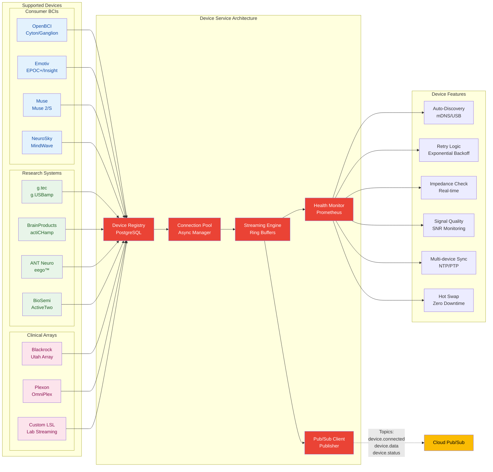

**Technical Specifications:**
- Written in Python 3.12 with asyncio
- Uses lock-free ring buffers for data
- Implements backpressure mechanisms
- Sub-100ms latency guarantee

### Processing Service

The Processing Service handles all signal processing and feature extraction operations using GCP AI/ML services.

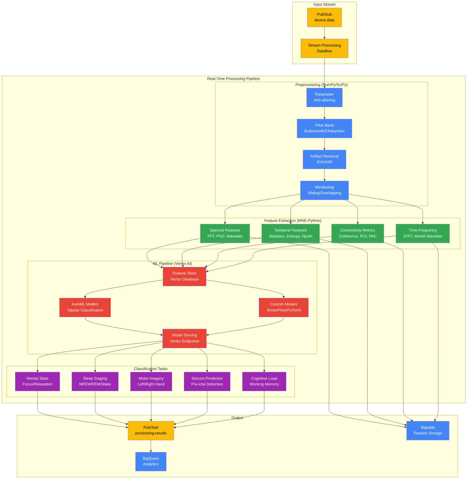

### Data Service

The Data Service manages data persistence, retrieval, and analytics using GCP's multi-tier storage architecture.

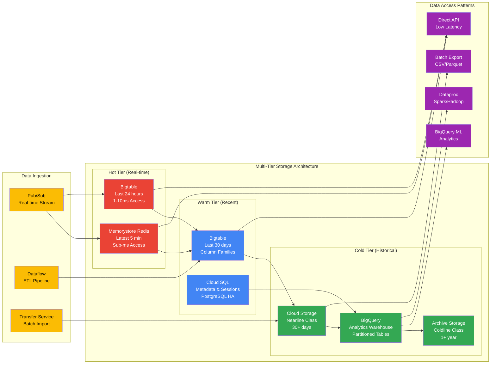

## Data Flow & Latency

### Real-Time Data Pipeline

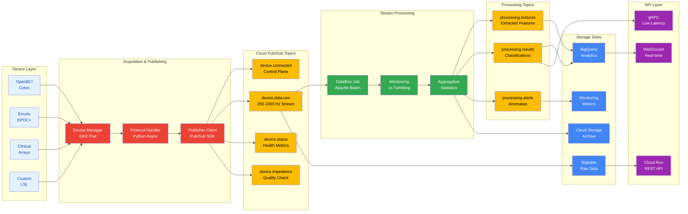

### Latency Budget

<Table>
  <thead>
    <Table.Tr>
      <Table.Th>Stage</Table.Th>
      <Table.Th>Budget</Table.Th>
      <Table.Th>Actual</Table.Th>
      <Table.Th>Notes</Table.Th>
    </Table.Tr>
  </thead>
  <tbody>
    <Table.Tr>
      <Table.Td>Device Acquisition</Table.Td>
      <Table.Td>20ms</Table.Td>
      <Table.Td>10-15ms</Table.Td>
      <Table.Td>Hardware dependent</Table.Td>
    </Table.Tr>
    <Table.Tr>
      <Table.Td>Network Transfer</Table.Td>
      <Table.Td>15ms</Table.Td>
      <Table.Td>5-10ms</Table.Td>
      <Table.Td>Optimized protocols</Table.Td>
    </Table.Tr>
    <Table.Tr>
      <Table.Td>Buffering</Table.Td>
      <Table.Td>5ms</Table.Td>
      <Table.Td>&lt;2ms</Table.Td>
      <Table.Td>Lock-free queues</Table.Td>
    </Table.Tr>
    <Table.Tr>
      <Table.Td>Feature Extraction</Table.Td>
      <Table.Td>15ms</Table.Td>
      <Table.Td>10-15ms</Table.Td>
      <Table.Td>SIMD optimized</Table.Td>
    </Table.Tr>
    <Table.Tr>
      <Table.Td>ML Classification</Table.Td>
      <Table.Td>15ms</Table.Td>
      <Table.Td>5-10ms</Table.Td>
      <Table.Td>TensorRT/ONNX</Table.Td>
    </Table.Tr>
    <Table.Tr>
      <Table.Td>Processing</Table.Td>
      <Table.Td>10ms</Table.Td>
      <Table.Td>5-10ms</Table.Td>
      <Table.Td>Parallel pipelines</Table.Td>
    </Table.Tr>
    <Table.Tr>
      <Table.Td>Storage Write</Table.Td>
      <Table.Td>10ms</Table.Td>
      <Table.Td>5-8ms</Table.Td>
      <Table.Td>Async writes</Table.Td>
    </Table.Tr>
    <Table.Tr>
      <Table.Td>API Response</Table.Td>
      <Table.Td>10ms</Table.Td>
      <Table.Td>5-8ms</Table.Td>
      <Table.Td>Cached responses</Table.Td>
    </Table.Tr>
  </tbody>
</Table>

## Scalability

### Horizontal Scaling Architecture

```mermaid
graph TB
    subgraph "External Traffic"
        ET[Cloud Load Balancer<br/>+ Cloud Armor]
    end

    subgraph "GKE Cluster - Regional"
        subgraph "Control Plane"
            CP[Kubernetes API<br/>HA Masters]
            HPA[Horizontal Pod<br/>Autoscaler]
            VPA[Vertical Pod<br/>Autoscaler]
            CA[Cluster<br/>Autoscaler]
        end

        subgraph "Node Pool 1 - General"
            subgraph "Zone A"
                N1A[n2-standard-4<br/>4 vCPU, 16GB RAM]
                P1A[Device Service<br/>2-10 replicas]
                P2A[API Service<br/>3-20 replicas]
            end

            subgraph "Zone B"
                N1B[n2-standard-4<br/>4 vCPU, 16GB RAM]
                P1B[Device Service<br/>2-10 replicas]
                P2B[API Service<br/>3-20 replicas]
            end

            subgraph "Zone C"
                N1C[n2-standard-4<br/>4 vCPU, 16GB RAM]
                P1C[Device Service<br/>2-10 replicas]
                P2C[API Service<br/>3-20 replicas]
            end
        end

        subgraph "Node Pool 2 - ML/GPU"
            subgraph "GPU Zone A"
                N2A[n1-highmem-4<br/>+ T4 GPU]
                P3A[ML Service<br/>1-5 replicas]
            end

            subgraph "GPU Zone B"
                N2B[n1-highmem-4<br/>+ T4 GPU]
                P3B[ML Service<br/>1-5 replicas]
            end
        end

        subgraph "Node Pool 3 - Memory"
            N3[n2-highmem-8<br/>8 vCPU, 64GB RAM]
            P4[Processing Service<br/>2-8 replicas]
        end
    end

    subgraph "Autoscaling Metrics"
        M1[CPU Usage<br/>>70%]
        M2[Memory Usage<br/>>80%]
        M3[Pub/Sub Queue<br/>>1000 msgs]
        M4[Custom Metrics<br/>Device Count]
    end

    subgraph "Managed Services"
        MS1[Cloud SQL<br/>Auto-failover]
        MS2[Bigtable<br/>Auto-scaling]
        MS3[Pub/Sub<br/>Unlimited Scale]
        MS4[Cloud Storage<br/>∞ Scale]
    end

    ET --> CP
    CP --> HPA
    CP --> VPA
    CP --> CA

    HPA --> P1A
    HPA --> P2A
    HPA --> P3A
    HPA --> P4

    CA --> N1A
    CA --> N1B
    CA --> N1C
    CA --> N2A
    CA --> N2B
    CA --> N3

    M1 --> HPA
    M2 --> HPA
    M3 --> HPA
    M4 --> HPA

    P1A --> MS1
    P2A --> MS2
    P3A --> MS3
    P4 --> MS4

    style ET fill:#34a853,color:#ffffff
    style CP fill:#ea4335,color:#ffffff
    style HPA fill:#fbbc04,color:#000000
    style VPA fill:#fbbc04,color:#000000
    style CA fill:#fbbc04,color:#000000
    style N1A fill:#4285f4,color:#ffffff
    style N1B fill:#4285f4,color:#ffffff
    style N1C fill:#4285f4,color:#ffffff
    style N2A fill:#9c27b0,color:#ffffff
    style N2B fill:#9c27b0,color:#ffffff
    style N3 fill:#4285f4,color:#ffffff
    style MS1 fill:#0f9d58,color:#ffffff
    style MS2 fill:#0f9d58,color:#ffffff
    style MS3 fill:#0f9d58,color:#ffffff
    style MS4 fill:#0f9d58,color:#ffffff
```

### Resource Allocation

<Tabs items={['Device Service', 'Processing Service', 'Data Service']}>
  <Tabs.Tab>
    **Device Service Resources:**
    - CPU: 2-8 cores
    - Memory: 4-16 GB
    - Network: 1-10 Gbps
    - Scaling: By device count
  </Tabs.Tab>

  <Tabs.Tab>
    **Processing Service Resources:**
    - CPU: 8-32 cores
    - Memory: 32-128 GB
    - GPU: Optional (CUDA)
    - Scaling: By channel count
  </Tabs.Tab>

  <Tabs.Tab>
    **Data Service Resources:**
    - CPU: 4-16 cores
    - Memory: 16-64 GB
    - Storage: NVMe SSD
    - Scaling: By write throughput
  </Tabs.Tab>
</Tabs>

## Security Architecture

### Defense in Depth

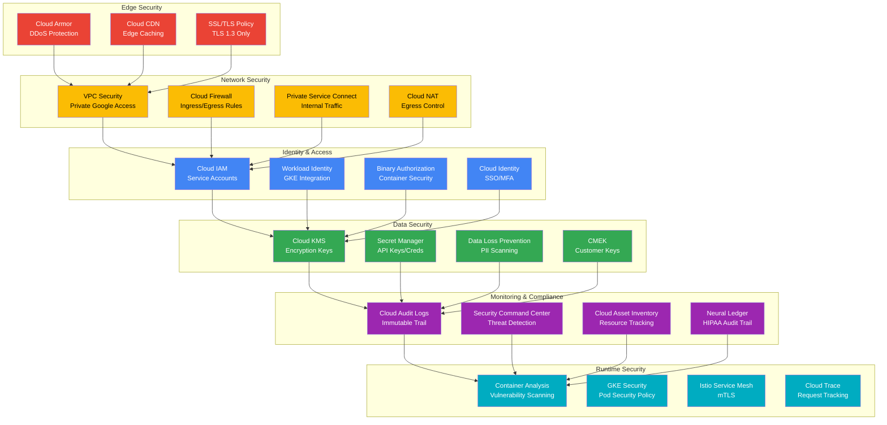

### Compliance Features

<Tabs items={['HIPAA', 'GDPR']}>
  <Tabs.Tab>
    **HIPAA Compliance:**
    - End-to-end encryption (AES-256)
    - Audit logging with immutability
    - Access controls (RBAC + ABAC)
    - Data retention policies
    - Business Associate Agreements
  </Tabs.Tab>

  <Tabs.Tab>
    **GDPR Compliance:**
    - Consent management
    - Right to deletion
    - Data portability
    - Privacy by design
    - Data minimization
  </Tabs.Tab>
</Tabs>

## Technology Stack

<Table>
  <thead>
    <Table.Tr>
      <Table.Th>Component</Table.Th>
      <Table.Th>Technology</Table.Th>
      <Table.Th>Justification</Table.Th>
    </Table.Tr>
  </thead>
  <tbody>
    <Table.Tr>
      <Table.Td>Backend</Table.Td>
      <Table.Td>Python 3.12 + FastAPI</Table.Td>
      <Table.Td>Async performance, ecosystem</Table.Td>
    </Table.Tr>
    <Table.Tr>
      <Table.Td>Real-time</Table.Td>
      <Table.Td>WebSocket + gRPC</Table.Td>
      <Table.Td>Low latency, bidirectional</Table.Td>
    </Table.Tr>
    <Table.Tr>
      <Table.Td>Message Bus</Table.Td>
      <Table.Td>Kafka + Redis Pub/Sub</Table.Td>
      <Table.Td>Scalability, persistence</Table.Td>
    </Table.Tr>
    <Table.Tr>
      <Table.Td>Time Series</Table.Td>
      <Table.Td>TimescaleDB</Table.Td>
      <Table.Td>PostgreSQL compatibility</Table.Td>
    </Table.Tr>
    <Table.Tr>
      <Table.Td>Object Store</Table.Td>
      <Table.Td>S3/MinIO</Table.Td>
      <Table.Td>Standard API, scalability</Table.Td>
    </Table.Tr>
    <Table.Tr>
      <Table.Td>Search</Table.Td>
      <Table.Td>Elasticsearch</Table.Td>
      <Table.Td>Full-text, aggregations</Table.Td>
    </Table.Tr>
    <Table.Tr>
      <Table.Td>ML Inference</Table.Td>
      <Table.Td>ONNX Runtime + TensorRT</Table.Td>
      <Table.Td>Optimized inference</Table.Td>
    </Table.Tr>
    <Table.Tr>
      <Table.Td>Monitoring</Table.Td>
      <Table.Td>Prometheus + Grafana</Table.Td>
      <Table.Td>Industry standard</Table.Td>
    </Table.Tr>
  </tbody>
</Table>

## Deployment Architecture

### Multi-Project GCP Setup

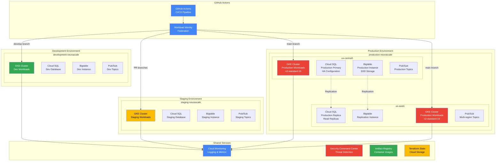

### Disaster Recovery

<Callout type="info">
  **RTO/RPO Targets:**
  - RTO (Recovery Time Objective): &lt;1 hour
  - RPO (Recovery Point Objective): &lt;5 minutes
</Callout>

**Backup Strategy:**
- Continuous replication to standby region
- Point-in-time recovery for 30 days
- Automated failover with health checks
- Regular DR drills

## Performance Optimization

### Optimization Techniques

<Tabs items={['Zero-Copy', 'SIMD', 'GPU', 'Async I/O']}>
  <Tabs.Tab>
    **Zero-Copy Data Transfer**
    ```python
    # Shared memory segments
    buffer = mmap.mmap(-1, size)
    # Direct memory access
    numpy_array = np.frombuffer(buffer)
    ```
  </Tabs.Tab>

  <Tabs.Tab>
    **SIMD Vectorization**
    ```python
    # NumPy with MKL backend
    # AVX2/AVX-512 instructions
    filtered = np.convolve(data, kernel, mode='same')
    ```
  </Tabs.Tab>

  <Tabs.Tab>
    **GPU Acceleration**
    ```python
    # CuPy for GPU processing
    import cupy as cp
    gpu_data = cp.asarray(cpu_data)
    gpu_fft = cp.fft.fft(gpu_data)
    ```
  </Tabs.Tab>

  <Tabs.Tab>
    **Async I/O**
    ```python
    # AsyncIO for concurrent operations
    async def process_streams(devices):
        tasks = [process_device(d) for d in devices]
        await asyncio.gather(*tasks)
    ```
  </Tabs.Tab>
</Tabs>

## Future Enhancements

### Roadmap

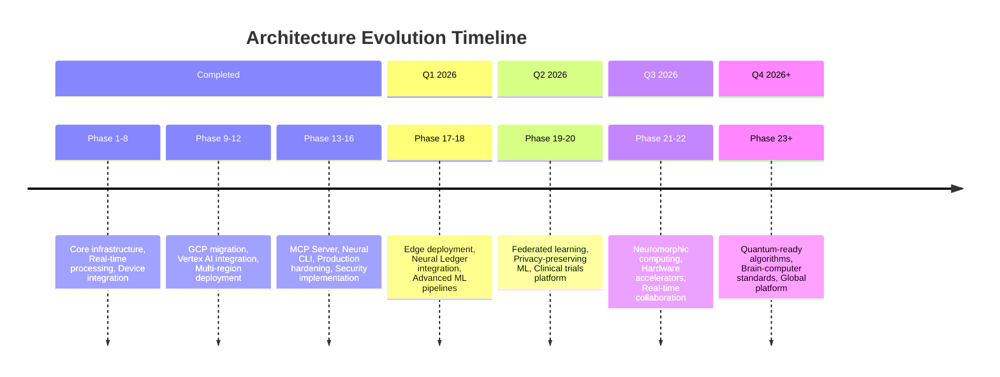

### Research Areas

- **Neuromorphic Computing** - Brain-inspired hardware integration
- **Spiking Neural Networks** - Event-based processing
- **Reservoir Computing** - Efficient temporal processing
- **Brain-Computer Interface Standards** - Industry standardization

## Related Documentation

- [API Documentation](/api-documentation) - Complete API reference
- [Neural Management System](/neural-management-system) - Neural Engine details
- [Security](/security) - Security and compliance details
- [Contributing Guide](/contributing) - Development guidelines
