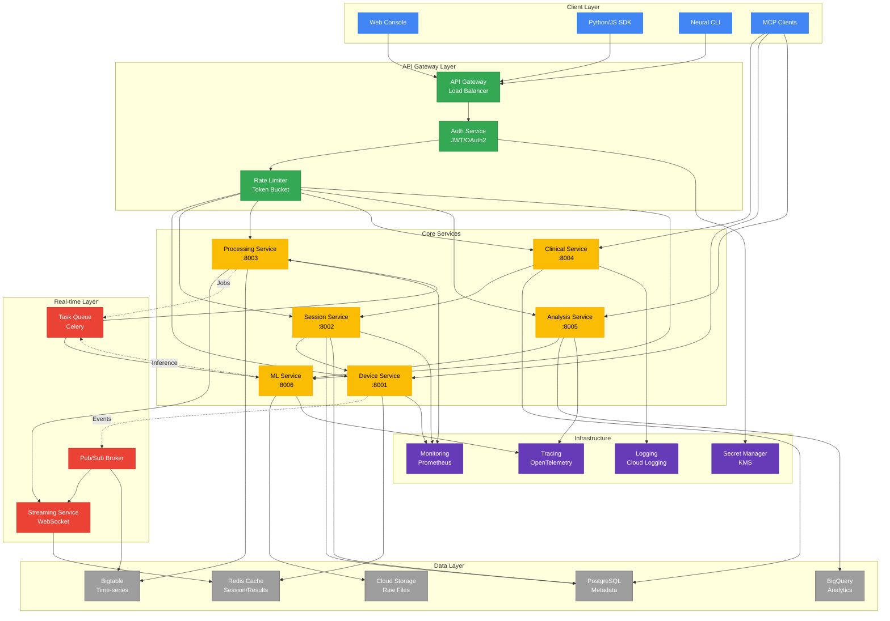

import { Tabs } from 'nextra/components'

# Component Interaction Diagram

This diagram shows the complete system architecture and how all services interact with each other, including synchronous and asynchronous communication patterns.



<Tabs items={['Communication Patterns', 'Service Details', 'Integration Points']}>
  <Tabs.Tab>
    **Communication Types:**

    | Pattern | Use Case | Technology | Latency |
    |---------|----------|------------|---------|
    | **Synchronous REST** | CRUD operations | HTTP/2 + JSON | 10-100ms |
    | **GraphQL** | Complex queries | Apollo Federation | 20-200ms |
    | **WebSocket** | Real-time streaming | WS + MessagePack | Less than 5ms |
    | **Pub/Sub** | Event broadcasting | Cloud Pub/Sub | 10-50ms |
    | **gRPC** | Service-to-service | Protocol Buffers | 5-20ms |
    | **Task Queue** | Async processing | Celery + Redis | 100ms-5s |
    | **MCP** | AI assistant integration | JSON-RPC | 50-200ms |

    **Service Discovery:**
    - Kubernetes DNS for internal services
    - Cloud Endpoints for external APIs
    - Consul for dynamic service registry
    - Health checks via `/health` endpoints
  </Tabs.Tab>

  <Tabs.Tab>
    **Service Responsibilities:**

    ```yaml
    Device Service:
      - Device registration and management
      - Connection handling (USB, BLE, Network)
      - Impedance monitoring
      - Real-time data acquisition
      - Event publishing

    Session Service:
      - Session lifecycle management
      - Recording coordination
      - Metadata management
      - Access control
      - Audit logging

    Processing Service:
      - Signal filtering and preprocessing
      - Feature extraction
      - Window management
      - Stream processing
      - Quality metrics

    Clinical Service:
      - Patient management
      - Treatment protocols
      - Clinical workflows
      - HIPAA compliance
      - Report generation

    Analysis Service:
      - Batch analysis jobs
      - Statistical computations
      - Visualization generation
      - Export functionality
      - Result caching

    ML Service:
      - Model serving
      - Real-time inference
      - Model versioning
      - A/B testing
      - Performance monitoring
    ```
  </Tabs.Tab>

  <Tabs.Tab>
    **Integration Points:**

    | Component | Inbound | Outbound | Protocol |
    |-----------|---------|----------|----------|
    | **API Gateway** | Clients | All services | HTTP/2 |
    | **Device Service** | Gateway, MCP | Pub/Sub, Cache | REST, gRPC |
    | **Session Service** | Gateway, Clinical | PostgreSQL, Device | REST, SQL |
    | **Processing Service** | Queue, Device | Bigtable, Stream | gRPC, WS |
    | **Clinical Service** | Gateway, MCP | PostgreSQL, Session | REST, SQL |
    | **Analysis Service** | Gateway, MCP | BigQuery, ML | REST, gRPC |
    | **ML Service** | Analysis, Queue | GCS, Cache | gRPC, REST |
    | **Streaming Service** | Processing | WebSocket clients | WS |
    | **Pub/Sub** | All services | Subscribers | Cloud Pub/Sub |
    | **Task Queue** | Services | Workers | AMQP |
  </Tabs.Tab>
</Tabs>
