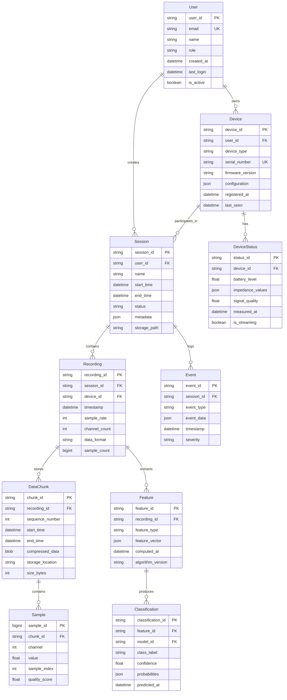
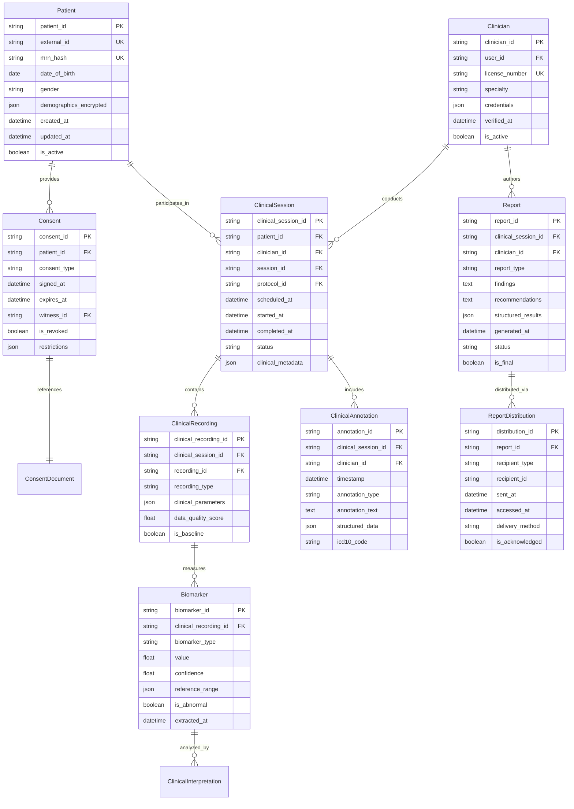
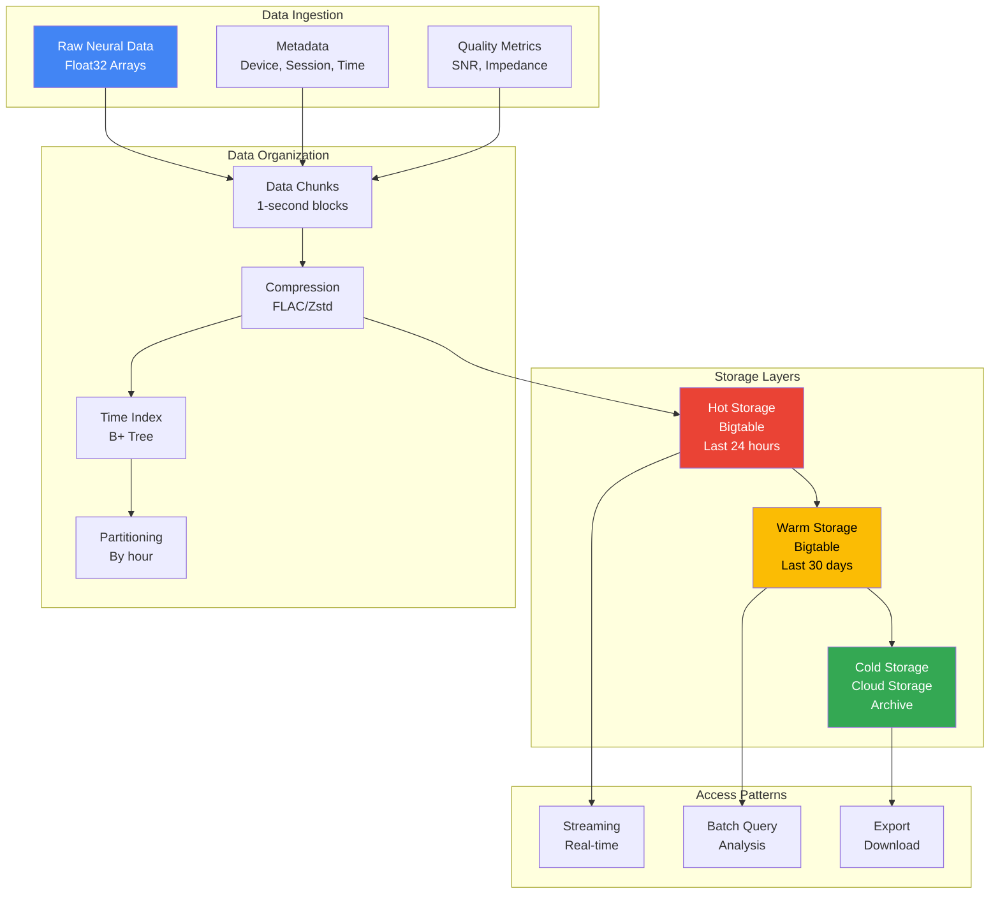

import { Tabs } from 'nextra/components'

# Data Models

## Core Data Model

This ER diagram shows the relationships between core entities in the NeuraScale system.



<Tabs items={['Entity Details', 'Relationships', 'Database Schema']}>
  <Tabs.Tab>
    **Core Entities:**

    | Entity | Description | Primary Storage |
    |--------|-------------|-----------------|
    | **User** | System users (researchers, clinicians) | PostgreSQL |
    | **Device** | Neural recording devices | PostgreSQL |
    | **Session** | Recording sessions | PostgreSQL |
    | **Recording** | Continuous data from a device | PostgreSQL + Bigtable |
    | **DataChunk** | Compressed time-series segments | Bigtable |
    | **Sample** | Individual data points | Bigtable |
    | **Feature** | Extracted features from recordings | BigQuery |
    | **Classification** | ML model predictions | BigQuery |
    | **Event** | Session events and markers | PostgreSQL |
    | **DeviceStatus** | Real-time device metrics | Redis + PostgreSQL |

    **Data Volume Estimates:**
    - Users: ~1,000
    - Devices: ~10,000
    - Sessions: ~100,000/month
    - Recordings: ~1M/month
    - Samples: ~100B/month (at 250Hz)
    - Features: ~10M/month
    - Classifications: ~10M/month
  </Tabs.Tab>

  <Tabs.Tab>
    **Relationship Cardinalities:**

    ```sql
    -- One-to-Many Relationships
    User (1) ----< (N) Session
    User (1) ----< (N) Device
    Device (1) ----< (N) Session
    Device (1) ----< (N) DeviceStatus
    Session (1) ----< (N) Recording
    Session (1) ----< (N) Event
    Recording (1) ----< (N) DataChunk
    Recording (1) ----< (N) Feature
    DataChunk (1) ----< (N) Sample
    Feature (1) ----< (N) Classification

    -- Many-to-Many Relationships (via junction tables)
    Device <----> Session (via Recording)
    User <----> Device (ownership can be transferred)
    ```

    **Referential Integrity Rules:**
    - CASCADE DELETE: Session → Recording → DataChunk → Sample
    - RESTRICT DELETE: User with active Sessions
    - SET NULL: Device deletion sets Recording.device_id to NULL
    - NO ACTION: Feature deletion prevents Classification deletion
  </Tabs.Tab>

  <Tabs.Tab>
    **Physical Database Schema:**

    ```sql
    -- PostgreSQL Tables
    CREATE TABLE users (
        user_id UUID PRIMARY KEY DEFAULT gen_random_uuid(),
        email VARCHAR(255) UNIQUE NOT NULL,
        name VARCHAR(255) NOT NULL,
        role VARCHAR(50) NOT NULL CHECK (role IN ('admin', 'researcher', 'clinician')),
        created_at TIMESTAMP WITH TIME ZONE DEFAULT NOW(),
        last_login TIMESTAMP WITH TIME ZONE,
        is_active BOOLEAN DEFAULT true
    );

    CREATE TABLE devices (
        device_id UUID PRIMARY KEY DEFAULT gen_random_uuid(),
        user_id UUID REFERENCES users(user_id),
        device_type VARCHAR(50) NOT NULL,
        serial_number VARCHAR(255) UNIQUE NOT NULL,
        firmware_version VARCHAR(50),
        configuration JSONB DEFAULT '{}',
        registered_at TIMESTAMP WITH TIME ZONE DEFAULT NOW(),
        last_seen TIMESTAMP WITH TIME ZONE,
        INDEX idx_user_devices (user_id),
        INDEX idx_device_type (device_type)
    );

    -- Bigtable Schema
    Table: neural_data
    Row Key: {recording_id}#{timestamp}#{channel}
    Column Families:
      - raw: raw_value, quality_score
      - meta: sample_rate, device_id
      - features: fft, psd, entropy

    -- BigQuery Schema
    Dataset: neurascale_analytics
    Tables:
      - features: Partitioned by DATE(computed_at)
      - classifications: Partitioned by DATE(predicted_at)
      - aggregated_metrics: Materialized views for dashboards
    ```
  </Tabs.Tab>
</Tabs>

## Clinical Data Model

This ER diagram shows the HIPAA-compliant clinical data model for patient management and medical records.



<Tabs items={['Clinical Entities', 'HIPAA Compliance', 'Access Control']}>
  <Tabs.Tab>
    **Clinical Data Entities:**

    | Entity | Description | Encryption |
    |--------|-------------|------------|
    | **Patient** | De-identified patient records | PII encrypted |
    | **Clinician** | Licensed healthcare providers | Credentials encrypted |
    | **Consent** | Patient consent records | Digitally signed |
    | **ClinicalSession** | Medical recording sessions | Audit trail |
    | **ClinicalRecording** | Medical-grade neural recordings | Encrypted at rest |
    | **ClinicalAnnotation** | Clinical observations and notes | Encrypted |
    | **Biomarker** | Extracted clinical metrics | Reference ranges |
    | **Report** | Clinical reports and findings | Encrypted, versioned |
    | **ReportDistribution** | Report access tracking | Audit log |

    **Clinical Workflows:**
    - Patient registration with consent
    - Pre-session impedance checks
    - Recording with clinical annotations
    - Automated biomarker extraction
    - Report generation and distribution
    - Follow-up scheduling
  </Tabs.Tab>

  <Tabs.Tab>
    **HIPAA Compliance Features:**

    ```yaml
    patient_privacy:
      - de_identification:
          method: "Safe Harbor"
          fields: ["name", "address", "dob", "ssn"]
          retention: "hash_only"

      - encryption:
          at_rest: "AES-256-GCM"
          in_transit: "TLS 1.3"
          key_management: "Cloud KMS"

      - access_control:
          authentication: "multi_factor"
          authorization: "role_based"
          minimum_necessary: true

    audit_trail:
      - data_access:
          who: "user_id, role, ip_address"
          what: "resource, action, fields"
          when: "timestamp_utc"
          why: "purpose_of_use"

      - retention:
          audit_logs: "7_years"
          clinical_data: "per_consent"
          backups: "30_days"

    breach_notification:
      - detection: "real_time"
      - notification: "within_72_hours"
      - reporting: "automated"
    ```

    **Data Integrity:**
    - Immutable audit logs
    - Cryptographic checksums
    - Version control for all changes
    - Automated backup verification
  </Tabs.Tab>

  <Tabs.Tab>
    **Access Control Matrix:**

    | Role | Patient Data | Clinical Sessions | Reports | Admin Functions |
    |------|--------------|-------------------|---------|-----------------|
    | **Patient** | Own data only | Own sessions | Own reports | None |
    | **Clinician** | Assigned patients | Own sessions | Authored reports | Limited |
    | **Researcher** | De-identified only | Consented sessions | Aggregated only | None |
    | **Admin** | Audit logs only | Metadata only | Statistics only | Full system |
    | **Data Analyst** | Aggregated only | None | Analytics only | None |

    **Permission Enforcement:**
    ```python
    class ClinicalAccessControl:
        def __init__(self):
            self.permissions = {
                "clinician": {
                    "patient.read": "assigned_only",
                    "patient.write": "with_consent",
                    "session.create": "own_only",
                    "report.sign": "authored_only"
                },
                "researcher": {
                    "data.read": "deidentified_only",
                    "analysis.run": "approved_protocols",
                    "export.data": "with_irb_approval"
                }
            }

        async def check_access(
            self,
            user: User,
            resource: str,
            action: str,
            context: dict
        ) -> bool:
            # Check role-based permissions
            role_perms = self.permissions.get(user.role, {})
            permission = f"{resource}.{action}"

            if permission not in role_perms:
                return False

            # Apply contextual rules
            rule = role_perms[permission]
            return await self._evaluate_rule(
                user, resource, rule, context
            )
    ```
  </Tabs.Tab>
</Tabs>

## Time-Series Data Model

This section details the optimized data model for high-frequency neural signal storage and retrieval.



<Tabs items={['Storage Strategy', 'Data Schema', 'Query Patterns']}>
  <Tabs.Tab>
    **Time-Series Storage Strategy:**

    | Storage Tier | Retention | Access Speed | Cost | Use Case |
    |--------------|-----------|--------------|------|----------|
    | **Hot** | 24 hours | < 1ms | $$$ | Real-time streaming |
    | **Warm** | 30 days | < 10ms | $$ | Recent analysis |
    | **Cold** | Unlimited | < 1s | $ | Long-term archive |

    **Data Characteristics:**
    - Sample rate: 250-1000 Hz
    - Channels: 1-256
    - Data type: Float32 (4 bytes)
    - Raw throughput: Up to 1 MB/s per device
    - Compression ratio: 3:1 to 5:1

    **Optimization Techniques:**
    - Delta encoding for sequential samples
    - Chunking for parallel processing
    - Column-oriented storage for channels
    - Bloom filters for quick existence checks
    - Pre-computed aggregations
  </Tabs.Tab>

  <Tabs.Tab>
    **Bigtable Schema Design:**

    ```python
    # Row Key Design
    # Format: {shard}#{recording_id}#{timestamp}#{channel}
    # Shard: 0-99 for load distribution
    # Timestamp: Microseconds since epoch
    # Channel: Zero-padded channel number

    class TimeSeriesSchema:
        # Column Families
        COLUMN_FAMILIES = {
            'raw': {
                'max_versions': 1,
                'ttl_days': 30,
                'compression': 'SNAPPY'
            },
            'meta': {
                'max_versions': 5,
                'ttl_days': 90,
                'compression': 'NONE'
            },
            'derived': {
                'max_versions': 3,
                'ttl_days': 7,
                'compression': 'ZSTD'
            }
        }

        # Column Qualifiers
        RAW_COLUMNS = [
            'value',          # Raw sample value
            'quality',        # Quality score (0-1)
            'timestamp_us'    # Precise timestamp
        ]

        META_COLUMNS = [
            'device_id',
            'session_id',
            'sample_rate',
            'filter_state',
            'annotations'
        ]

        DERIVED_COLUMNS = [
            'fft_bins',       # Frequency domain
            'psd',            # Power spectral density
            'phase',          # Phase information
            'envelope'        # Signal envelope
        ]
    ```

    **Write Path Optimization:**
    ```python
    class BatchWriter:
        def __init__(self, table):
            self.table = table
            self.batch_size = 1000
            self.buffer = []

        async def write_samples(
            self,
            recording_id: str,
            samples: np.ndarray,
            timestamp: int
        ):
            # Prepare batch mutations
            mutations = []
            shard = hash(recording_id) % 100

            for i, sample in enumerate(samples):
                row_key = f"{shard:02d}#{recording_id}#{timestamp+i}#00"

                mutations.append(
                    SetCell(
                        family='raw',
                        column='value',
                        value=struct.pack('f', sample)
                    )
                )

            # Batch write
            if len(self.buffer) >= self.batch_size:
                await self.flush()
    ```
  </Tabs.Tab>

  <Tabs.Tab>
    **Query Access Patterns:**

    ```sql
    -- Time Range Query (Optimized)
    SELECT timestamp, channel, value
    FROM neural_data
    WHERE recording_id = ?
      AND timestamp BETWEEN ? AND ?
      AND channel IN (?)
    ORDER BY timestamp;

    -- Aggregation Query
    SELECT
        DATE_TRUNC('second', timestamp) as time_bucket,
        channel,
        AVG(value) as mean_value,
        STDDEV(value) as std_value,
        COUNT(*) as sample_count
    FROM neural_data
    WHERE recording_id = ?
    GROUP BY time_bucket, channel;

    -- Feature Extraction Query
    WITH windowed_data AS (
        SELECT
            timestamp,
            channel,
            value,
            LAG(value, 1) OVER (PARTITION BY channel ORDER BY timestamp) as prev_value,
            LEAD(value, 1) OVER (PARTITION BY channel ORDER BY timestamp) as next_value
        FROM neural_data
        WHERE recording_id = ?
    )
    SELECT
        timestamp,
        channel,
        value,
        (value - prev_value) as diff,
        (next_value - 2*value + prev_value) as second_diff
    FROM windowed_data;
    ```

    **Query Performance Tips:**
    - Use row key prefixes for efficient scanning
    - Leverage server-side filters
    - Implement client-side caching
    - Use parallel queries for multiple channels
    - Pre-aggregate common queries
  </Tabs.Tab>
</Tabs>
