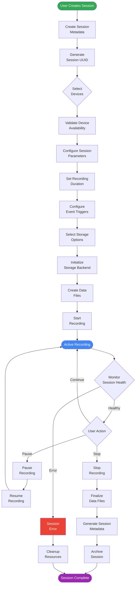
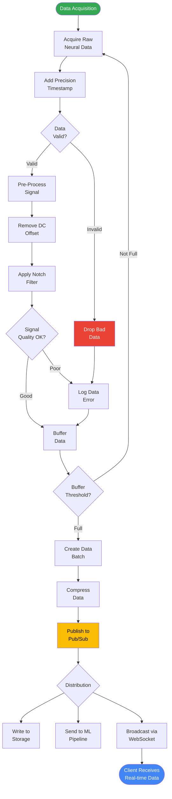

import { Tabs } from 'nextra/components'

# Process Flowcharts

## Device Connection Flow

This flowchart illustrates the complete process from device discovery to active data streaming, including error handling and recovery mechanisms.

```mermaid
flowchart TB
    Start([User Initiates Connection])

    Discovery{Device<br/>Discovery Mode}
    USB[USB Device<br/>Detection]
    BLE[BLE Device<br/>Scanning]
    WIFI[WiFi/LSL<br/>Network Scan]

    DeviceList[Display Available<br/>Devices List]

    SelectDevice{User Selects<br/>Device}

    CheckDriver{Driver<br/>Installed?}
    InstallDriver[Install Device<br/>Driver]

    InitConnection[Initialize<br/>Connection]

    Handshake{Protocol<br/>Handshake}

    Configure[Configure Device<br/>Parameters]
    SetSampleRate[Set Sample Rate<br/>250-1000 Hz]
    SetChannels[Select Active<br/>Channels]
    SetFilters[Configure<br/>Filters]

    Impedance{Impedance<br/>Check Required?}
    CheckImpedance[Run Impedance<br/>Check]
    ImpedanceOK{Impedance<br/><10kΩ?}

    StartBuffer[Initialize<br/>Ring Buffer]

    StartStream[Start Data<br/>Stream]

    Validate{Data<br/>Valid?}

    ProcessData[Process<br/>Incoming Data]
    PublishData[Publish to<br/>Pub/Sub]

    Streaming([Active Streaming])

    Error[Connection<br/>Error]
    Retry{Retry<br/>Connection?}

    Disconnect[Disconnect<br/>Device]

    End([Connection Ended])

    Start --> Discovery
    Discovery --> USB
    Discovery --> BLE
    Discovery --> WIFI

    USB --> DeviceList
    BLE --> DeviceList
    WIFI --> DeviceList

    DeviceList --> SelectDevice

    SelectDevice -->|No Device| End
    SelectDevice -->|Device Selected| CheckDriver

    CheckDriver -->|No| InstallDriver
    CheckDriver -->|Yes| InitConnection
    InstallDriver --> InitConnection

    InitConnection --> Handshake

    Handshake -->|Failed| Error
    Handshake -->|Success| Configure

    Configure --> SetSampleRate
    SetSampleRate --> SetChannels
    SetChannels --> SetFilters
    SetFilters --> Impedance

    Impedance -->|Yes| CheckImpedance
    Impedance -->|No| StartBuffer

    CheckImpedance --> ImpedanceOK
    ImpedanceOK -->|No| Error
    ImpedanceOK -->|Yes| StartBuffer

    StartBuffer --> StartStream
    StartStream --> Validate

    Validate -->|Invalid| Error
    Validate -->|Valid| ProcessData

    ProcessData --> PublishData
    PublishData --> Streaming

    Streaming -->|Data Flow| ProcessData
    Streaming -->|User Disconnect| Disconnect
    Streaming -->|Connection Lost| Error

    Error --> Retry
    Retry -->|Yes| InitConnection
    Retry -->|No| Disconnect

    Disconnect --> End

    style Start fill:#34a853,color:#fff
    style Streaming fill:#4285f4,color:#fff
    style Error fill:#ea4335,color:#fff
    style End fill:#9c27b0,color:#fff
    style ProcessData fill:#fbbc04,color:#000
    style PublishData fill:#fbbc04,color:#000
```



<Tabs items={['Process Steps', 'Error Handling', 'Implementation Details']}>
  <Tabs.Tab>
    **Key Process Steps:**

    1. **Discovery Phase**
       - USB devices detected via serial port enumeration
       - BLE devices found through active scanning
       - WiFi/LSL devices discovered via mDNS broadcast

    2. **Connection Setup**
       - Driver verification and installation if needed
       - Protocol-specific handshake (varies by device type)
       - Connection parameters negotiation

    3. **Configuration**
       - Sample rate selection (250Hz, 500Hz, 1000Hz)
       - Channel mapping and activation
       - Digital filter configuration (notch, bandpass)

    4. **Quality Assurance**
       - Optional impedance checking per channel
       - Signal quality validation
       - Automatic bad channel detection

    5. **Data Streaming**
       - Zero-copy ring buffer initialization
       - Real-time data validation
       - Asynchronous Pub/Sub publishing
  </Tabs.Tab>

  <Tabs.Tab>
    **Error Handling Mechanisms:**

    - **Connection Failures**: Exponential backoff retry strategy
    - **Driver Issues**: Automatic driver download and installation
    - **Protocol Errors**: Fallback to compatible protocol versions
    - **Data Validation**: Packet checksum and timestamp verification
    - **Network Issues**: Automatic reconnection with state preservation
    - **Buffer Overflow**: Backpressure handling and flow control

    **Recovery Strategies:**
    ```python
    # Retry configuration
    MAX_RETRIES = 3
    INITIAL_BACKOFF = 1.0  # seconds
    MAX_BACKOFF = 30.0     # seconds
    BACKOFF_MULTIPLIER = 2.0
    ```
  </Tabs.Tab>

  <Tabs.Tab>
    **Implementation References:**

    - **Device Discovery**: `neural-engine/src/devices/discovery_service.py`
    - **Connection Manager**: `neural-engine/src/devices/device_manager.py`
    - **Protocol Handlers**: `neural-engine/src/devices/protocols/`
    - **Ring Buffer**: `neural-engine/src/core/ring_buffer.py`
    - **Pub/Sub Client**: `neural-engine/src/messaging/pubsub_client.py`

    **Key Classes:**
    ```python
    class DeviceDiscoveryService:
        async def discover_devices(self) -> List[DeviceInfo]

    class DeviceManager:
        async def connect(self, device_id: str) -> Device
        async def configure(self, device: Device, config: DeviceConfig)
        async def start_streaming(self, device: Device)
    ```
  </Tabs.Tab>
</Tabs>

## Session Management Flow

This flowchart shows the complete lifecycle of a neural recording session from creation to completion.



<Tabs items={['Session Lifecycle', 'Data Management', 'Error Recovery']}>
  <Tabs.Tab>
    **Session Management Steps:**

    1. **Session Creation**
       - Generate unique session identifier (UUID v4)
       - Associate with patient/participant record
       - Set recording permissions and access controls

    2. **Device Selection**
       - Verify device availability and compatibility
       - Check for device conflicts or exclusive access
       - Reserve devices for session duration

    3. **Configuration**
       - Recording duration (continuous or fixed)
       - Event triggers (manual, scheduled, or signal-based)
       - Storage options (hot, warm, cold tiers)

    4. **Recording Process**
       - Synchronized multi-device recording
       - Real-time health monitoring
       - Pause/resume functionality

    5. **Session Completion**
       - Data file finalization and integrity checks
       - Metadata generation with session summary
       - Archival to appropriate storage tier
  </Tabs.Tab>

  <Tabs.Tab>
    **Data Management During Session:**

    ```python
    class SessionDataManager:
        def __init__(self, session_id: str):
            self.session_id = session_id
            self.storage_tier = "hot"  # bigtable
            self.buffer_size = 1_000_000  # samples

        async def write_data(self, data: np.ndarray):
            # Write to hot storage with buffering
            await self.hot_storage.write_batch(data)

        async def finalize(self):
            # Move to appropriate tier based on config
            if self.long_term_storage:
                await self.migrate_to_cold_storage()
    ```

    **Storage Hierarchy:**
    - **Hot**: Real-time access during recording
    - **Warm**: Recent sessions (< 30 days)
    - **Cold**: Long-term archive (> 30 days)
  </Tabs.Tab>

  <Tabs.Tab>
    **Error Recovery Procedures:**

    | Error Type | Recovery Action | Data Preservation |
    |------------|----------------|-------------------|
    | Device Disconnect | Auto-reconnect, continue recording | Buffer maintains 10s window |
    | Storage Failure | Failover to backup storage | Write-ahead log ensures no loss |
    | Network Issues | Local caching, sync when restored | Up to 1 hour local cache |
    | Power Loss | Auto-save every 60 seconds | Maximum 60s data loss |
    | System Crash | Session recovery on restart | Checkpoint every 5 minutes |

    **Cleanup Operations:**
    - Release device reservations
    - Flush all buffers to storage
    - Update session status in database
    - Notify connected clients
    - Generate audit trail entry
  </Tabs.Tab>
</Tabs>

## Real-Time Data Streaming Flow

This flowchart details the real-time data processing pipeline from acquisition to client delivery.



<Tabs items={['Pipeline Stages', 'Performance Metrics', 'Optimization']}>
  <Tabs.Tab>
    **Data Processing Pipeline:**

    1. **Acquisition Stage**
       - Receive raw data from device drivers
       - Apply hardware timestamps with microsecond precision
       - Validate packet integrity and sequence

    2. **Pre-Processing Stage**
       - Remove DC offset using high-pass filter (0.1 Hz)
       - Apply notch filter for powerline noise (50/60 Hz)
       - Optional: Apply bandpass filter based on use case

    3. **Quality Assessment**
       - Check for saturated channels
       - Detect disconnected electrodes
       - Calculate signal-to-noise ratio
       - Mark poor quality segments

    4. **Buffering Strategy**
       - Ring buffer: 10,000 samples per channel
       - Batch threshold: 1,000 samples (4 seconds @ 250Hz)
       - Emergency flush: Every 100ms

    5. **Distribution**
       - Parallel fan-out to multiple consumers
       - Priority-based message delivery
       - Guaranteed delivery to storage
  </Tabs.Tab>

  <Tabs.Tab>
    **Performance Characteristics:**

    | Stage | Processing Time | Throughput | CPU Usage |
    |-------|----------------|------------|-----------|
    | Acquisition | < 0.1ms | 100k samples/s | 5% |
    | Validation | < 0.5ms | 50k samples/s | 10% |
    | Pre-Processing | < 2ms | 20k samples/s | 25% |
    | Compression | < 1ms | 40k samples/s | 15% |
    | Publishing | < 5ms | 10k samples/s | 10% |

    **Latency Breakdown:**
    ```
    Device → Buffer:       0.1ms
    Buffer → Processing:   2.0ms
    Processing → Pub/Sub:  5.0ms
    Pub/Sub → WebSocket:   3.0ms
    WebSocket → Client:    5.0ms
    -------------------------------
    Total End-to-End:     15.1ms
    ```

    **Scalability Limits:**
    - Single node: 64 channels @ 1kHz
    - Distributed: 1000+ channels @ 1kHz
    - WebSocket connections: 10,000 concurrent
  </Tabs.Tab>

  <Tabs.Tab>
    **Optimization Techniques:**

    ```python
    # Vectorized processing using NumPy
    class OptimizedProcessor:
        def __init__(self):
            # Pre-compute filter coefficients
            self.notch_b, self.notch_a = signal.iirnotch(
                60.0, 30.0, fs=1000
            )

        def process_batch(self, data: np.ndarray) -> np.ndarray:
            # Process entire batch at once
            # Shape: (n_channels, n_samples)

            # Remove DC offset (vectorized)
            data = data - np.mean(data, axis=1, keepdims=True)

            # Apply notch filter (parallelized)
            data = signal.filtfilt(
                self.notch_b, self.notch_a, data, axis=1
            )

            return data
    ```

    **Memory Optimization:**
    - Zero-copy operations where possible
    - Memory pool for buffer allocation
    - Efficient data structure alignment

    **Network Optimization:**
    - Binary protocol (MessagePack)
    - Compression for > 1000 samples
    - Batched WebSocket frames
  </Tabs.Tab>
</Tabs>

## ML Model Lifecycle Flow

This flowchart shows the complete machine learning model lifecycle from data collection through deployment and monitoring, including retraining feedback loops.

```mermaid
flowchart TB
    subgraph "Data Collection"
        RAW[Raw Neural Data<br/>Sessions]
        LABEL[Labeled Events<br/>Clinical Annotations]
        QUALITY[Quality Metrics]
    end

    subgraph "Data Preparation"
        CLEAN[Data Cleaning<br/>Artifact Removal]
        SPLIT[Train/Val/Test<br/>80/10/10 Split]
        AUGMENT[Data Augmentation<br/>Synthetic Samples]
        FEATURE[Feature Engineering<br/>Domain Features]
    end

    subgraph "Model Development"
        EXPLORE[Model Exploration<br/>Architecture Search]
        TRAIN[Model Training<br/>Distributed GPU]
        VALIDATE[Validation<br/>Cross-validation]
        OPTIMIZE[Hyperparameter<br/>Optimization]
    end

    subgraph "Model Evaluation"
        METRICS[Performance Metrics<br/>Acc/Prec/Recall]
        CLINICAL_VAL[Clinical Validation<br/>Expert Review]
        BIAS[Bias Detection<br/>Fairness Analysis]
        INTERPRET[Interpretability<br/>SHAP/LIME]
    end

    subgraph "Model Registry"
        VERSION[Version Control<br/>Git LFS]
        METADATA[Model Metadata<br/>Training Config]
        ARTIFACT[Model Artifacts<br/>Weights/Config]
        APPROVE[Approval Workflow]
    end

    subgraph "Deployment"
        PACKAGE[Model Packaging<br/>Docker/ONNX]
        DEPLOY_TEST[Test Deployment<br/>Staging Env]
        CANARY[Canary Release<br/>5% Traffic]
        PROD[Production Deploy<br/>100% Traffic]
    end

    subgraph "Inference"
        SERVE[Model Serving<br/>TensorFlow Serving]
        CACHE_INF[Inference Cache<br/>Redis]
        BATCH[Batch Inference<br/>Offline Jobs]
        STREAM_INF[Stream Inference<br/>Real-time]
    end

    subgraph "Monitoring"
        PERF_MON[Performance Monitor<br/>Latency/Throughput]
        DRIFT[Drift Detection<br/>Data/Concept]
        ALERT[Alert System<br/>PagerDuty]
        FEEDBACK[User Feedback<br/>Clinical Outcomes]
    end

    RAW --> CLEAN
    LABEL --> CLEAN
    QUALITY --> CLEAN

    CLEAN --> SPLIT
    SPLIT --> AUGMENT
    AUGMENT --> FEATURE

    FEATURE --> EXPLORE
    EXPLORE --> TRAIN
    TRAIN --> VALIDATE
    VALIDATE --> OPTIMIZE
    OPTIMIZE --> TRAIN

    VALIDATE --> METRICS
    METRICS --> CLINICAL_VAL
    CLINICAL_VAL --> BIAS
    BIAS --> INTERPRET

    INTERPRET --> VERSION
    VERSION --> METADATA
    METADATA --> ARTIFACT
    ARTIFACT --> APPROVE

    APPROVE --> PACKAGE
    PACKAGE --> DEPLOY_TEST
    DEPLOY_TEST --> CANARY
    CANARY --> PROD

    PROD --> SERVE
    SERVE --> CACHE_INF
    SERVE --> BATCH
    SERVE --> STREAM_INF

    STREAM_INF --> PERF_MON
    BATCH --> PERF_MON
    PERF_MON --> DRIFT
    DRIFT --> ALERT
    ALERT --> FEEDBACK

    FEEDBACK -->|Retrain Trigger| RAW
    DRIFT -->|Retrain Trigger| RAW

    style RAW fill:#4285F4,stroke:#1a73e8,color:#fff
    style TRAIN fill:#34A853,stroke:#188038,color:#fff
    style PROD fill:#EA4335,stroke:#C5221F,color:#fff
    style DRIFT fill:#FBBC04,stroke:#F9AB00,color:#000
```



<Tabs items={['Training Pipeline', 'Deployment Strategy', 'Monitoring & Retraining']}>
  <Tabs.Tab>
    **Model Training Pipeline:**

    | Stage | Duration | Resources | Output |
    |-------|----------|-----------|--------|
    | **Data Collection** | Continuous | Storage: 10TB/month | Labeled datasets |
    | **Data Cleaning** | 2-4 hours | CPU: 32 cores | Clean dataset |
    | **Feature Engineering** | 1-2 hours | CPU: 16 cores | Feature matrices |
    | **Model Training** | 4-12 hours | GPU: 4x V100 | Trained model |
    | **Hyperparameter Opt** | 8-24 hours | GPU: 8x V100 | Best parameters |
    | **Validation** | 1-2 hours | CPU: 8 cores | Metrics report |
    | **Clinical Review** | 1-3 days | Human experts | Approval/feedback |

    **Supported Model Types:**
    ```python
    MODEL_ARCHITECTURES = {
        "classification": {
            "EEGNet": "Compact CNN for EEG",
            "DeepConvNet": "Deep CNN architecture",
            "ShallowConvNet": "Shallow CNN for online",
            "LSTM-FCN": "LSTM + Fully Convolutional",
            "Transformer": "Attention-based model"
        },
        "regression": {
            "CNN-LSTM": "Feature prediction",
            "TCN": "Temporal Convolutional Network",
            "WaveNet": "Dilated convolutions"
        },
        "anomaly_detection": {
            "Autoencoder": "Reconstruction-based",
            "VAE": "Variational Autoencoder",
            "GAN": "Generative Adversarial Network"
        }
    }
    ```
  </Tabs.Tab>

  <Tabs.Tab>
    **Deployment Process:**

    ```yaml
    stages:
      - name: Model Validation
        steps:
          - Unit tests for model code
          - Integration tests with pipeline
          - Performance benchmarks
          - Security scanning

      - name: Containerization
        steps:
          - Build Docker image
          - Optimize for inference (quantization)
          - Create ONNX export
          - Push to Artifact Registry

      - name: Staging Deployment
        steps:
          - Deploy to staging cluster
          - Run smoke tests
          - Validate against test data
          - Monitor for 24 hours

      - name: Canary Release
        steps:
          - Deploy to 5% of traffic
          - Monitor key metrics
          - Compare with baseline
          - Gradual rollout to 25%, 50%, 100%

      - name: Production Monitoring
        steps:
          - Real-time performance tracking
          - Error rate monitoring
          - Resource utilization
          - User feedback collection
    ```

    **Rollback Strategy:**
    - Automatic rollback on error rate > 5%
    - Manual rollback capability
    - Previous 3 versions kept hot
    - Zero-downtime rollback
  </Tabs.Tab>

  <Tabs.Tab>
    **Model Monitoring Metrics:**

    | Metric | Threshold | Action |
    |--------|-----------|--------|
    | **Inference Latency** | > 100ms (p99) | Scale up replicas |
    | **Error Rate** | > 1% | Alert + investigate |
    | **Data Drift** | KL divergence > 0.1 | Trigger retraining |
    | **Concept Drift** | Accuracy drop > 5% | Immediate retraining |
    | **Resource Usage** | > 80% | Auto-scale |
    | **Cache Hit Rate** | < 60% | Optimize caching |

    **Retraining Triggers:**
    ```python
    class RetrainingTrigger:
        def __init__(self):
            self.triggers = {
                "scheduled": CronTrigger("0 0 * * 0"),  # Weekly
                "performance": ThresholdTrigger(
                    metric="accuracy",
                    threshold=0.85,
                    direction="below"
                ),
                "drift": DriftTrigger(
                    method="kolmogorov_smirnov",
                    threshold=0.05
                ),
                "data_volume": VolumeTrigger(
                    new_samples=10000,
                    min_interval_days=7
                ),
                "clinical_feedback": ManualTrigger(
                    approval_required=True
                )
            }

        async def check_triggers(self):
            for name, trigger in self.triggers.items():
                if await trigger.should_fire():
                    await self.initiate_retraining(name)
    ```

    **Continuous Learning Pipeline:**
    - Incremental learning for online adaptation
    - Active learning for efficient labeling
    - Transfer learning from pre-trained models
    - Federated learning for privacy-preserving updates
  </Tabs.Tab>
</Tabs>
