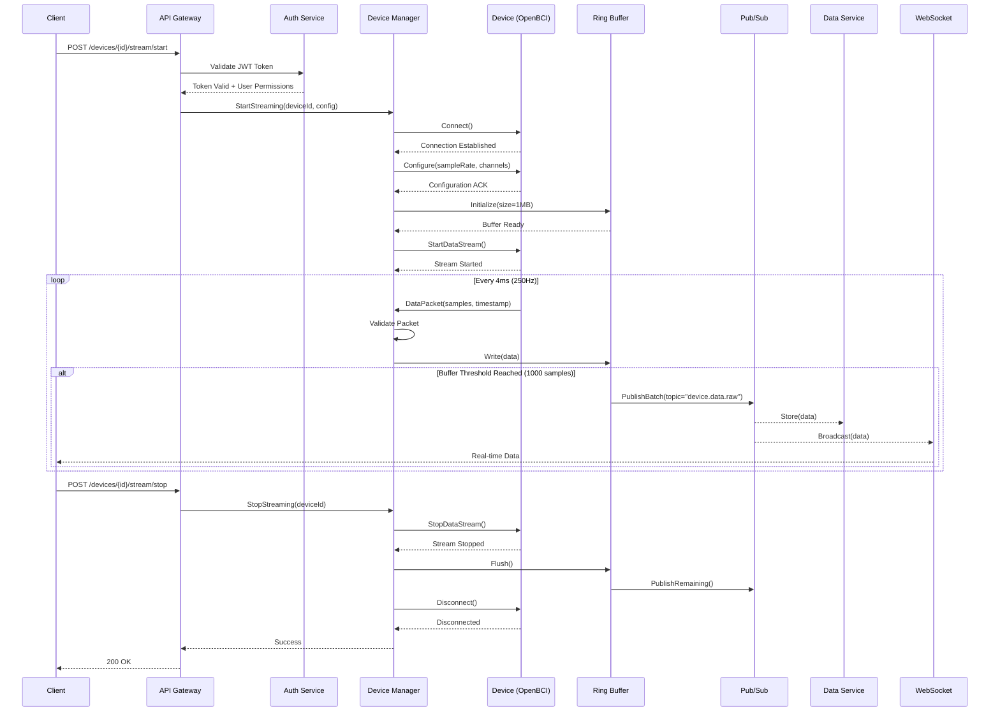
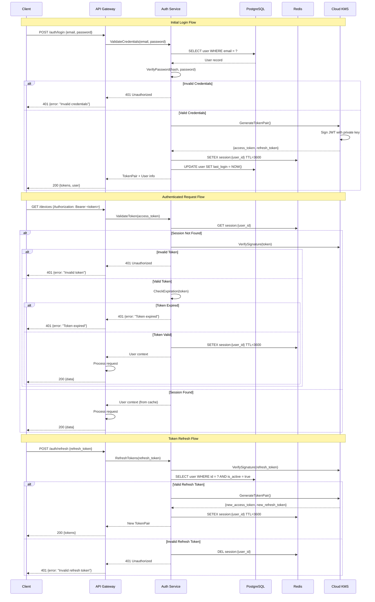
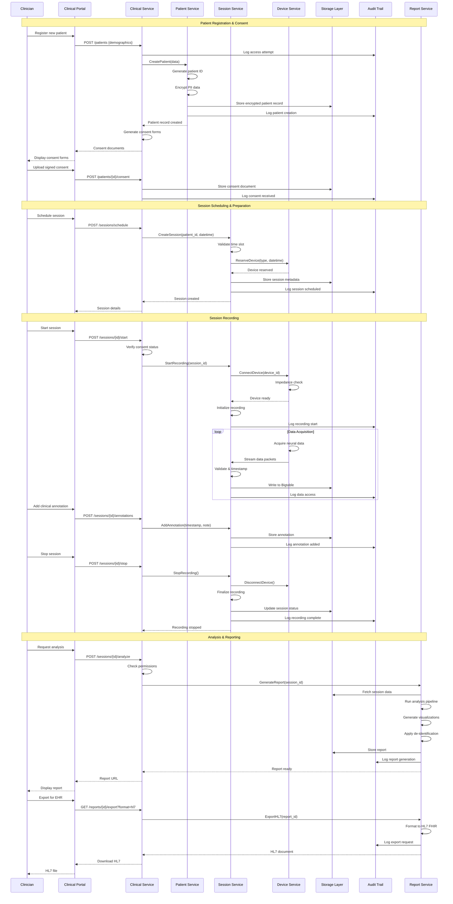
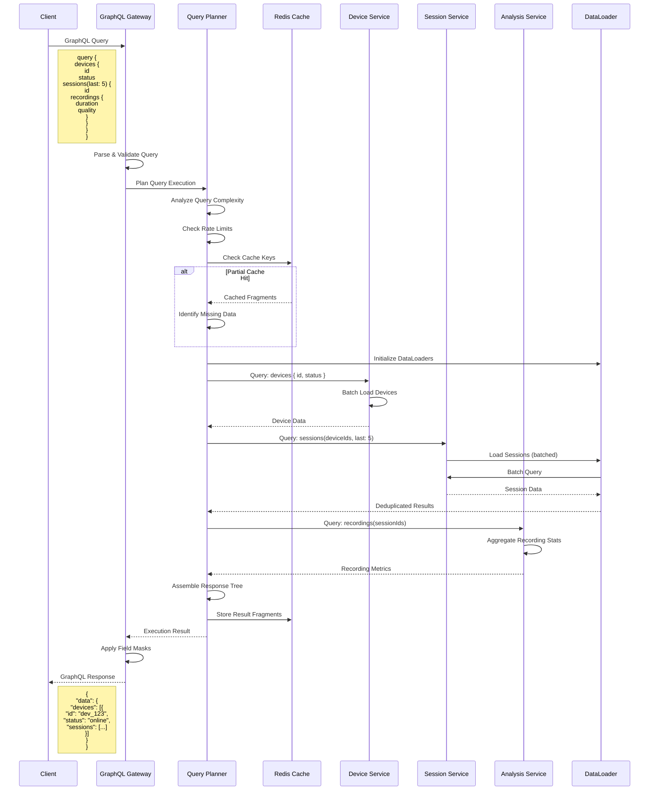

import { Tabs } from 'nextra/components'

# Sequence Diagrams

## Device Streaming Sequence

This sequence diagram shows the time-ordered interactions between components during real-time device streaming.



<Tabs items={['Timing Details', 'Message Formats', 'Error Scenarios']}>
  <Tabs.Tab>
    **Timing Specifications:**

    | Operation | Typical Latency | Max Latency | Notes |
    |-----------|----------------|-------------|--------|
    | JWT Validation | 5-10ms | 50ms | Cached tokens faster |
    | Device Connection | 100-500ms | 2000ms | USB fastest, BLE slowest |
    | Configuration | 20-50ms | 100ms | Depends on parameters |
    | Buffer Init | Less than 1ms | 5ms | Pre-allocated memory |
    | Data Packet | 4ms | 8ms | 250Hz sampling rate |
    | Pub/Sub Publish | 5-10ms | 20ms | Async operation |
    | WebSocket Broadcast | 2-5ms | 10ms | Direct connection |

    **Buffering Strategy:**
    - Ring buffer size: 1MB (holds ~10s of data)
    - Batch threshold: 1000 samples (~4 seconds)
    - Flush interval: 100ms (failsafe)
  </Tabs.Tab>

  <Tabs.Tab>
    **Key Message Formats:**

    ```python
    # Data Packet Structure
    class NeuralDataPacket:
        timestamp: datetime       # UTC timestamp
        device_id: str           # Unique device identifier
        sequence_number: int     # Packet sequence counter
        samples: np.ndarray      # Shape: (n_channels, n_samples)
        sample_rate: int         # Hz (250, 500, 1000)
        channel_mask: int        # Active channels bitmask
        battery_level: float     # 0.0 to 1.0
        signal_quality: List[float]  # Per-channel quality
    ```

    **Pub/Sub Message Format:**
    ```json
    {
        "topic": "device.data.raw",
        "device_id": "openbci_cyton_001",
        "timestamp": "2024-01-15T10:30:45.123Z",
        "data": {
            "packets": ["..."],
            "batch_size": 1000,
            "duration_ms": 4000
        }
    }
    ```

    **WebSocket Frame Format:**
    ```json
    {
        "type": "data",
        "device_id": "openbci_cyton_001",
        "channels": [1.23, 4.56, 7.89],
        "timestamp": 1705317045123,
        "quality": [0.98, 0.99, 0.97]
    }
    ```
  </Tabs.Tab>

  <Tabs.Tab>
    **Error Handling Sequences:**

    ```mermaid
    sequenceDiagram
        participant Client
        participant DM as Device Manager
        participant Device
        participant PS as Pub/Sub

        Note over Client,PS: Scenario 1: Connection Lost
        Device--xDM: Connection Lost
        DM->>DM: Detect Disconnection
        DM->>PS: Publish("device.disconnected")
        DM->>DM: Attempt Reconnection

        alt Reconnection Successful
            DM->>Device: Connect()
            Device-->>DM: Connected
            DM->>Device: Resume Stream
            DM->>PS: Publish("device.reconnected")
        else Reconnection Failed
            DM->>PS: Publish("device.error")
            DM-->>Client: Error Notification
        end

        Note over Client,PS: Scenario 2: Buffer Overflow
        Device->>DM: DataPacket
        DM->>DM: Buffer Full Check
        DM->>PS: EmergencyFlush()
        DM->>DM: Apply Backpressure
        DM-->>Device: Slow Down Signal
    ```
  </Tabs.Tab>
</Tabs>

## Authentication Sequence

This sequence diagram shows the complete authentication and authorization flow using JWT tokens.



<Tabs items={['Token Details', 'Security Features', 'Implementation']}>
  <Tabs.Tab>
    **JWT Token Structure:**

    ```json
    {
      "header": {
        "alg": "RS256",
        "typ": "JWT",
        "kid": "key_id_2024"
      },
      "payload": {
        "sub": "user_uuid",
        "email": "user@example.com",
        "role": "researcher",
        "permissions": ["read:devices", "write:sessions"],
        "iat": 1705320000,
        "exp": 1705323600,
        "iss": "neurascale.io",
        "aud": "neurascale-api"
      },
      "signature": "..."
    }
    ```

    **Token Lifetimes:**
    - Access Token: 1 hour
    - Refresh Token: 30 days
    - Session Cache: 1 hour (sliding window)

    **Token Storage:**
    - Client: Secure storage (HttpOnly cookies or secure local storage)
    - Server: Redis for session caching
    - Keys: Cloud KMS for signing keys
  </Tabs.Tab>

  <Tabs.Tab>
    **Security Measures:**

    1. **Password Security**
       - Argon2id hashing (memory-hard)
       - Salt per password
       - Configurable work factors

    2. **Token Security**
       - RS256 asymmetric signing
       - Key rotation every 90 days
       - Token binding to IP/device

    3. **Rate Limiting**
       - Login: 5 attempts per 15 minutes
       - Token refresh: 10 per hour
       - API calls: 1000 per hour

    4. **Additional Protection**
       - CSRF tokens for web clients
       - Secure headers (HSTS, CSP)
       - Request signing for sensitive operations

    ```python
    # Rate limiting implementation
    @rate_limit(
        key=lambda: f"login:{request.remote_addr}",
        rate="5/15m",
        method="sliding_window"
    )
    async def login(credentials: LoginRequest):
        # Login logic
        pass
    ```
  </Tabs.Tab>

  <Tabs.Tab>
    **Authentication Service Implementation:**

    ```python
    from datetime import datetime, timedelta
    from typing import Optional, Tuple
    import jwt
    from argon2 import PasswordHasher
    from redis import Redis

    class AuthService:
        def __init__(self, kms_client, db, redis: Redis):
            self.kms = kms_client
            self.db = db
            self.redis = redis
            self.ph = PasswordHasher()

        async def authenticate(
            self,
            email: str,
            password: str
        ) -> Tuple[str, str]:
            # Fetch user
            user = await self.db.fetch_one(
                "SELECT * FROM users WHERE email = ?",
                email
            )

            if not user:
                raise AuthenticationError("Invalid credentials")

            # Verify password
            try:
                self.ph.verify(user.password_hash, password)
            except:
                raise AuthenticationError("Invalid credentials")

            # Generate tokens
            access_token = await self._generate_access_token(user)
            refresh_token = await self._generate_refresh_token(user)

            # Cache session
            await self._cache_session(user.id, {
                "user_id": user.id,
                "email": user.email,
                "role": user.role,
                "permissions": user.permissions
            })

            return access_token, refresh_token

        async def _generate_access_token(self, user) -> str:
            payload = {
                "sub": str(user.id),
                "email": user.email,
                "role": user.role,
                "permissions": user.permissions,
                "iat": datetime.utcnow(),
                "exp": datetime.utcnow() + timedelta(hours=1)
            }

            # Sign with KMS
            return await self.kms.sign_jwt(payload)
    ```
  </Tabs.Tab>
</Tabs>

## Clinical Workflow Sequence

This sequence diagram shows the complete clinical workflow from patient registration through session recording and report generation, including all HIPAA compliance checkpoints.



<Tabs items={['Workflow Steps', 'Compliance Checkpoints', 'Data Security']}>
  <Tabs.Tab>
    **Clinical Workflow Steps:**

    | Step | Duration | Requirements | Output |
    |------|----------|--------------|--------|
    | **Patient Registration** | 5-10 min | Demographics, Medical ID | Patient record |
    | **Consent Process** | 10-15 min | Signed forms, Witness | Legal consent |
    | **Device Setup** | 5-10 min | Impedance < 10kΩ | Ready device |
    | **Baseline Recording** | 2-5 min | Stable signal | Baseline data |
    | **Active Recording** | 20-60 min | Clinical protocol | Neural data |
    | **Data Review** | 5-10 min | Quality check | Validated data |
    | **Report Generation** | 2-5 min | Analysis complete | Clinical report |
    | **EHR Integration** | 1-2 min | HL7/FHIR format | Exported data |

    **Session Types:**
    - Diagnostic assessment
    - Treatment monitoring
    - Research protocol
    - Neurofeedback training
    - Pre/post intervention
  </Tabs.Tab>

  <Tabs.Tab>
    **HIPAA Compliance Points:**

    ```python
    class HIPAACompliance:
        def __init__(self):
            self.requirements = {
                "access_control": {
                    "authentication": "Multi-factor required",
                    "authorization": "Role-based (RBAC)",
                    "audit_trail": "All access logged"
                },
                "encryption": {
                    "at_rest": "AES-256-GCM",
                    "in_transit": "TLS 1.3",
                    "key_management": "Cloud KMS"
                },
                "data_integrity": {
                    "checksums": "SHA-256 for all files",
                    "versioning": "Immutable audit log",
                    "backup": "Daily encrypted backups"
                },
                "consent_management": {
                    "storage": "Encrypted document store",
                    "tracking": "Consent status per data use",
                    "revocation": "Immediate data isolation"
                }
            }

        async def validate_access(self, user, resource, action):
            # Check user authentication
            if not await self.verify_mfa(user):
                raise AuthenticationError("MFA required")

            # Check authorization
            if not self.rbac.has_permission(user, resource, action):
                raise AuthorizationError("Access denied")

            # Log access attempt
            await self.audit.log({
                "user": user.id,
                "resource": resource,
                "action": action,
                "timestamp": datetime.utcnow(),
                "ip_address": user.ip_address
            })
    ```

    **Audit Requirements:**
    - All data access logged
    - User actions traceable
    - Immutable audit trail
    - 7-year retention
    - Regular audit reviews
  </Tabs.Tab>

  <Tabs.Tab>
    **Data Security Measures:**

    | Layer | Protection | Implementation |
    |-------|------------|----------------|
    | **Application** | Input validation | OWASP guidelines |
    | **API** | Rate limiting | 100 req/min per user |
    | **Network** | Zero-trust architecture | Service mesh + mTLS |
    | **Storage** | Encryption at rest | AES-256-GCM |
    | **Database** | Column encryption | Sensitive fields only |
    | **Backup** | Encrypted archives | Daily + geographic redundancy |
    | **Key Management** | HSM-backed | Cloud KMS rotation |

    **Privacy Controls:**
    ```yaml
    de_identification:
      - Remove direct identifiers
      - Generalize quasi-identifiers
      - Add statistical noise
      - K-anonymity (k=5)

    data_minimization:
      - Collect only necessary data
      - Automatic data expiration
      - Purpose limitation
      - Consent-based retention

    access_patterns:
      clinician:
        - Own patients only
        - Time-limited access
        - Purpose declaration
      researcher:
        - De-identified data only
        - IRB approval required
        - Aggregated results
      admin:
        - Audit access only
        - No patient data view
        - System metrics only
    ```
  </Tabs.Tab>
</Tabs>

## GraphQL API Sequence

This sequence diagram shows how GraphQL requests are handled, including query planning, federation, and caching.



<Tabs items={['Query Processing', 'Performance Optimization', 'Federation']}>
  <Tabs.Tab>
    **GraphQL Query Processing:**

    1. **Query Parsing**
       - Syntax validation
       - Schema validation
       - Depth limiting (max: 10 levels)
       - Complexity scoring

    2. **Authorization**
       - Field-level permissions
       - Resource-based access control
       - Data filtering by user context

    3. **Query Planning**
       - Identify data sources
       - Optimize fetch order
       - Batch similar requests
       - Parallelize independent queries

    4. **Execution**
       - DataLoader for N+1 prevention
       - Concurrent resolver execution
       - Error boundary handling
       - Partial response on errors

    ```graphql
    # Example query with permissions
    query GetDeviceData($deviceId: ID!) @authenticated {
      device(id: $deviceId) @requirePermission(action: "read") {
        id
        name
        status
        sessions(last: 10) @cost(complexity: 5) {
          id
          startTime
          recordings @cost(complexity: 10) {
            id
            duration
            sampleCount
            quality @computed
          }
        }
      }
    }
    ```
  </Tabs.Tab>

  <Tabs.Tab>
    **Performance Optimizations:**

    ```typescript
    // DataLoader implementation
    class DeviceLoader extends DataLoader<string, Device> {
      async batchLoadFn(ids: string[]): Promise<Device[]> {
        // Batch fetch from database
        const devices = await db.query(
          'SELECT * FROM devices WHERE id = ANY($1)',
          [ids]
        );

        // Maintain order and handle missing
        return ids.map(id =>
          devices.find(d => d.id === id) ||
          new Error(`Device ${id} not found`)
        );
      }
    }

    // Query complexity calculation
    function calculateComplexity(query: DocumentNode): number {
      let complexity = 0;

      visit(query, {
        Field(node) {
          // Base cost
          complexity += 1;

          // Additional cost for lists
          if (node.selectionSet) {
            const listMultiplier = getListMultiplier(node);
            complexity += listMultiplier *
              node.selectionSet.selections.length;
          }
        }
      });

      return complexity;
    }

    // Caching strategy
    const cacheConfig = {
      device: { ttl: 300, tags: ['device'] },
      session: { ttl: 60, tags: ['session'] },
      recording: { ttl: 3600, tags: ['recording'] },
      analysis: { ttl: 86400, tags: ['analysis'] }
    };
    ```

    **Performance Metrics:**
    - Query latency p50: < 50ms
    - Query latency p99: < 200ms
    - Cache hit rate: > 80%
    - DataLoader batch efficiency: > 90%
  </Tabs.Tab>

  <Tabs.Tab>
    **GraphQL Federation Architecture:**

    ```graphql
    # Device Service Schema
    type Device @key(fields: "id") {
      id: ID!
      name: String!
      type: String!
      status: DeviceStatus!
      firmwareVersion: String
      # Extended by other services
    }

    # Session Service Schema
    extend type Device @key(fields: "id") {
      id: ID! @external
      sessions(
        first: Int
        last: Int
        after: String
        before: String
      ): SessionConnection!
    }

    type Session @key(fields: "id") {
      id: ID!
      deviceId: ID!
      startTime: DateTime!
      endTime: DateTime
      status: SessionStatus!
      device: Device!
    }

    # Analysis Service Schema
    extend type Session @key(fields: "id") {
      id: ID! @external
      analysis: Analysis
      metrics: SessionMetrics!
    }
    ```

    **Federation Benefits:**
    - Service autonomy
    - Independent scaling
    - Schema composition
    - Unified API surface
  </Tabs.Tab>
</Tabs>
