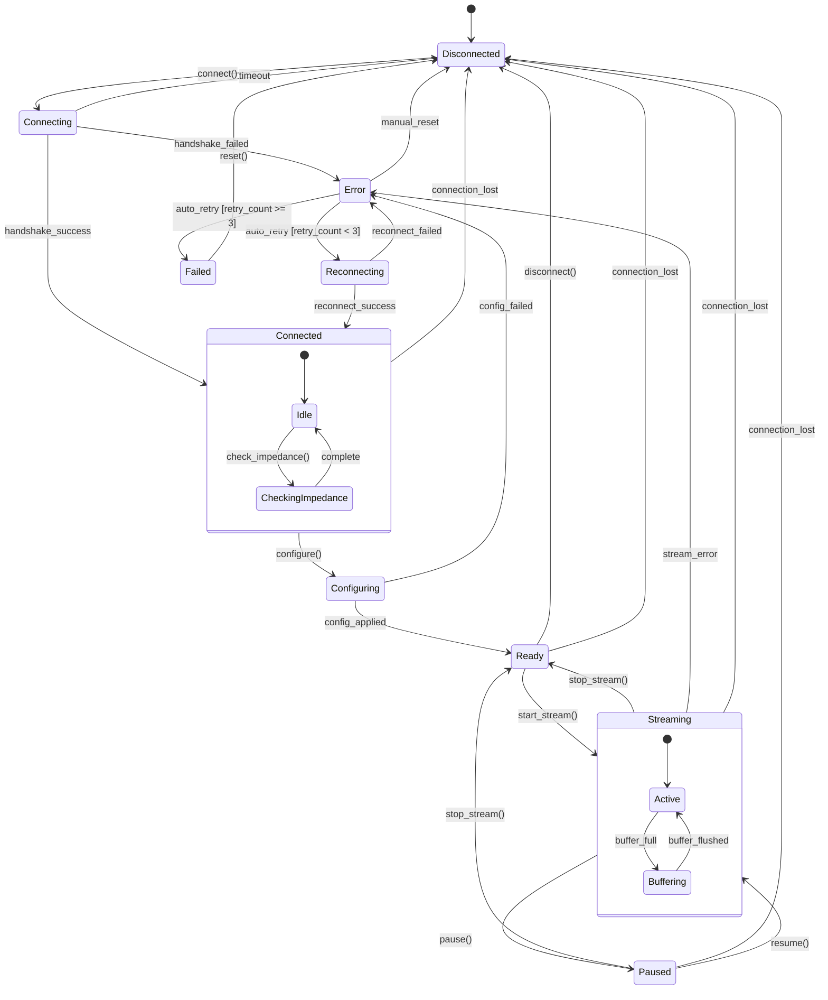
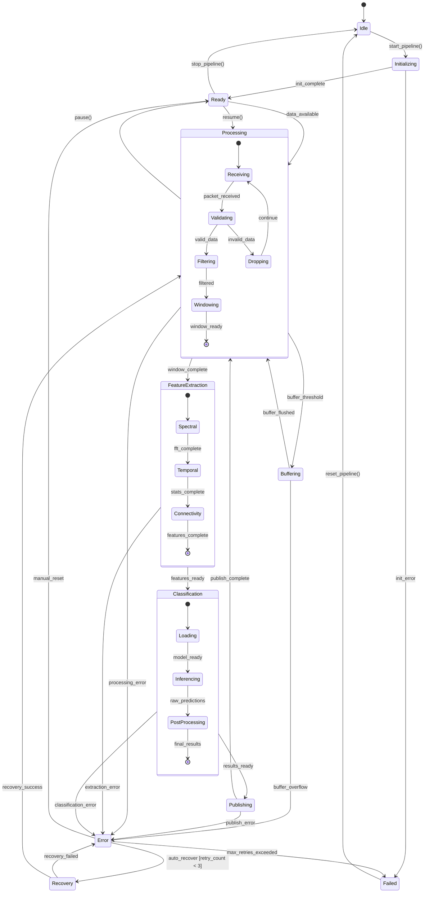
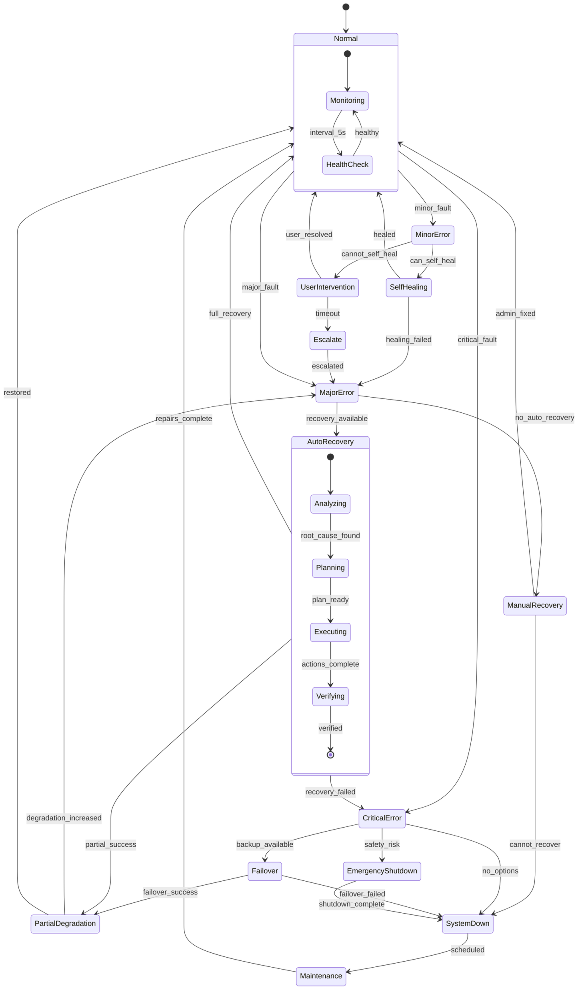

import { Tabs } from 'nextra/components'

# State Diagrams

## Device State Machine

This state diagram shows all possible device states and the transitions between them, including guards and actions.



<Tabs items={['State Descriptions', 'Transition Events', 'Implementation']}>
  <Tabs.Tab>
    **Device States:**

    | State | Description | Allowed Actions |
    |-------|-------------|-----------------|
    | **Disconnected** | No active connection to device | Connect |
    | **Connecting** | Establishing connection | Cancel |
    | **Connected** | Connected but not configured | Configure, Disconnect, Check Impedance |
    | **Configuring** | Applying device settings | Cancel |
    | **Ready** | Configured and ready to stream | Start Stream, Disconnect |
    | **Streaming** | Actively receiving data | Pause, Stop, Monitor |
    | **Paused** | Streaming suspended | Resume, Stop |
    | **Error** | Recoverable error state | Retry, Reset |
    | **Reconnecting** | Attempting automatic recovery | Cancel |
    | **Failed** | Unrecoverable error | Manual Reset |

    **Composite States:**
    - **Connected**: Contains sub-states for impedance checking
    - **Streaming**: Contains sub-states for buffer management
  </Tabs.Tab>

  <Tabs.Tab>
    **State Transitions:**

    ```python
    # Transition Guards
    class TransitionGuards:
        @staticmethod
        def can_retry(device: Device) -> bool:
            return device.retry_count < MAX_RETRIES

        @staticmethod
        def has_valid_config(device: Device) -> bool:
            return device.validate_configuration()

        @staticmethod
        def buffer_available(device: Device) -> bool:
            return device.buffer.free_space > MIN_BUFFER_SIZE

    # Transition Actions
    class TransitionActions:
        @staticmethod
        async def on_connect(device: Device):
            device.retry_count = 0
            await device.initialize_driver()

        @staticmethod
        async def on_streaming_start(device: Device):
            await device.buffer.initialize()
            await device.start_data_thread()

        @staticmethod
        async def on_error(device: Device, error: Exception):
            await device.log_error(error)
            await device.notify_error_handlers(error)
            device.retry_count += 1
    ```

    **Event Triggers:**
    - User actions: `connect()`, `disconnect()`, `start_stream()`, `stop_stream()`
    - System events: `connection_lost`, `buffer_full`, `data_timeout`
    - Error events: `handshake_failed`, `config_failed`, `stream_error`
  </Tabs.Tab>

  <Tabs.Tab>
    **State Machine Implementation:**

    ```python
    from enum import Enum, auto
    from typing import Optional, Callable

    class DeviceState(Enum):
        DISCONNECTED = auto()
        CONNECTING = auto()
        CONNECTED = auto()
        CONFIGURING = auto()
        READY = auto()
        STREAMING = auto()
        PAUSED = auto()
        ERROR = auto()
        RECONNECTING = auto()
        FAILED = auto()

    class DeviceStateMachine:
        def __init__(self, device_id: str):
            self.device_id = device_id
            self.state = DeviceState.DISCONNECTED
            self.retry_count = 0
            self.state_handlers = {}
            self.transition_callbacks = []

        def register_state_handler(
            self,
            state: DeviceState,
            handler: Callable
        ):
            self.state_handlers[state] = handler

        async def transition_to(
            self,
            new_state: DeviceState,
            event: Optional[str] = None
        ):
            old_state = self.state

            # Validate transition
            if not self._is_valid_transition(old_state, new_state):
                raise InvalidTransitionError(
                    f"Cannot transition from {old_state} to {new_state}"
                )

            # Execute exit actions
            await self._execute_exit_actions(old_state)

            # Update state
            self.state = new_state

            # Execute entry actions
            await self._execute_entry_actions(new_state)

            # Notify callbacks
            for callback in self.transition_callbacks:
                await callback(old_state, new_state, event)
    ```

    **Usage Example:**
    ```python
    # neural-engine/src/devices/state_machine.py
    device_sm = DeviceStateMachine("openbci_001")
    device_sm.register_state_handler(
        DeviceState.STREAMING,
        handle_streaming_state
    )

    await device_sm.transition_to(DeviceState.CONNECTING)
    ```
  </Tabs.Tab>
</Tabs>

## Processing Pipeline State Machine

This state diagram shows the states and transitions for the real-time neural data processing pipeline.



<Tabs items={['Pipeline States', 'Processing Details', 'Implementation']}>
  <Tabs.Tab>
    **Pipeline States:**

    | State | Description | Processing Rate |
    |-------|-------------|-----------------|
    | **Idle** | No active processing | 0 samples/s |
    | **Initializing** | Loading models, allocating buffers | N/A |
    | **Ready** | Waiting for data | 0 samples/s |
    | **Processing** | Active data processing | 250-1000 samples/s |
    | **Buffering** | Accumulating data for batch | Variable |
    | **FeatureExtraction** | Computing features | ~10 windows/s |
    | **Classification** | ML inference | ~10 predictions/s |
    | **Publishing** | Sending results | Async |
    | **Error** | Recoverable error state | 0 samples/s |
    | **Recovery** | Attempting auto-recovery | N/A |
    | **Failed** | Unrecoverable error | 0 samples/s |

    **Composite State Details:**
    - **Processing**: Receiving → Validating → Filtering → Windowing
    - **FeatureExtraction**: Spectral → Temporal → Connectivity analysis
    - **Classification**: Model loading → Inference → Post-processing
  </Tabs.Tab>

  <Tabs.Tab>
    **Processing Pipeline Stages:**

    ```python
    # Pipeline Configuration
    PIPELINE_CONFIG = {
        "buffer_size": 10000,        # samples
        "window_size": 1000,         # samples (4s at 250Hz)
        "window_overlap": 0.5,       # 50% overlap
        "batch_size": 10,            # windows per batch
        "feature_dims": 128,         # feature vector size
        "model_timeout": 100,        # ms
        "publish_timeout": 50,       # ms
    }

    # Processing Stages
    class ProcessingStages:
        RECEIVING = "receiving"
        VALIDATING = "validating"
        FILTERING = "filtering"
        WINDOWING = "windowing"
        SPECTRAL = "spectral_features"
        TEMPORAL = "temporal_features"
        CONNECTIVITY = "connectivity_features"
        INFERENCE = "ml_inference"
        PUBLISHING = "result_publishing"
    ```

    **Performance Metrics:**
    - Latency per stage: 1-5ms
    - Total pipeline latency: Less than 50ms
    - Throughput: 1000 samples/s per channel
    - Feature extraction: 10ms per window
    - ML inference: 5-10ms per batch
  </Tabs.Tab>

  <Tabs.Tab>
    **Pipeline State Machine Implementation:**

    ```python
    from enum import Enum, auto
    from dataclasses import dataclass
    from typing import Optional, List
    import asyncio

    class PipelineState(Enum):
        IDLE = auto()
        INITIALIZING = auto()
        READY = auto()
        PROCESSING = auto()
        BUFFERING = auto()
        FEATURE_EXTRACTION = auto()
        CLASSIFICATION = auto()
        PUBLISHING = auto()
        ERROR = auto()
        RECOVERY = auto()
        FAILED = auto()

    @dataclass
    class PipelineContext:
        buffer: RingBuffer
        feature_extractor: FeatureExtractor
        classifier: MLClassifier
        publisher: ResultPublisher
        error_count: int = 0
        current_window: Optional[np.ndarray] = None
        features: Optional[np.ndarray] = None
        predictions: Optional[dict] = None

    class ProcessingPipeline:
        def __init__(self, config: dict):
            self.config = config
            self.state = PipelineState.IDLE
            self.context = None
            self._state_handlers = self._setup_handlers()

        async def start(self):
            await self.transition_to(PipelineState.INITIALIZING)

        async def process_data(self, data: np.ndarray):
            if self.state != PipelineState.READY:
                raise InvalidStateError(
                    f"Cannot process data in state {self.state}"
                )

            self.context.buffer.write(data)

            if self.context.buffer.ready_for_window():
                await self.transition_to(PipelineState.PROCESSING)

        async def transition_to(
            self,
            new_state: PipelineState
        ):
            # Execute state transition
            old_state = self.state
            self.state = new_state

            # Call appropriate handler
            handler = self._state_handlers.get(new_state)
            if handler:
                try:
                    await handler()
                except Exception as e:
                    await self._handle_error(e)

        async def _handle_processing(self):
            # Get window from buffer
            window = self.context.buffer.get_window(
                size=self.config["window_size"],
                overlap=self.config["window_overlap"]
            )

            # Validate and filter
            if not self._validate_window(window):
                return await self.transition_to(PipelineState.READY)

            filtered = await self._filter_window(window)
            self.context.current_window = filtered

            # Move to feature extraction
            await self.transition_to(PipelineState.FEATURE_EXTRACTION)
    ```
  </Tabs.Tab>
</Tabs>

## System Error Recovery State Machine

This state diagram shows the comprehensive error handling and recovery mechanisms across the system.



<Tabs items={['Error Categories', 'Recovery Strategies', 'Implementation']}>
  <Tabs.Tab>
    **System Error Categories:**

    | Error Level | Examples | Impact | Auto-Recovery |
    |-------------|----------|--------|---------------|
    | **Minor** | Single packet loss | Minimal | Yes |
    | **Minor** | Cache miss | Performance | Yes |
    | **Minor** | Slow query | Latency | Yes |
    | **Major** | Device disconnect | Service degradation | Partial |
    | **Major** | Database connection lost | Data availability | Partial |
    | **Major** | Service crash | Feature unavailable | Partial |
    | **Critical** | Data corruption | Data integrity | No |
    | **Critical** | Security breach | System compromise | No |
    | **Critical** | Hardware failure | Total outage | No |

    **Recovery Time Objectives:**
    - Minor errors: < 1 minute
    - Major errors: < 5 minutes
    - Critical errors: < 30 minutes
    - Full restoration: < 2 hours
  </Tabs.Tab>

  <Tabs.Tab>
    **Recovery Strategy Matrix:**

    ```yaml
    error_recovery_strategies:
      device_errors:
        connection_lost:
          - retry_with_backoff: 3 attempts
          - switch_to_backup_device: if available
          - notify_user: after 3 failures
          - log_incident: always

      data_errors:
        corruption_detected:
          - isolate_bad_data: immediate
          - restore_from_backup: if available
          - reconstruct_from_raw: if possible
          - alert_admin: always

      service_errors:
        crash_detected:
          - auto_restart: max 3 times
          - health_check: before traffic
          - gradual_traffic: 10% increments
          - monitor_metrics: 5 min window

      infrastructure_errors:
        network_partition:
          - switch_to_local_cache: immediate
          - queue_writes: up to 1 hour
          - sync_when_restored: automatic
          - alert_if_prolonged: > 5 minutes

    escalation_paths:
      - level_1: automated_recovery
        timeout: 5_minutes
        on_failure: level_2

      - level_2: ops_team_paged
        timeout: 15_minutes
        on_failure: level_3

      - level_3: engineering_team_paged
        timeout: 30_minutes
        on_failure: executive_escalation
    ```

    **Self-Healing Mechanisms:**
    - Automatic service restarts
    - Connection pool refresh
    - Cache invalidation and rebuild
    - Replica failover
    - Load rebalancing
  </Tabs.Tab>

  <Tabs.Tab>
    **Error Recovery Implementation:**

    ```python
    from enum import Enum, auto
    from typing import Optional, Dict, List
    import asyncio

    class ErrorSeverity(Enum):
        MINOR = auto()
        MAJOR = auto()
        CRITICAL = auto()

    class SystemState(Enum):
        NORMAL = auto()
        MINOR_ERROR = auto()
        MAJOR_ERROR = auto()
        CRITICAL_ERROR = auto()
        SELF_HEALING = auto()
        AUTO_RECOVERY = auto()
        MANUAL_RECOVERY = auto()
        PARTIAL_DEGRADATION = auto()
        EMERGENCY_SHUTDOWN = auto()
        FAILOVER = auto()
        SYSTEM_DOWN = auto()
        MAINTENANCE = auto()

    class ErrorRecoverySystem:
        def __init__(self):
            self.state = SystemState.NORMAL
            self.error_history: List[ErrorEvent] = []
            self.recovery_strategies: Dict[str, RecoveryStrategy] = {}
            self.health_monitors: List[HealthMonitor] = []

        async def handle_error(
            self,
            error: Exception,
            context: ErrorContext
        ):
            severity = self._classify_error(error, context)

            if severity == ErrorSeverity.MINOR:
                await self._handle_minor_error(error, context)
            elif severity == ErrorSeverity.MAJOR:
                await self._handle_major_error(error, context)
            else:
                await self._handle_critical_error(error, context)

        async def _handle_minor_error(
            self,
            error: Exception,
            context: ErrorContext
        ):
            await self.transition_to(SystemState.MINOR_ERROR)

            # Try self-healing first
            if await self._can_self_heal(error):
                await self.transition_to(SystemState.SELF_HEALING)

                try:
                    await self._perform_self_healing(error, context)
                    await self.transition_to(SystemState.NORMAL)
                except Exception as e:
                    # Escalate if self-healing fails
                    await self._escalate_error(e, context)

        async def _perform_self_healing(
            self,
            error: Exception,
            context: ErrorContext
        ):
            strategy = self.recovery_strategies.get(
                error.__class__.__name__
            )

            if strategy:
                await strategy.execute(error, context)
                await self._verify_recovery()
            else:
                raise RecoveryError("No self-healing strategy found")

        async def _initiate_auto_recovery(
            self,
            error: Exception,
            context: ErrorContext
        ):
            recovery_plan = await self._analyze_and_plan(error, context)

            for step in recovery_plan.steps:
                try:
                    await step.execute()
                    await self._verify_step(step)
                except Exception as e:
                    await self._handle_recovery_failure(e, step)
                    break

        def _classify_error(
            self,
            error: Exception,
            context: ErrorContext
        ) -> ErrorSeverity:
            # Classification logic based on error type and context
            if isinstance(error, (ConnectionError, TimeoutError)):
                return ErrorSeverity.MINOR
            elif isinstance(error, (ServiceError, DatabaseError)):
                return ErrorSeverity.MAJOR
            elif isinstance(error, (DataCorruption, SecurityError)):
                return ErrorSeverity.CRITICAL
            else:
                # Use ML model for unknown errors
                return self._ml_classify_error(error, context)
    ```
  </Tabs.Tab>
</Tabs>
